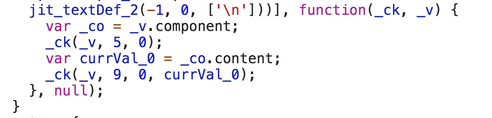

### 👉 Default Change Detection Strategy

By default Angular uses the `ChangeDetectionStrategy.Default` change detection strategy.

The default strategy doesn’t assume anything about the application, therefore every time something changes in our application, as a result of various user events, timers, XHR, promises, etc., a change detection will run on all components.

This means anything from a click event to data received from an ajax call causes the change detection to be triggered.

We can see this easily be creating a getter in our component and using it in our template. For example:

<Embed src="https://gist.github.com/NetanelBasal/545f9dbd6a780a24fbbbd7b5f803b2f6.js" aspectRatio={0.357} caption="" />

After the code above runs, each time we click the button, Angular will run a change detection cycle and we should see two logs of “Checking the view” in the console (or one log in production).

This technique is called dirty checking. In order to know whether the view should be updated, Angular needs to access the new value, compare it with the old one, and make the decision on whether the view should be updated.

Now, imagine a big application with thousands of expressions; If we let Angular check every single one of them when a change detection cycle runs, we might encounter a performance problem.

Although Angular is very fast, as your app grows, Angular will have to work harder to keep track of all the changes.

What if we could help Angular and give it a better indication of _when_ to check our components?

### 🔥 OnPush Change Detection Strategy

We can set the `ChangeDetectionStrategy` of our component to `ChangeDetectionStrategy.OnPush` .

This tells Angular that the component only depends on its `@inputs()` ( aka pure ) and needs to be checked only in the following cases:

#### 1️⃣ The `Input` reference changes.

By setting the `onPush` change detection strategy we are signing a contract with Angular that obliges us to work with immutable objects (or observables as we’ll see later).

The advantage of working with immutability in the context of change detection is that Angular could perform a simple reference check in order to know if the view should be checked. Such checks are way cheaper than a deep comparison check.

Let’s try to mutate an object and see the result.

<Embed src="https://gist.github.com/NetanelBasal/c4433dfd7c9e9aef2cbd7ebdd8d39c7f.js" aspectRatio={0.357} caption="" />

When we click on the button we will not see any log. That’s because Angular is comparing the old value with the new value by reference, something like:

<Embed src="https://gist.github.com/NetanelBasal/bbe362cbb96dfaba44cfc58ed5d8685b.js" aspectRatio={0.357} caption="" />

Just a reminder that numbers, booleans, strings, null and undefined are primitive types. All primitive types are passed by value. Objects, arrays, and functions are also passed by value, but the value is [a copy of a reference](https://stackoverflow.com/a/13104500/7330592).

So in order to trigger a change detection in our component, we need to change the object reference.

<Embed src="https://gist.github.com/NetanelBasal/5ea7e5e90d4f32f7aefc4ddafefd8a80.js" aspectRatio={0.357} caption="" />

With this change we will see that the view has been checked and the new value is displayed as expected.

#### 2️⃣ **An event originated from the component or one of its children.**

A component could have an internal state that’s updated when an event is triggered from the component or one of his children.

For example:

<Embed src="https://gist.github.com/NetanelBasal/608df5bc40c6fc11281dceaaa48e68ab.js" aspectRatio={0.357} caption="" />

When we click on the button, Angular runs a change detection cycle and the view is updated as expected.

You might be thinking to yourself that this should work with every asynchronous API that triggers change detection, as we learned at the beginning, but it won’t.

It turns out that the rule applies only to DOM events, so the following APIs will not work.

<Embed src="https://gist.github.com/NetanelBasal/ca7f18b55349cb9d51df3b1337c77b42.js" aspectRatio={0.357} caption="" />

Note that you are still updating the property so in the next change detection cycle, for example, when we click on the button, the value will be six ( 5 + 1 ).

#### 3️⃣ We run change detection explicitly.

Angular provides us with three methods for triggering change detection ourselves when needed.

The first is `detectChanges()` which tells Angular to run change detection on the component and his children.

<Embed src="https://gist.github.com/NetanelBasal/649a9fc5da9ada1d34d5d147c75451cd.js" aspectRatio={0.357} caption="" />

The second is `ApplicationRef.tick()` which tells Angular to run change detection for the **whole** application.

<Embed src="https://gist.github.com/NetanelBasal/be1e2d98b31fd6d1ce5fbd62e4c3a03e.js" aspectRatio={0.357} caption="application\_ref.ts" />

The third is `markForCheck()` which does **NOT** trigger change detection. Instead, it marks all `onPush` ancestors as to be checked once, either as part of the current or next change detection cycle.

<Embed src="https://gist.github.com/NetanelBasal/61d4650963600dbc94184d696b5abccf.js" aspectRatio={0.357} caption="refs.ts" />

_Another important thing to note here is that running change detection manually is not considered a “hack”, this is by design and it’s completely valid behavior (in reasonable cases, of course)._

### 🤓 Angular Async Pipe

The `async` pipe subscribes to an observable or promise and returns the latest value it has emitted.

Let’s see a trivial example of an `onPush` component with an `input()` observable.

<Embed src="https://gist.github.com/NetanelBasal/c0981cec22f488ecacef2ebc9f72d0d3.js" aspectRatio={0.357} caption="" />

When we click on the button we are not going to see the view updated. This is because none of the conditions mentioned above occurred, so Angular will not check the component at the current change detection cycle.

Now, let’s change it to use the `async` pipe.

<Embed src="https://gist.github.com/NetanelBasal/7f9a1681501ba4f7f5ffb511e726368d.js" aspectRatio={0.357} caption="" />

Now we can see that the view is updated when we click on the button. The reason for that is that when a new value is emitted, the `async` pipe marks the component to be checked for changes. We can see it in the [source](https://github.com/angular/angular/blob/5.2.10/packages/common/src/pipes/async_pipe.ts#L139) code:

<Embed src="https://gist.github.com/NetanelBasal/449891ada9c3df7a34a67939ef8c3ae6.js" aspectRatio={0.357} caption="" />

Angular is calling to `markForCheck()` for us and that’s why the view is updated even though the reference hasn’t changed.

> If a component depends only on its input properties, and they are observable, then this component can change if and only if one of its input properties emits an event.

Quick tip: It’s an anti-pattern to expose your subject to the outside world, always expose the observable, by using the `asObservable()` method.

### 👀 onPush and View Queries

Let’s say we have the following components:

<Embed src="https://gist.github.com/NetanelBasal/130c02ce4be4c7f39e018a853fb2c2bd.js" aspectRatio={0.357} caption="" />

Probably your expectation is that after three seconds Angular will update the tab component view with the new content.

After all, we saw that if we update the input reference in `onPush` components this should trigger change detection, no?

Unfortunately, in this case, it doesn’t work that way. There is no way for Angular to know that we are updating a property in the tab component. Defining `inputs()` in the template is the only way to let Angular knows that this property should be checked on a change detection cycle.

For example:

<Embed src="https://gist.github.com/NetanelBasal/394a883ee2c50710e3576b9cf88234bb.js" aspectRatio={0.357} caption="" />

Because we define explicitly the `input()` in the template, Angular creates a function called an `updateRenderer()`, that keeps track of the content value during each change detection cycle.

The simple solution in these cases is to use setters and call `markForCheck()`.

<Embed src="https://gist.github.com/NetanelBasal/3b5d45852c5a69ec47f37e1cb65fa5f5.js" aspectRatio={0.357} caption="" />

### 💪 === onPush++

After we understood (hopefully) the power of `onPush`, we can leverage it in order to create a more performant application. The more `onPush` components we have the less checks Angular needs to perform. Let’s see a real world example:

Let’s say that we have a `todos` component that takes a todos as `input()`.

<Embed src="https://gist.github.com/NetanelBasal/c40a62b4a696eafb41fc4ea780d7402e.js" aspectRatio={0.357} caption="" />

The disadvantage of the above approach is that when we click on the add button Angular needs to check each todo, even if **nothing** has changed, so in the first click we’ll see three logs in the console.

In the above example there is only one expression to check, but imagine a real world component with multiple bindings (ngIf, ngClass, expressions, etc.). This could get expensive.

> We’re running change detection for no reason

The more performant way is to create a todo component and define its change detection strategy to be `onPush`. For example:

<Embed src="https://gist.github.com/NetanelBasal/65d3ea7109cf741dee9ee5361e7ba7d3.js" aspectRatio={0.357} caption="" />

Now when we click the add button we’ll see a single log in the console because none of the inputs of the other todo components changed, therefore their view wasn’t checked.

**Also, by creating a dedicated component we make our code more readable and reusable.**

_Follow me on_ [_Medium_](https://medium.com/@NetanelBasal/) _or_ [_Twitter_](https://twitter.com/NetanelBasal) _to read more about Angular, Vue and JS!_

### **😍** 🚀 **Have You Tried Akita Yet?**

One of the leading state management libraries, Akita has been used in countless production environments. It’s constantly developing and improving.

Whether it’s entities arriving from the server or UI state data, Akita has custom-built stores, powerful tools, and tailor-made plugins, which help you manage the data and negate the need for massive amounts of boilerplate code. We/I highly recommend you try it out.

[**🚀 Introducing Akita: A New State Management Pattern for Angular Applications**  
_Every developer knows state management is difficult. Continuously keeping track of what has been updated, why, and…_netbasal.com](https://netbasal.com/introducing-akita-a-new-state-management-pattern-for-angular-applications-f2f0fab5a8 "https://netbasal.com/introducing-akita-a-new-state-management-pattern-for-angular-applications-f2f0fab5a8")
