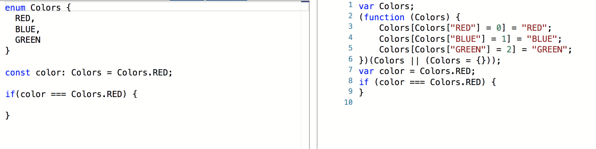

Enums allows us to define a set of named constants. By using enums we can keep our code DRY, easy to refactor, and more readable.

For example, if we need to use set of colors in our application that represents a numeric value in the server, we can do the following:

<Embed src="https://gist.github.com/NetanelBasal/edf213088cdaa9722a66f5878a03aec0.js" aspectRatio={0.357} caption="Enum" />

Enums are not magic. If we take a look at the transpiled code, we can see that it is just a plain JS object.

<Embed src="https://gist.github.com/NetanelBasal/4ea9206b2be18c49d12572daf0e62901.js" aspectRatio={0.357} caption="Enums Output" />

The disadvantage here is that all of this code goes into our JS bundle file even though we do not use it in a dynamic way, which leads us to three problems:

1.  The bundle will increase depending on the number of enums.
2.  Increased memory consumption.
3.  We need to perform a lookup each time we access the value.

In most cases, what we really want is to simply replace the object with the specific value we need. In fact, in typescript we can do this by using `const` enums.

The only thing that we need to do is add a `const` before the enum definition.

<Embed src="https://gist.github.com/NetanelBasal/5804b9336c9c24e129477aec8075b4f6.js" aspectRatio={0.357} caption="Add const" />

Keep in mind that you should **NOT** use `const` if you are using enum in a dynamic way, for example:

<Embed src="https://gist.github.com/NetanelBasal/ec611b72cf4f2ac16e7bd636ef271b86.js" aspectRatio={0.357} caption="Dynamic Usage" />

You can still enjoy both worlds by setting the `preserveConstEnums` to true. This will tell the compiler to not erase `const` enum declarations in generated code. In this case, the output will be:

<Embed src="https://gist.github.com/NetanelBasal/b5df20912c35a0302c3eaaa3d73f7ce9.js" aspectRatio={0.357} caption="`preserveConstEnums`" />

The last thing worth noting is that if you are a third party library author and you allow your consumers to import the library enums, you should not use this feature because typescript will not know what the value is and mark the object as undefined.

_Follow me on_ [_Medium_](https://medium.com/@NetanelBasal/) _or_ [_Twitter_](https://twitter.com/NetanelBasal) _to read more about Angular, Vue and JS!_
