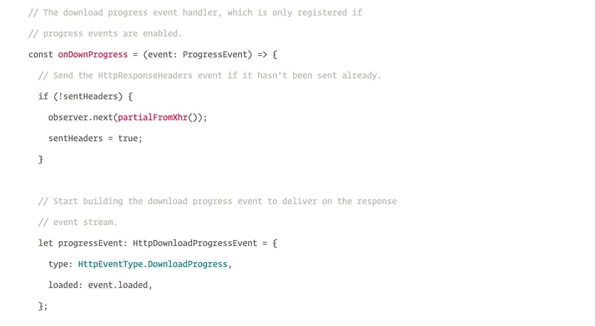

Angular version [4.3.0-rc.0](https://github.com/angular/angular/blob/master/CHANGELOG.md#430-rc0-2017-07-08) is now available. In this release, we can see a new exciting feature we all waited for — an improved version of the HTTP client API.

> HttpClient is an evolution of the existing Angular HTTP API, which exists  
> alongside of it in a separate package, @angular/common/http. This structure  
> ensures that existing codebases can slowly migrate to the new API.

### Installation

First of all, we need to update all of our packages to version 4.3.0-rc.0.

Next, we need to include the `HttpClientModule` in our `AppModule`.

<Embed src="https://gist.github.com/NetanelBasal/4c43f757738504db2ff89b71ee042ba0.js" aspectRatio={0.357} caption="" />

Now we are ready. Let’s see three new things we’ve all been waiting for.

### JSON as default

JSON is an assumed default and no longer needs to be explicitly parsed.

We do not need to write the following code anymore:

```
http.get(url).map(res => res.json()).subscribe(...)
```

Now we can just write:

```
http.get(url).subscribe(...)
```

### Interceptors Support

Interceptors allow middleware logic to be inserted into the pipeline.

#### Request Interceptor

<Embed src="https://gist.github.com/NetanelBasal/07bbcf60ce543b86fcd9bc623b7b73d4.js" aspectRatio={0.357} caption="" />

If we want to register new interceptor, we need to implement the `HttpInterceptor` interface. This interface has one method that we must implement — `intercept` .

The intercept method will give us the `Request` object and the HTTP handler and expect us to return an observable of type `HttpEvent`.

The Request/Response objects need to be immutable. Therefore, we need to `clone` the original request before we return it.

The `next.handle(req)` method is invoking the underlying XHR with the new request and returns a stream of response events.

#### Response Interceptor

<Embed src="https://gist.github.com/NetanelBasal/ec02f28433ec51eafcd30686a8921a7c.js" aspectRatio={0.357} caption="" />

An interceptor may choose to transform the response event stream as well, by applying additional Rx operators on the stream returned by `next.handle()`.

The last thing we have to do is to register the interceptors with the `HTTP_INTERCEPTORS` multi provider.

<Embed src="https://gist.github.com/NetanelBasal/ed22cba76b2ddfd0014a095b489a59d6.js" aspectRatio={0.357} caption="" />

### Progress events

Progress events for both request upload and response download.

<Embed src="https://gist.github.com/NetanelBasal/2200a87247c650c2e0aea1837f82d592.js" aspectRatio={0.357} caption="" />

If we want to get notified about the download/upload progress we need to pass `{ reportProgress: true }` to the `HttpRequest` object.

There are two new features that we will not talk about today:

-   Post-request verification & flush based testing framework.
-   Typed, synchronous response body access, including support for JSON body types.

This was an overview of the new HTTP client and its main features. You can find the full source code [here](https://github.com/angular/angular/tree/master/packages/common/http).

_Follow me on_ [_Medium_](https://medium.com/@NetanelBasal/) _or_ [_Twitter_](https://twitter.com/NetanelBasal) _to read more about Angular, Vue and JS!_
