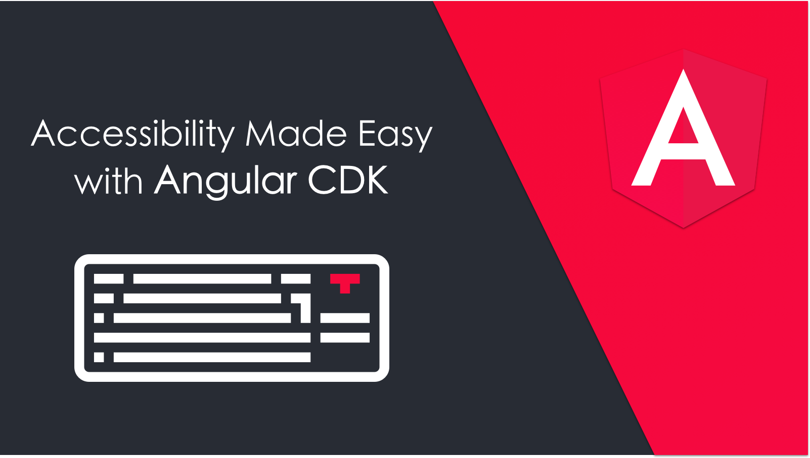
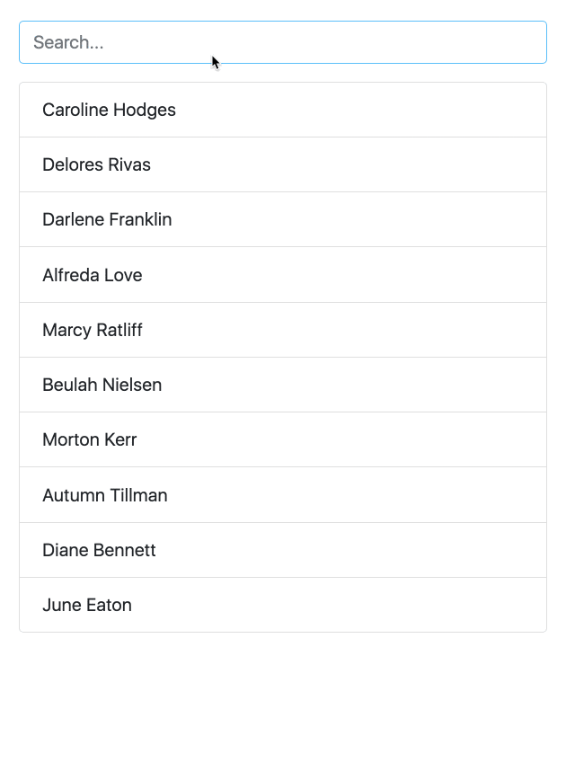
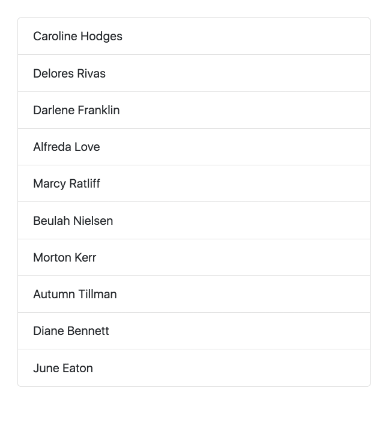
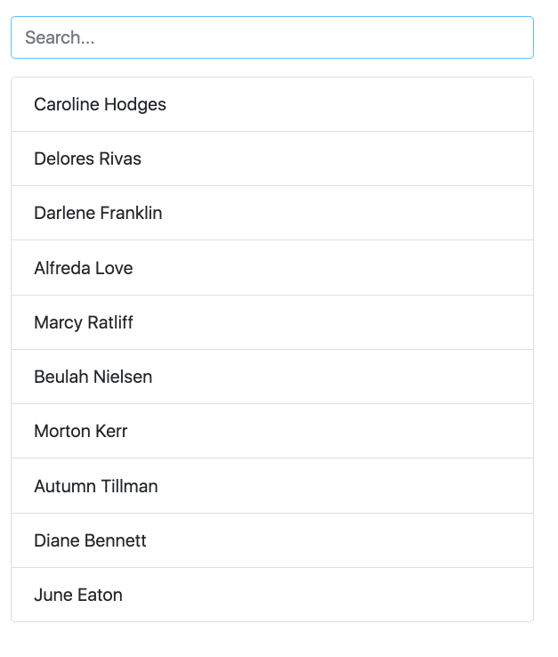
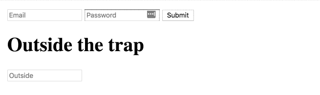

Keyboard focus and navigation are essential when developing for the accessible web. Many users rely on a keyboard when they surf the web.

If a user doesn’t use other input mechanisms, they’ll have a tough time interacting and navigating your site unless it’s keyboard navigable.

In this article, we’ll learn how Angular CDK makes adding this ability easier.

We’ll create a searchable list and add the option to choose items using the keyboard. Here is a demo that illustrates our final result:

Let’s start by creating a list-item component:

<Embed src="https://gist.github.com/NetanelBasal/4ef1d18282439478860ec63346c7df97.js" aspectRatio={0.357} caption="" />

This component is straightforward. It gets the item via `input` and displays the content via `ng-content`. Now, let’s move on and create the app component:

<Embed src="https://gist.github.com/NetanelBasal/f37b92638765a2eed23e696f16e8a309.js" aspectRatio={0.357} caption="" />

This is basic stuff. We loop over an array of users and display the username. Now we have a searchable list, so let’s add the keyboard interaction.

### The ListKeyManager Class

`ListKeyManager` manages the active options in an item list based on keyboard interactions. It’s intended to be used with components that correspond to a `role="menu”` or `role="listbox”` pattern.

Any component that uses a `ListKeyManager` need to do three things:

-   Create a `@ViewChildren` query for the options being managed.
-   Initialize the `ListKeyManager`, passing in the options.
-   Forward keyboard events from the managed component to the `ListKeyManager`.

There are two varieties of `ListKeyManager`, `ActiveDescendantKeyManager` and `FocusKeyManager`. Let’s start with `ActiveDescendantKeyManager` .

### The ActiveDescendantKeyManager Class

<Embed src="https://gist.github.com/NetanelBasal/b5e5642de2dcc1a33fe13c705f1110a8.js" aspectRatio={0.357} caption="" />

We instantiate the `ActiveDescendantKeyManager` class, which extends the `ListKeyManager` class and passes on the query list to it.

We also call the `withWrap()` method, as we want to wrap to the other end of the list when there are no more items in a given direction (looping).

We listen for the input’s keydown event and pass the event to the `onKeyDown()` method of the `keyManager` object. Under the hood, active option will be managed based on the user’s keyboard navigation.

When the user presses enter, we can grab the active option via the `activeItem` property of the `keyManager` object.

Now, let’s see how to style the active option. Each managed item should implement the `Highlightable` interface:

<Embed src="https://gist.github.com/NetanelBasal/62ccb266b6fe6c90865abd7e9c9fdf15.js" aspectRatio={0.357} caption="" />

As the user navigates, Angular calls the `setActiveStyles()` method on the newly active option and `setInActiveStyles()` on the previously option. This allows us to style our component.

<Embed src="https://gist.github.com/NetanelBasal/cc3599a73d7db74984212f725be79c4f.js" aspectRatio={0.357} caption="" />

### The FocusKeyManager Class

The `FocusKeyManager` class is used when options receive direct browser focus. Each managed item must implement the `FocusableOption` interface:

<Embed src="https://gist.github.com/NetanelBasal/b3171ec3d23fc122bdb2c7669cc073e2.js" aspectRatio={0.357} caption="" />

As the user navigates, Angular calls the `focus()` method on the newly active option.

<Embed src="https://gist.github.com/NetanelBasal/9774fb718161a182b8a0fa8314217b4b.js" aspectRatio={0.357} caption="" />

### Skipping Items

We have two options for skipping items during navigation. The first option is setting the item `disabled` property to true. For example:

<Embed src="https://gist.github.com/NetanelBasal/578b722cd292f8e7a125f9b31209fc9c.js" aspectRatio={0.357} caption="" />

The second option is to define a `skipPredicate()` method. For example:

<Embed src="https://gist.github.com/NetanelBasal/465d26b13c9f56660c5a194e35f01ec3.js" aspectRatio={0.357} caption="" />

### Typehead Mode

We can turn on the `typeahead` mode. This allows users to set the active item by typing. That means that when the user searches, the first result is automatically set as active.

Let’s add the search functionality.

<Embed src="https://gist.github.com/NetanelBasal/4850a621f3fa88bee6a585e8f9a92bd0.js" aspectRatio={0.357} caption="" />

Note that we **must** implement the `getLabel()` method when we’re in `typehead` mode.

---

And of course, in addition to all of that, you can dynamically set the active item by calling methods like: `setFirstItemActive()`, `setLastItemActive()`, `updateActiveItem(index)`, `setActiveItem(item)` and more.

### FocusTrap

There may come a time when you find it essential to trap focus within a DOM node — that way, when users hit Tab or Shift+Tab or click around, they can’t escape a certain cycle of focusable elements (this is useful for modals, for example).

The `cdkTrapFocus` directive traps Tab key focus within an element. Let’s see an example:

<Embed src="https://gist.github.com/NetanelBasal/26c1a94a6914f254959d8addefbf097e.js" aspectRatio={0.357} caption="" />

That’s all. Here are the complete examples:

<Embed src="https://stackblitz.com/edit/angular-keyb-1?embed=1" aspectRatio={undefined} caption="ActiveDescendantKeyManager" />

<Embed src="https://stackblitz.com/edit/angular-keyb-2?embed=1" aspectRatio={undefined} caption="FocusKeyManager" />

### 👂🏻 **Last but Not Least, Have you Heard of Akita?**

Akita is a state management pattern that we’ve developed here in Datorama. It’s been successfully used in a big data production environment for over seven months, and we’re continually adding features to it.

Akita encourages simplicity. It saves you the hassle of creating boilerplate code and offers powerful tools with a moderate learning curve, suitable for both experienced and inexperienced developers alike.

I highly recommend checking it out.

[**🚀 Introducing Akita: A New State Management Pattern for Angular Applications**  
_Every developer knows state management is difficult. Continuously keeping track of what has been updated, why, and…_netbasal.com](https://netbasal.com/introducing-akita-a-new-state-management-pattern-for-angular-applications-f2f0fab5a8 "https://netbasal.com/introducing-akita-a-new-state-management-pattern-for-angular-applications-f2f0fab5a8")

_Follow me on_ [_Medium_](https://medium.com/@NetanelBasal/) _or_ [_Twitter_](https://twitter.com/NetanelBasal) _to read more about Angular, Akita and JS!_
