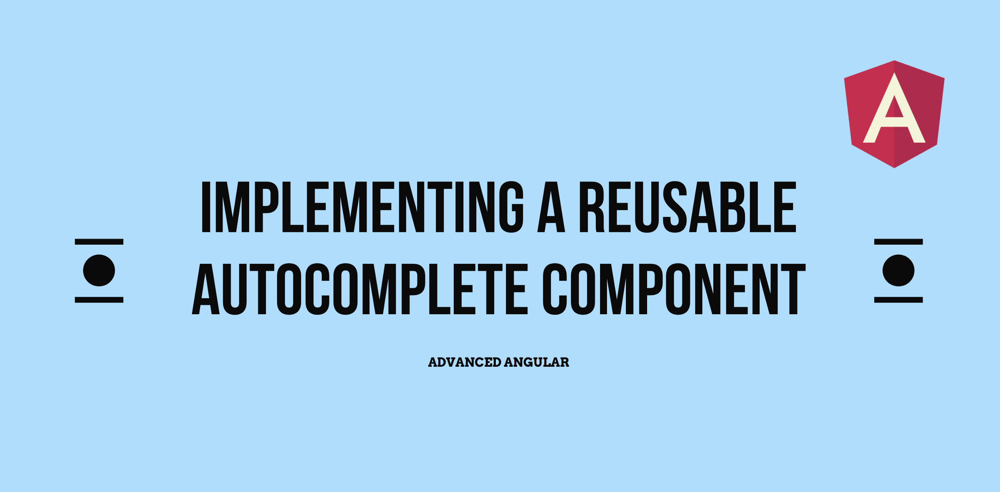
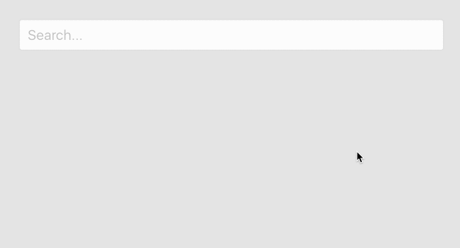

In this article, I’ll walk you through the process of creating a custom autocomplete component with Angular by using the Angular’s CDK. Along the way we’ll go over various techniques that we can use to build robust components in Angular.

To see the big picture, here is the general structure detailing the use of the components and directives we’ll describe in this article:

<Embed src="https://gist.github.com/NetanelBasal/7e1ca0f4d594fa82a227f94b9f446c04.js" aspectRatio={0.357} caption="" />

Before we start with the code implementation, we can observe _two things_ from the code above:

First, we can discern that we don’t encapsulate the input text inside the `autocomplete` component. Instead, we pass the `autocomplete` reference to the `appAutocomplete` directive.

The reason for this is that we want to give the component’s consumers the ability to handle the input API directly (for instance in order to define event handlers) without having to expose and manage it from our component.

Secondly, we can see that we don’t couple the `OptionComponent` selector to our `autocomplete` component (i.e name it `app-autocomplete-option`). This is because we want to increase the `autocomplete` component’s usability by letting us apply the same functionality to other components, such as custom select, custom menus, etc.

Let’s get started.

### Creating the OptionComponent

First, we create the `app-option` component:

<Embed src="https://gist.github.com/NetanelBasal/a9935917aadc8beb8e8a325d25e2d819.js" aspectRatio={0.357} caption="" />

In the component’s markup, we wrap the content in a `div` to apply our style and using `ng-content`, give the consumer the power to pass any additional required content.

We take the option value via `input` and expose a `click$` observable which we map to this value. We’ll see later how the parent component takes advantage of this property.

### Creating the AutocompleteComponent

The HTML structure of our component is pretty minimalistic:

<Embed src="https://gist.github.com/NetanelBasal/9d8269be895c08a880d2cc83b3670666.js" aspectRatio={0.357} caption="" />

There are a few things to explain here, so let’s break it down:

<Embed src="https://gist.github.com/NetanelBasal/f9622756c2de61bbd41439b373e772f5.js" aspectRatio={0.357} caption="" />

First, we wrap our content in an `ng-template` tag to keep it’s instantiation lazy, so it won’t be created until we need it. We obtain a reference to this template by using the `ViewChild` decorator passing the local variable we named `root` . Later, we’ll see how we instantiate this template from the `AutocompleteDirective`.

Within the template we place the autocomplete wrapper `div`, which is responsible for styling.

<Embed src="https://gist.github.com/NetanelBasal/87e109a86ec6756307e4bf095707a7e5.js" aspectRatio={0.357} caption="" />

Before explaining what we have here, let’s stop for a second and create the `AutocompleteContentDirective` :

<Embed src="https://gist.github.com/NetanelBasal/8a4bba7c153df42e08d564624d8263e1.js" aspectRatio={0.357} caption="" />

The whole purpose of this directive is to expose a reference to its `TemplateRef` so its parent, the `AutocompleteComponent`, can query and render it on demand.

Continuing with the `AutocompleteComponent` component code, we obtain a reference to the `AutocompleteContentDirective` that we’ve created, by using the `ContentChild` decorator. We pass the `tpl` property which contains the template we want to create to the `ngTemplateOutlet` directive.

At this point, you might be asking yourself why we’ve used an `ng-template` wrapper around our `OptionComponent`, rather than simply placing it in an `ng-content`, like this:

<Embed src="https://gist.github.com/NetanelBasal/0e51425a587b3da2f1f4ad0df993f54b.js" aspectRatio={0.357} caption="" />

We opted for that structure due to how `ng-content` [works](https://medium.com/claritydesignsystem/ng-content-the-hidden-docs-96a29d70d11b).

When using `ng-content`, the host doesn’t have any control over the content. This behavior can lead to unexpected side-effects, as Angular will create the `OptionComponent` instances without taking into consideration whether they are nested in an autocomplete component.

**The way we truly perform the components’ instantiation in a lazy manner is by using** `**ng-template**`**.**

Next, we need to query the option child components, and expose an observable that fires upon an option’s click:

<Embed src="https://gist.github.com/NetanelBasal/79457e9bc70dfd68bd1e78583967b327.js" aspectRatio={0.357} caption="" />

We obtain a reference to the `OptionComponent` children by using the `ContentChildren` decorator. Next, we create the `optionsClick()` method which listens to the QueryList’s `changes()` event that emits the current options, and switches to a new observable which fires each time one of the options is clicked. We’ll see later how the `AutocompleteDirective` uses this functionality.

**A bit of advice:** If you have encountered a performance problem you might consider using event delegation.

<Embed src="https://gist.github.com/NetanelBasal/a77f30fa65e7cc936a826295dfeab2ea.js" aspectRatio={0.357} caption="" />

Lastly, we use the `exportAs` property as we need to pass the component instance reference to our `AutocompleteDirective`, as we saw in the beginning of the article. If you’re not familiar with this property, I recommend reading [this](https://netbasal.com/angular-2-take-advantage-of-the-exportas-property-81374ce24d26) article.

### Creating the AutocompleteDirective

Finally, we reach the last piece of the puzzle:

<Embed src="https://gist.github.com/NetanelBasal/5592542f6c70abefbdba431310da49d0.js" aspectRatio={0.357} caption="" />

We have the `appAutocomplete` input that takes an instance of `AppAutoComplete`.

In the constructor, we inject a few providers: 1) The host element which in our case is the `input` element. 2) A reference to the current form control so we can update its value. 3) A reference to the `ViewContainerRef` and 4) Angular Material’s Overlay service so we can create and position the autocomplete dropdown.

Next, in the `ngOnInit` hook, we set a `focus` event listener on the native input element, which calls the `openDropdown()` method. Let’s see its implementation:

<Embed src="https://gist.github.com/NetanelBasal/a533d1fca8314b947734422176d2f96c.js" aspectRatio={0.357} caption="" />

I’m going to be DRY 😀 and redirect you a previous article where I explained in details each step in the code above:

[**Creating Powerful Components with Angular CDK**  
_Creating Components with Angular CDK Overlay_netbasal.com](https://netbasal.com/creating-powerful-components-with-angular-cdk-2cef53d81cea "https://netbasal.com/creating-powerful-components-with-angular-cdk-2cef53d81cea")

The important part to note here is that we pass `this.appAutocomplete.rootTemplate` to our overlay instance and that will be the **actual template been rendered**.

Next, we need to listen to the `optionsClick` method we’ve created earlier:

<Embed src="https://gist.github.com/NetanelBasal/05203d3c6477373f40713fc76f124ab3.js" aspectRatio={0.357} caption="" />

When the user clicks on an option, we get the option’s value, set the control’s value with it, and close the dropdown.

Finally, we need to create the functionality of closing the dropdown whenever the user clicks outside:

<Embed src="https://gist.github.com/NetanelBasal/aa1f024a7b698fea0c1e3d1a54ba48d3.js" aspectRatio={0.357} caption="" />

We listen to the document’s click event, and close the dropdown when a click meets two conditions: 1) The click target isn’t the origin. 2) The click target isn’t the dropdown or any one of its children.

### Filtering the Options

The last step on the journey is filtering the options based on the search term. At first glance, you might think to add this functionality to the component itself, but we’ll take a different approach.

As we already have a `filter` pipe in our application, we’ll prefer composition and use it to filter the options based on the result. This will make our code reusable and also give the consumers the freedom to choose a custom client-side filtering implementation, or even incorporate a server-side based search.

<Embed src="https://gist.github.com/NetanelBasal/2c9c47803d70d10809169365cf9bcd01.js" aspectRatio={0.357} caption="" />

Now, we can use it to filter the result:

<Embed src="https://gist.github.com/NetanelBasal/199b421e1b95c3a86f333d5f7dd69898.js" aspectRatio={0.357} caption="" />

We also want to give feedback to the user when there aren’t any results. To do this we’ll refactor our HTML and use a technique described in detail in one of my [previous](https://netbasal.com/using-pipe-results-in-angular-templates-430683fa2213) articles, so we don’t need to apply the pipe twice:

<Embed src="https://gist.github.com/NetanelBasal/9017b58602ec9d808b09785d45dae1b5.js" aspectRatio={0.357} caption="" />

The second approach to filtering, that can give us more control, is to use RxJS:

<Embed src="https://gist.github.com/NetanelBasal/3d9f72ef6ce85c30595d1afc953c9d64.js" aspectRatio={0.357} caption="" />

Last but not least, if you want to implement keyboard navigation functionality, check out the following article:

[**Accessibility Made Easy with Angular CDK**  
_Keyboard focus and navigation are essential when developing for the accessible web. Many users rely on a keyboard when…_netbasal.com](https://netbasal.com/accessibility-made-easy-with-angular-cdk-1caaf3d98de2 "https://netbasal.com/accessibility-made-easy-with-angular-cdk-1caaf3d98de2")

### 🚀 Have You Tried Akita Yet?

One of the leading state management libraries, Akita has been used in countless production environments. It’s constantly developing and improving.

Whether it’s entities arriving from the server or UI state data, Akita has custom-built stores, powerful tools, and tailor-made plugins, which help you manage the data and negate the need for massive amounts of boilerplate code. We/I highly recommend you try it out.

[**🚀 Introducing Akita: A New State Management Pattern for Angular Applications**  
_Every developer knows state management is difficult. Continuously keeping track of what has been updated, why, and…_netbasal.com](https://netbasal.com/introducing-akita-a-new-state-management-pattern-for-angular-applications-f2f0fab5a8 "https://netbasal.com/introducing-akita-a-new-state-management-pattern-for-angular-applications-f2f0fab5a8")

[**Form Fatale: How Akita’s Form Manager Can Do Away with Complex Multistep Form Logic in Angular**  
_Akita’s Angular Form Manager_netbasal.com](https://netbasal.com/form-fatale-how-akitas-form-manager-can-do-away-with-complex-multistep-form-logic-in-angular-329a557cc68 "https://netbasal.com/form-fatale-how-akitas-form-manager-can-do-away-with-complex-multistep-form-logic-in-angular-329a557cc68")

_Follow me on_ [_Medium_](https://medium.com/@NetanelBasal/) _or_ [_Twitter_](https://twitter.com/NetanelBasal) _to read more about Angular, Akita and JS!_

<Embed src="https://stackblitz.com/edit/github-4zpkjw?embed=1" aspectRatio={undefined} caption="" />

[**Angular demo runner**  
_Online angular editor for building demo._ng-run.com](https://ng-run.com/github/NetanelBasal/ng-autocomplete?layout=1&open=src%2Fapp%2Fautocomplete%2Fautocomplete.directive.ts "https://ng-run.com/github/NetanelBasal/ng-autocomplete?layout=1&open=src%2Fapp%2Fautocomplete%2Fautocomplete.directive.ts")
