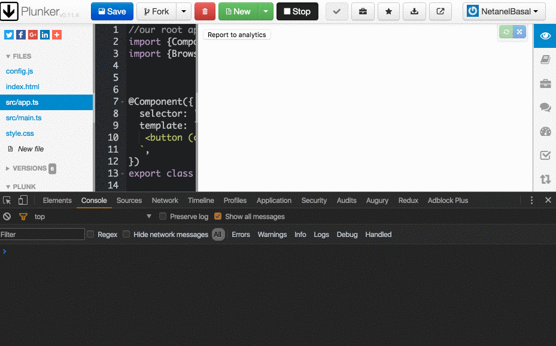
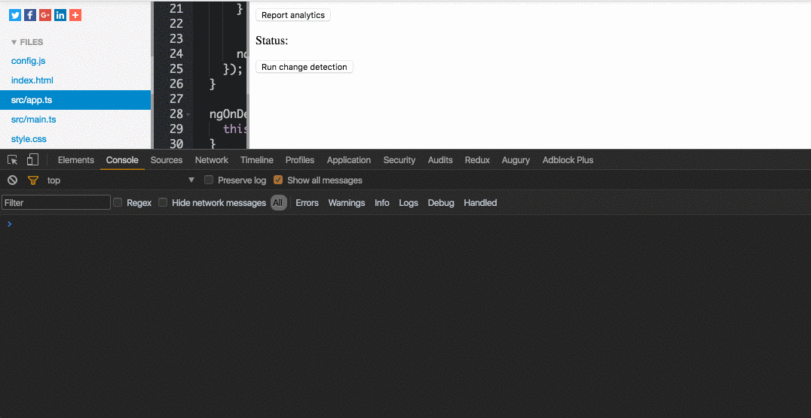

#### Change Detection in Angular 2

In Angular 2, change detection is automatic as opposed to Angular 1 that apply the change detection with the help of methods like `$scope.$watch()` and `$scope.$digest()`.

Under the hood, Angular 2 uses something called **Zones**. In a nutshell, Zone.js intercepts all of the asynchronous APIs in the browser by monkey patching them.

Monkey patching is a technique to override, extend or even suppress the default behavior of a code segment without changing its source code. So when we call something like `setTimeout` — Angular 2 knows that and can trigger change detection and decide if she needs to update the DOM because `setTimeout()` is monkey patched.

A simple example of monkey patching:

<Embed src="https://gist.github.com/NetanelBasal/f35ad1c23b5a6f20f1eb7fc35cc84828.js" aspectRatio={0.357} caption="" />

### But…

As we know, the process of change detection is expensive. It performs dirty checking on all of your bindings when any asynchronous event happens. For example, when clicking on a button, when sending XHR, when using `setTimeout`, etc. (when not using `onPush`)

There are times where we don’t need to trigger change detection because the operation that we need does not have anything that is related to our DOM.

#### Our use case

Most of the apps today are reporting to some analytics service about events that they care about. For instance, when the user clicks on a link, we want to report this event to our analytics provider. In this case, we don’t care about the DOM; we only need to send the event, so why do we need to bother Angular and trigger the change detection?

#### How can we escape from change detection?

Angular 2 gives us the ability to escape from change detection with the help of the `ngZone` service that exposes the runOutsideAngular method:

> Running functions via runOutsideAngular allows you to escape Angular’s zone and do work that doesn’t trigger Angular change-detection or is subject to Angular’s error handling.

Any future tasks or micro-tasks scheduled from within this function will continue executing from **outside** of the Angular zone.

And that’s exactly what we need!

Let’s try to use this function:

<Embed src="https://gist.github.com/NetanelBasal/bf62dcc0731ccc133010cc39815561b7.js" aspectRatio={0.357} caption="" />

When the user clicks on the button, the `reportToAnalytics` function will run, and the function that we pass to the `runOutsideAngular` method will be executed outside the Angular zone and is not supposed to trigger the change detection.

We are done, right?! No, we don’t. This code has two problems:

1.  The bound click event already triggers the change detection, so our code is meaningless. We can visualize this with the help of the `ngAfterViewChecked` Lifecycle hook that is called after every check of a component’s view.

2\. Our code isn’t reusable.

#### The Solution:

We need to create a reusable directive that will accept the event name and the handler to call when that event happens. So we need something like this:

<Embed src="https://gist.github.com/NetanelBasal/a48d2e5031c9150768e447eb6da8915e.js" aspectRatio={0.357} caption="" />

The second thing that we need to do is escape from the Angular default events handler if we want to succeed in our mission.

#### The Directive:

<Embed src="https://gist.github.com/NetanelBasal/e51e63e764b9b96ee07054734d49b1d5.js" aspectRatio={0.357} caption="" />

A lot is going on here so let me explain the code piece by piece.

<Embed src="https://gist.github.com/NetanelBasal/7a012028afc5173b3316eae49858f144.js" aspectRatio={0.357} caption="" />

We are creating a directive and defining the CSS selector to be every element that has the `outSideEventHandler` attribute. (I know, this is a horrible name)

<Embed src="https://gist.github.com/NetanelBasal/83caa348d50ddbaaf604a6cdb30ecfed.js" aspectRatio={0.357} caption="" />

We are setting input for our directive; we are using the `**@**Input` decorator that lets us pass data into directives to dynamically configure them, In this case, we need the event name, and to initialize it with the “click” event.

<Embed src="https://gist.github.com/NetanelBasal/394341adf7539d3dee4792cf984e1012.js" aspectRatio={0.357} caption="" />

We need a way to let our consumers know that the event they are interested in is happening. We are setting a `@Output` for our directive and alias it as the directive name ( internally, we called the property emitter ).

Note how the `@Output('outSideEventHandler')` emitter is set to a new instance of EventEmitter. This **@Output** decorator makes the emitter property available as an event binding like we saw in the above template.(outSideEventHandler).

> When an output property emits an event, an event handler attached to that event in the template is invoked.

In simple words, we are asking Angular to run our `reportAnalytics` function when our emitter emits an event.

<Embed src="https://gist.github.com/NetanelBasal/90e461d397c4ae87a5052290d8e384ba.js" aspectRatio={0.357} caption="" />

In the `ngOnInit` hook, we are calling the `runOutsideAngular`  method  passing a function that will call the native `addEventListener` API with the event name and our handler. In our case, the event name is the click event, and our handler is a function that will trigger our emitter to emit an event letting all the subscribers know.

So what will happen is when the event is triggered, for example, someone clicks on the button, the button will catch this event and will trigger the `reportAnalytics`  function**.**

<Embed src="https://gist.github.com/NetanelBasal/871a6ec5228c4c960b9535407ed5e48f.js" aspectRatio={0.357} caption="" />

As good developers, we don’t want memory leaks, so we are removing the event handler using the `ngOnDestroy` hook.

Now we can check that our code is working:

<Embed src="https://gist.github.com/NetanelBasal/7305a842b440dc0e5ca0a13ebfecc2ea.js" aspectRatio={0.357} caption="" />

We expect that when we click the “Run change detection” button, Angular will trigger the change detection, but when we click on the “Report to analytics” button, we must not see the log of view checked which means that Angular doesn’t trigger the change detection and we are done!

That’s all!

_☞_ **_Please tap or click “︎_**❤” _to help to promote this piece to others._
