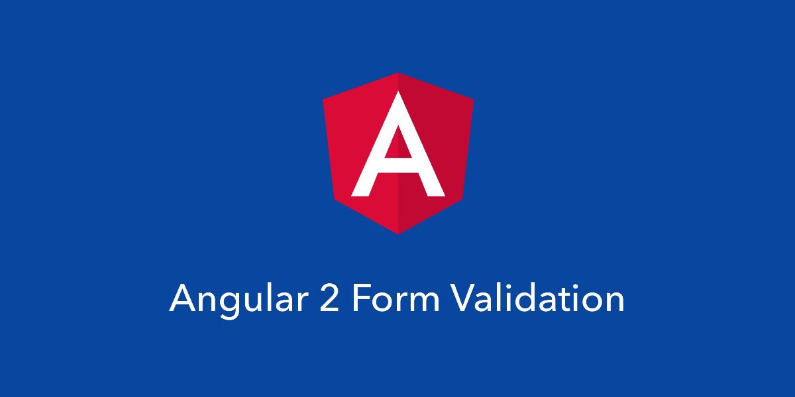

_By: Netanel Basal (Angular Expert) and Yaron Biton, misterBIT.co.il CTO_

A form creates a cohesive, effective, and compelling data entry experience. An Angular form coordinates a set of data-bound user controls, tracks changes, validates input, and presents errors.

In this article, we will look at how to include an async validation in your form.

For example, inside a signup form we often need to validate with the server that the username or email are not already in use.

Let’s kick start this thing:

<Embed src="https://gist.github.com/NetanelBasal/88c5bbcc2f5a67a92079f20c462227ad.js" aspectRatio={0.357} caption="" />

We start by creating a directive with the Directive decorator.

We want to be able to use this directive both in the model driven and template driven forms, so at the selector field, we define the CSS selector to be every element that has the asyncValidator attribute and the formControlName or ngModel attributes.

Next, we need to register the directive by pushing it to the global NG\_ASYNC\_VALIDATORS provider.

The NG\_ASYNC\_VALIDATORS is the providers array for asynchronous validators to be used.

We don’t want to override the provider, so we define the useExisting key.

If you are asking yourself what the hell this forwardRef is? You can read about this [here](http://blog.thoughtram.io/angular/2015/09/03/forward-references-in-angular-2.html) but in a nutshell, you need this because in ECMASCRIPT2015 classes are not hoisted to the top, so at this point (inside the metadata definition), the class is not yet defined.

Let’s continue with creating the AsyncValidator class that need to implements the Validator interface.

<Embed src="https://gist.github.com/NetanelBasal/67f19d13bfd359bcf2d870a32c5e492e.js" aspectRatio={0.357} caption="" />

The Validator interface has one required method: _validate_, In this case, because we are dealing with async validation the method signature is to return Promise or Observable.

Angular will call this function every time you make a change in your form field and be wait for the async function to be complete.

<Embed src="https://gist.github.com/NetanelBasal/fc07045d3f3e8c384fbd0890b5848dc2.js" aspectRatio={0.357} caption="" />

In the real world, we will have a server that verifies that the email is unique, but for the simplicity, we are going to fake this. Let’s start by showing the Promise way.

<Embed src="https://gist.github.com/NetanelBasal/371fd4a10fea2e3316cb6ab15729a923.js" aspectRatio={0.357} caption="" />

This code is straightforward; we are just returning a promise, and we are using the setTimeout function for faking async action.

If the validation pass we need to return null and if not we need to return an object with the error as the key.

So the only thing we need to do now is returning this promise from the validate method.

<Embed src="https://gist.github.com/NetanelBasal/aeb6a82fd79cd184b36f69e58856f859.js" aspectRatio={0.357} caption="" />

Now let’s see the Observable part, and be prepared to one gotcha!

<Embed src="https://gist.github.com/NetanelBasal/57e037331f2d3f666656fcb9185e5d46.js" aspectRatio={0.357} caption="" />

This code is also straightforward, when the email is unique we pass the null value and when not we pass the object with the error.

So let’s try it by returning this function from the validate method:

<Embed src="https://gist.github.com/NetanelBasal/9dcd0024973690cf3ce2543c943486df.js" aspectRatio={0.357} caption="" />

If you try to run this code, you will see that nothing is changing, the form status stays the same no matter what you type. You can guess why?

This is happening because **the observable never completes**, so Angular does not know when to change the form status. So **remember** your observable must to complete.

You can accomplish this in many ways, for example, you can call the _first()_ method, or if you are creating your own observable, you can call the complete method on the observer.

<Embed src="https://gist.github.com/NetanelBasal/12c0289aa4f4748f30480ae05b6f3690.js" aspectRatio={0.357} caption="" />

**Tip**: If you are working with observables, in this case you can leverage some useful methods here like:

<Embed src="https://gist.github.com/NetanelBasal/f90c559266fbe72f7b2a3b2ed5d2b1f9.js" aspectRatio={0.357} caption="" />

**Note**: Having a public API that checks if an email exist in your system, required sine server-side protection, or otherwise hackers may exploit it as a vulnerability.

You can play with the code — [plunker](https://plnkr.co/edit/Vo1Kf3uGPjHD1RuDrzrk?p=preview).

That’s all.

_☞_ **_Please tap or click “︎_**❤” _to help to promote this piece to others._
