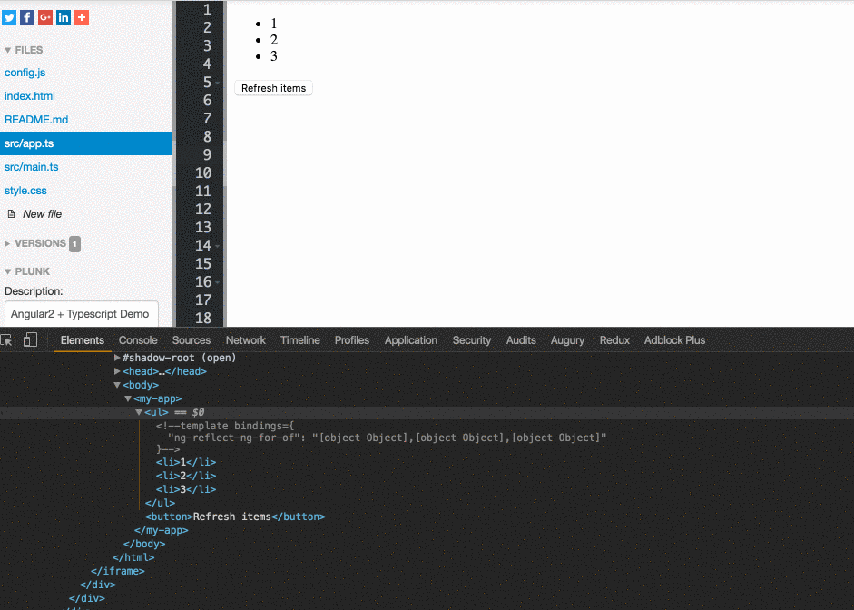
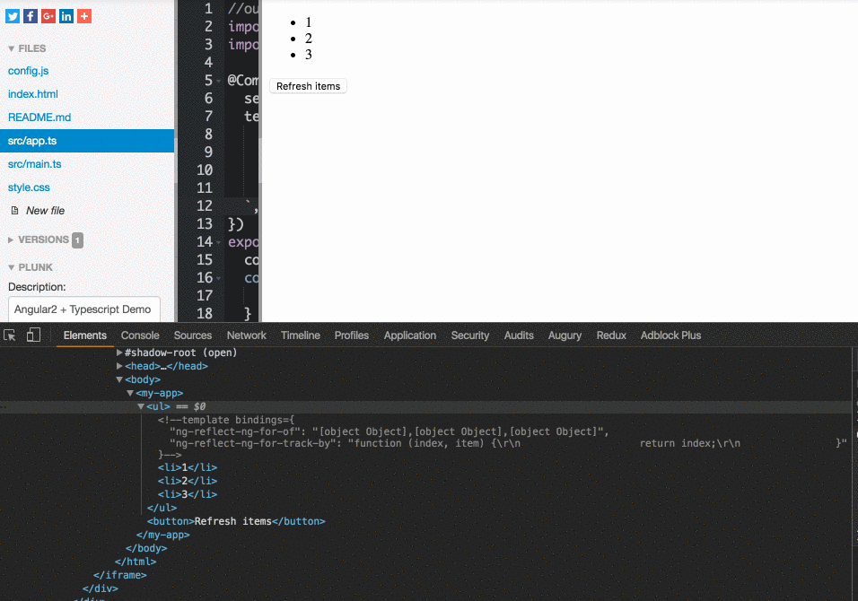

### The Problem:

When you need to iterate over a collection in Angular 2, you will probably use the **ngFor** directive that will instantiate a template once per item from the collection.

<Embed src="https://gist.github.com/NetanelBasal/6e64375b5e22d46b9caa82cb06016d7f.js" aspectRatio={0.357} caption="" />

If we need at some point to change the data in the collection, for example as a result of an API request, we have a problem because Angular can’t keep track of items in the collection and has no knowledge of which items have been removed or added.

As a result, Angular needs to remove all the DOM elements that associated with the data and create them again. That means a lot of DOM manipulations especially in a case of a **big** collection, and as we know, DOM manipulations are expensive.

**Note**: when I’m saying “change the data” I’m referring to replace the collection with new objects and not keeping the same reference.

Let’s see this in action:

### The Solution:

We can help Angular to track which items added or removed by providing a `trackBy` function. The `trackBy` function takes the index and the current item as arguments and needs to return the unique identifier for this item.

<Embed src="https://gist.github.com/NetanelBasal/099f5c45ffbe6b573b65abe6413ec519.js" aspectRatio={0.357} caption="" />

Now when you change the collection, Angular can track which items have been added or removed according to the unique identifier and create or destroy only the items that changed.

That’s all. you can play with the code [here](https://plnkr.co/edit/u4nbIJztVaRvEmCqTvCs?p=preview).

### **Things to not miss**:

[**🚀 Introducing Akita: A New State Management Pattern for Angular Applications**  
_Every developer knows state management is difficult. Continuously keeping track of what has been updated, why, and…_netbasal.com](https://netbasal.com/introducing-akita-a-new-state-management-pattern-for-angular-applications-f2f0fab5a8 "https://netbasal.com/introducing-akita-a-new-state-management-pattern-for-angular-applications-f2f0fab5a8")

[**NetanelBasal/spectator**  
_spectator - 👻 Angular Tests Made Easy 🤓_github.com](https://github.com/NetanelBasal/spectator "https://github.com/NetanelBasal/spectator")

_☞_ **_Please tap or click “︎_**❤” _to help to promote this piece to others._
