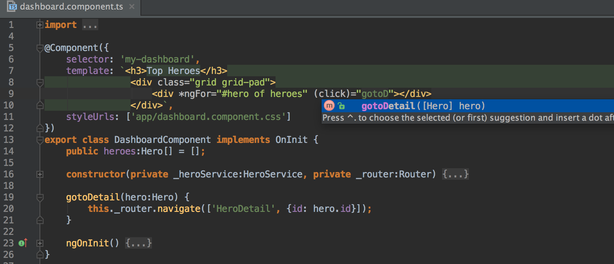

As developers, sometimes we need to render a list and let the user the ability to add more values to the list.

But many times we need to limit the list to be only with unique values.   
For example, imagine that the user fills a form where he needs to send an email to other users, we want the emails to be unique.

In Angular js you probably implement this something like this:

<Embed src="https://gist.github.com/NetanelBasal/760a766579ded6743c6017371a7158b5.js" aspectRatio={0.357} caption="" />

This code is fine, but with Angular 2 we can do better. We can use the new [**Set**](https://developer.mozilla.org/en-US/docs/Web/JavaScript/Reference/Global_Objects/Set) object introduced in ECMAScript2015 with the `ngFor` directive.

> Set objects are collections of values. You can iterate through the elements of a set in insertion order. A value in the Set may only occur once; it is unique in the Set’s collection.

Let’s see this in action:

<Embed src="https://gist.github.com/NetanelBasal/a053a8f9a571bcc27f18562b55e5380c.js" aspectRatio={0.357} caption="" />

Fun stuff!

### What? How? Why?

The `ngFor` directive accepts any object that implements the `Iterable` interface. You can read more about `[iterators](https://developer.mozilla.org/en/docs/Web/JavaScript/Guide/Iterators_and_Generators)` here.

So, for example, we can create our own `iterable` and just give it to the `ngFor` directive.

<Embed src="https://gist.github.com/NetanelBasal/bc952111ae99d78c6af32776982f0e4b.js" aspectRatio={0.357} caption="" />

And it just works.

But, wait, I was lying, not every object that implements the iterator interface. After digging into the source code I found this function:

<Embed src="https://gist.github.com/NetanelBasal/2b121b2b8606e6be8a283776aac8d46b.js" aspectRatio={0.357} caption="" />

From this function we can learn that we **can’t** `ngFor` on:

1.  String.
2.  Map.
3.  An object that is not Array.

By the way, the `[QueryList](https://angular.io/docs/js/latest/api/core/index/QueryList-class.html)` object is also `iterable` and works with `ngFor`.

That’s all!

_☞_ **_Please tap or click “︎_**❤” _to help to promote this piece to others._
