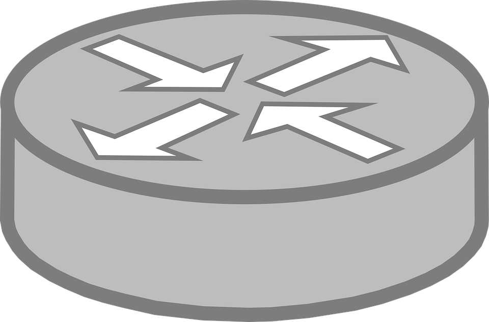

I want to share with you something that I discovered when going through the router source code.

The _router-outlet_ directive exposing two events:

1.  activate — emits any time a new component is instantiated.
2.  deactivate — emits when the component is destroyed.

For example:

```
<router-outlet
   (activate)='onActivate($event)'
   (deactivate)='onDeactivate($event)'>
</router-outlet>

export class AppComponent {

  onActivate(component) {
    // you have access to the component instance
  }

  onDeactivate(component) {
    // you have access to the component instance
  }

}
```

The only case that I can think of where it will be useful is if we need to add some global hook for all our routing components.

I am open to more ideas :)

_☞_ **_Please tap or click “︎_**❤” _to help to promote this piece to others._
