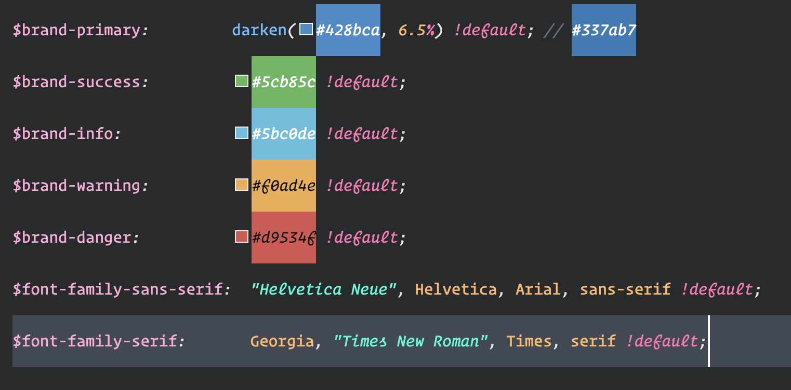
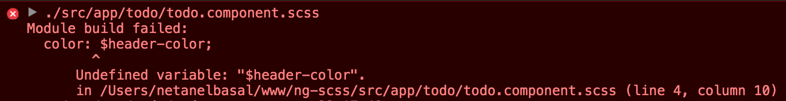

If you worked with a tool like SASS you probably used to have a global file with all your variables, like colors, fonts, etc.

For example:

```
$main-color: green;
$second-color: yellow;
```

The difference now when working with angular-cli and webpack, is that you don’t have access to the variables in a global way.

Let’s create `variables.scss` in our `src` directory:

```
$header-color: green;
```

Now let’s try to use the `variable` in our component.

```
// todo.component.scss

h1 {
  color: $header-color;
}
```

At this point you will get this error:



The solution is to import the `variables` file where you need to use it.

```
@import “../../variables.scss”;

h1 {
 color: $header-color;
}
```

**Note:** The path is relative to the component location.

I know it can be frustrating to write all the path shit especially when you have nested components, but you have a solution for this.

```
@import “~variables.scss”;

h1 {
 color: $header-color;
}
```

You just need to prepend them with a `~` to tell webpack that this is not a relative import.

The path will be resolved to this:

```
/Users/netanelbasal/www/ng-scss/src/variables.scss
```

**disclaimer:**  
Maybe this technique will work on every webpack project, but in this case, I am using angular-cli.

_Follow me on_ [_Medium_](https://medium.com/@NetanelBasal/) _or_ [_Twitter_](https://twitter.com/NetanelBasal) _to read more about Vue, Angular and JS!_


