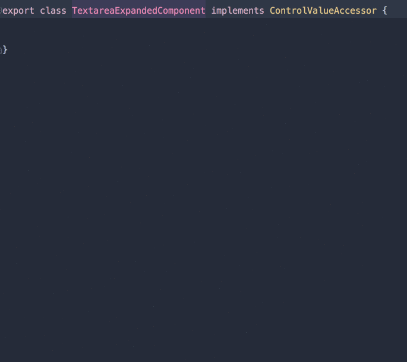
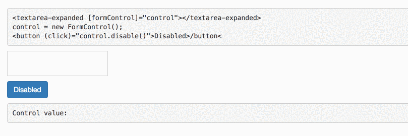

Imagine that you need to implement an auto-expand `textarea` for one of your forms.

You do not want to use methods like calculating the height on every key press, and you go with the _hacky_ solution — a simple `div` with a `contenteditable` attribute to achieve the same effect.

So you think naively that you can connect it to Angular forms like you usually do.

```
<div contenteditable="true" tabindex="1" 
      role="textarea" [formControl]="control"></div>
```

But then you get the error:

> No value accessor for form control with unspecified name attribute

What Angular wants to tell you is, hey, you want to work with me, but I have no idea how to access the value of your component.

For Angular to know how to access the value, we need to implement the `ControlValueAccessor` interface in our component.

As the name suggest, `ControlValueAccessor` tells Angular how to access the control value, you can think of it like a bridge between a `control` and a native element.

Let’s go over the methods we need to implement.

**_quick tip:_** If you work with smart IDE, you can save yourself some time by doing the following. ( `alt` + `enter` )



#### `writeValue` — model -> view

Write a new value to the element. Angular will call this method with the `value` in one of the following cases:

1.  When you instantiate a new `FormControl` .
2.  When you call `this.control.patchValue/setValue(value)`

In our case, we need to set the `textContent` property of our div to this `value`.

<Embed src="https://gist.github.com/NetanelBasal/a24d770a7781e6f9b93f317c95eecfd1.js" aspectRatio={0.357} caption="" />

#### `registerOnChange` — view -> model

Set the function to be called when the control receives a `change` event. Angular provides you with a `function` and asks you to call it whenever there is a change in your **component** with the new value so that it can update the control.

In our case, we need to listen to the `input` event and call this function with the new value.

<Embed src="https://gist.github.com/NetanelBasal/0186133dc6ac6d987eeb742d5a51f5d6.js" aspectRatio={0.357} caption="" />

The `registerOnTouched` method is the same as `registerOnChange` except that you should call her when the control receives a **touch** event.

#### setDisabledState —

This function is called when the control status changes to or from `DISABLED`. Depending on the value, it will enable or disable the appropriate DOM element.

Angular will call this method in one of the following cases:

1.  When you instantiate a new `FormControl` with the `disabled` property set to true. `FormControl({value: '', disabled: true})`
2.  When you call `control.disable()` or when you call `control.enable()` after your already called `control.disable()` at least once.

In our case, we need to add a `disabled` class to our `div` to simulate a disabled `textarea`.

<Embed src="https://gist.github.com/NetanelBasal/e8993bb34f024d1c519f0c79184877a9.js" aspectRatio={0.357} caption="" />

The last thing we have to do is register the component by pushing it to the global `NG_VALUE_ACCESSOR` provider.

<Embed src="https://gist.github.com/NetanelBasal/231e543b0d2ef780eb89091f4605e330.js" aspectRatio={0.357} caption="" />

At runtime, Angular calls all the elements that bound to this `token` and uses them to bind the model to the respective element.

We need to use `forwardRef` because in ES6 classes are not hoisted to the top, so at this point (inside the metadata definition), the class is not yet defined.

`multi: true` indicates that several elements of `NG_VALUE_ACCESSOR` can be bound to this provider.

**_Note_**_: You can implement only one_ **_custom_**  `_ControlValueAccessor_` _per component._



You can find the full source code [here](https://gist.github.com/NetanelBasal/5aa37369154283589ad3f00715158631).

If you want to see a real world example, you can read my article — [Leverage Structural Directives to Create Powerful Components in Angular](https://netbasal.com/leverage-structural-directives-to-create-powerful-components-in-angular-c95e3cfde789).

_Follow me on_ [_Medium_](https://medium.com/@NetanelBasal/) _or_ [_Twitter_](https://twitter.com/NetanelBasal) _to read more about Angular, Akita and JS!_

### 👂🏻 **Last but Not Least, Have you Heard of Akita?**

Akita is a state management pattern that we’ve developed here in Datorama. It’s been successfully used in a big data production environment for over seven months, and we’re continually adding features to it.

Akita encourages simplicity. It saves you the hassle of creating boilerplate code and offers powerful tools with a moderate learning curve, suitable for both experienced and inexperienced developers alike.

I highly recommend checking it out.

[**🚀 Introducing Akita: A New State Management Pattern for Angular Applications**  
_Every developer knows state management is difficult. Continuously keeping track of what has been updated, why, and…_netbasal.com](https://netbasal.com/introducing-akita-a-new-state-management-pattern-for-angular-applications-f2f0fab5a8 "https://netbasal.com/introducing-akita-a-new-state-management-pattern-for-angular-applications-f2f0fab5a8")[](https://netbasal.com/introducing-akita-a-new-state-management-pattern-for-angular-applications-f2f0fab5a8)
