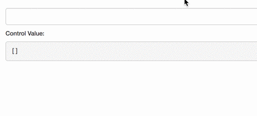

If you’ve worked with AngularJS, you probably remember the `ngModelController` [parsers](https://docs.angularjs.org/api/ng/type/ngModel.NgModelController) and [formatters](https://docs.angularjs.org/api/ng/type/ngModel.NgModelController) options. Parsers change how view values will be saved in the model and Formatters change how model values will appear in the view.

Unfortunately, Angular has not implemented this feature in the new version, but we can achieve the same result with `ControlValueAccessor`.

### `ControlValueAccessor`

> A `ControlValueAccessor` is a bridge between a control and a native element.

If you have no prior knowledge on this subject I encourage you to read my previous article — [Angular Custom Form Controls Made Easy](https://netbasal.com/angular-custom-form-controls-made-easy-4f963341c8e2).

In our example, we will allow the user to enter a list of emails separated by commas. What we want to achieve is:

1.  We want the **model** value to be an array of emails.
2.  We want the **view** value to be emails separated by commas.



Let’s create a custom form control to achieve the above result.

```
@Directive({
  selector: '[splitterControl]',
  providers: [ SPLITTER_VALUE_ACCESSOR ]
})
export class SplitterDirective implements ControlValueAccessor {
  onChange;

  constructor( private renderer : Renderer2, 
               private element : ElementRef ) {
  }

  writeValue( value : any ) : void {
    const element = this.element.nativeElement;
    this.renderer.setProperty(element, 'value', value.join(','));
  }

  registerOnChange( fn : any ) : void {
    this.onChange = fn;
  }

}
```

The `writeValue` method is the equivalent of AngularJS `$formatters` — model => view.

```
@Directive({
  selector: '[splitterControl]',
  providers: [ SPLITTER_VALUE_ACCESSOR ]
})
export class SplitterDirective implements ControlValueAccessor {
  onChange;

  constructor( private renderer : Renderer2, 
               private element : ElementRef ) {
  }

  @HostListener('input', [ '$event.target.value' ])
  input( value ) {
    this.onChange(value.split(',').filter(Boolean));
  }

  writeValue( value : any ) : void {
    const element = this.element.nativeElement;
    this.renderer.setProperty(element, 'value', value.join(','));
  }

  registerOnChange( fn : any ) : void {
    this.onChange = fn;
  }

}
```

The `onChange` method is the equivalent of AngularJS `$parsers` — view=> model.

Now we can use our custom form control.

```
<input splitterControl [formControl]="control" class="form-control">

control = new FormControl([ 'a@a.com' ]);
```

Remember, you can implement only one **custom** `ControlValueAccessor` per component.

That’s all.

_Follow me on_ [_Medium_](https://medium.com/@NetanelBasal/) _or_ [_Twitter_](https://twitter.com/NetanelBasal) _to read more about Angular, Vue and JS!_
