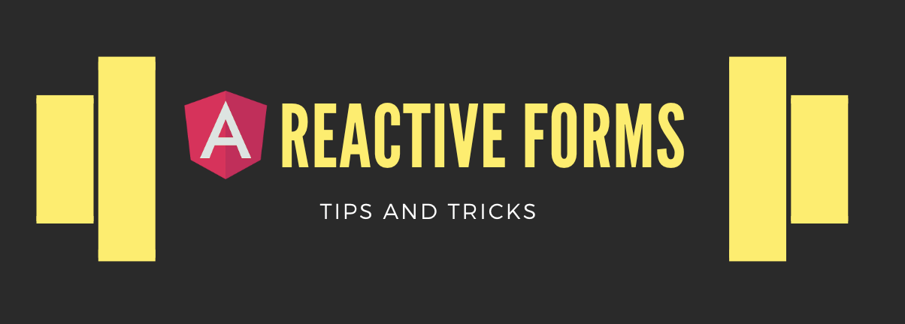
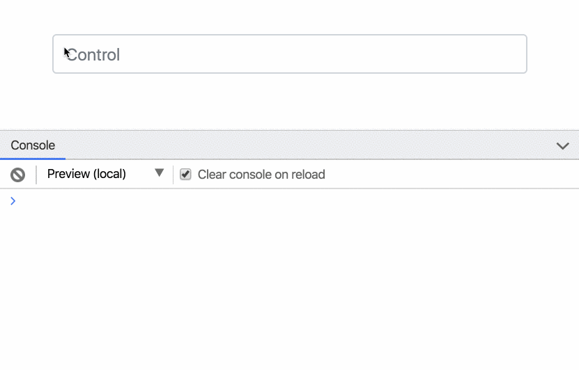

With every article I publish, my goal is to help you become a better and more confident coder.

Here are a couple of pointers to help shed some light on Angular Forms:

### Control Validation

By default, whenever a value of a `FormControl` changes, Angular runs the control validation process.

For example, if you have an input that is bound to a form control, Angular performs the control validation process for _every_ keystroke.

<Embed src="https://gist.github.com/NetanelBasal/9e316d104c77dbe1adecb0f67d1d47d8.js" aspectRatio={0.357} caption="" />

Let’s see this in action:

Now, imagine a form with complex validation requirements — updating such a form on every keystroke could become too costly. In addition to that, I find it very annoying to display an error message to the user when he hasn’t completed the action of entering the form data.

The way we get around this is by using the `updateOn` property. We can tell Angular that we only want to run the validation function upon `submit` or `blur`. As we saw, the default option is upon `change`.

<Embed src="https://gist.github.com/NetanelBasal/9cc294d59fa8661bbcf3faf5eb23a967.js" aspectRatio={0.357} caption="" />

We can also apply this option to a `formGroup` or a `formArray`.

---

Ok, that’s great. But let’s say we still want to run our validators whenever form control’s data changes, how can we optimize them?

In such a case we don’t have to use the control validator mechanism, we can create an alternative which we can fully control ourselves.

Luckily, every control exposes a `valueChanges` observable that we can take advantage of, and use RxJS to do some more powerful stuff. For example, we can add a `debounce` to our control.

<Embed src="https://gist.github.com/NetanelBasal/cce51a297f5b6079879628bf8267fd6a.js" aspectRatio={0.357} caption="" />

And this is only one simple example. We can use more powerful operators to perform advanced cross-control validations like `merge`, `combineLatest`, etc., so keep that in mind.

**I also wanted to mention that I’m against** [**premature optimization**](http://wiki.c2.com/?PrematureOptimization)— you should always prefer readability and reusability, and only apply optimizations when you think you may need them.

---

There might be cases when we don’t want to invalidate the form just because a single control is invalid. I haven’t come across such a case, but maybe you have.

In such a case the message you’re trying to convey to the user is: “this value isn’t valid, but it doesn’t mean the form can’t be submitted”.

In this instance we can set the `onlySelf` property to true, which means that each change only affects the control itself alone, and not its parents.

<Embed src="https://gist.github.com/NetanelBasal/cf5d72f3fb5b3c582eec911116878af5.js" aspectRatio={0.357} caption="" />

### Preventing Infinite Loops

In the process of setting up our form controls, we might inadvertently cause infinite loops.

For example, if on the one hand we listen to the store’s changes and update the form accordingly, and on the other hand we listen to the form’s value changes and update the store.

<Embed src="https://gist.github.com/NetanelBasal/3b487f1615419121573382914eec104f.js" aspectRatio={0.357} caption="" />

In order to avoid the above situation, we can tell Angular not to emit the `valueChanges` event whenever we update the form.

<Embed src="https://gist.github.com/NetanelBasal/e451fdce23ef4bd263dbe1002bff47da.js" aspectRatio={0.357} caption="" />

And now we’re good to go. It is worth noting that most of a control’s methods support this option, such as `setValue()`, `reset(), updateValueAndValidity()`, etc.

### Control Disabling

As you may know, when we need to disable or enable a control we can call the `control.disable()` or `control.enable()` methods.

That’s helpful, but sometimes we want to tell Angular that this control is `disabled` on the initialization face. We can achieve this by passing an object to our `FormControl` constructor.

<Embed src="https://gist.github.com/NetanelBasal/1e452f627caf8ac8b36cb69061625ab3.js" aspectRatio={0.357} caption="" />

Pay attention that we must also pass the `value` property; otherwise Angular assumes that we want the control’s value to be `{ disabled: true }`.

---

My next tip is something I think many people haven’t noticed yet. Whenever we call a control’s `disable()` or `enable()` methods, Angular triggers the `valueChanges` event.

Yes, it may surprise you because the “value” didn’t change, but this is how it works.

<Embed src="https://gist.github.com/NetanelBasal/42877265ecff6e0cfa907fd16719bf72.js" aspectRatio={0.357} caption="" />

There are times when we want to prevent this behavior from occurring.

Let’s say we need to update the store upon form’s value changes. This behavior would cause redundant updates, since we’d also update the store whenever the control disability status changed.

Luckily as we mentioned before there is an easy fix, we can add `{ emitEvent false }` to the current method:

<Embed src="https://gist.github.com/NetanelBasal/77e5292e732253d22e93114aad435ea0.js" aspectRatio={0.357} caption="" />

---

When we want to get our `FormGroup` value we usually call the `value` property. For example:

<Embed src="https://gist.github.com/NetanelBasal/be1923c9e504ae1356a8c20aaec9d040.js" aspectRatio={0.357} caption="" />

But there’s one catch there. The `value` property will omit controls that are disabled. So, in the above example, we’ll only get the `email` control value.

In most cases, this is not the desired behavior. In order to get the complete form’s values, we can use the `FormGroup.getRawValue()` method.

### Control Getters and Setters

I want to talk about a common mistake that I see in people’s code examples, especially on Stackoverflow. When they need to add a new control, they assign it directly to the parent’s controls property:

<Embed src="https://gist.github.com/NetanelBasal/4eacd21d265ece705c36b9ee3b806c25.js" aspectRatio={0.357} caption="" />

Please don’t do this. Instead, use the `addControl()` method, since it performs multiple required tasks for us under the hood:

<Embed src="https://gist.github.com/NetanelBasal/c8d71d243b42bd56e20d868589f00115.js" aspectRatio={0.357} caption="Angular source code" />

---

Another thing I want to talk about is obtaining a reference to a form control. This is more of a personal stylistic preference, but I don’t like to get it from the group’s controls property:

<Embed src="https://gist.github.com/NetanelBasal/80b36f636df351785d925df00068cc65.js" aspectRatio={0.357} caption="" />

Angular provides the group with a `get()` method, and I find it to be a more preferable option.

<Embed src="https://gist.github.com/NetanelBasal/1772f3f055a28d783e0dee4c0c2b5908.js" aspectRatio={0.357} caption="" />

Another reason to prefer this — the Angular team might opt to change the `FormGroup` structure in the future, and if we use the `controls` property directly, it might lead to a breaking change, whereas the `get()` method could adjust to reflect the new structure.

This might be why Angular provides us with the `get()` method, but hey, maybe it’s just me.

### Using FormBuilder

There are times when we need to create a large form structure. In this case, the code can rapidly become repetitive and full of boilerplate. For example:

<Embed src="https://gist.github.com/NetanelBasal/dd4df81d213b9c2faf7de553b030ad2a.js" aspectRatio={0.357} caption="" />

In reality, it might be even larger than that, but you get the point. In order to make our life easier, Angular provides us with the `FormBuilder` service, which frees us from adding boilerplate. I think it’s a better option, as it enables much cleaner code.

<Embed src="https://gist.github.com/NetanelBasal/0cee3190cfa9774c51af1edde8241bb4.js" aspectRatio={0.357} caption="" />

That’s it 😀

### Additional Resources

[**Three Ways to Dynamically Alter your Form Validation in Angular**  
_Dynamic form validation in Angular_netbasal.com](https://netbasal.com/three-ways-to-dynamically-alter-your-form-validation-in-angular-e5fd15f1e946 "https://netbasal.com/three-ways-to-dynamically-alter-your-form-validation-in-angular-e5fd15f1e946")

[**Attribute Directives ❤ Angular Forms**  
_In this article, we’ll examine creating Angular Directives that interact with the Angular Forms controls._netbasal.com](https://netbasal.com/attribute-directives-angular-forms-b40503643089 "https://netbasal.com/attribute-directives-angular-forms-b40503643089")

[**Show form errors on submit in Angular**  
_If you are like me, you probably think that the best point to show to users the form errors is when the user submits…_netbasal.com](https://netbasal.com/show-form-errors-on-submit-in-angular-a6a10cd3e04b "https://netbasal.com/show-form-errors-on-submit-in-angular-a6a10cd3e04b")

[**Make Your Angular Form’s Error Messages Magically Appear**  
_In this article, we’re going to learn how to develop a generic method that displays validation errors in Angular’s…_netbasal.com](https://netbasal.com/make-your-angular-forms-error-messages-magically-appear-1e32350b7fa5 "https://netbasal.com/make-your-angular-forms-error-messages-magically-appear-1e32350b7fa5")

[**Angular Custom Form Controls Made Easy**  
_Imagine that you need to implement an auto-expand textarea for one of your forms._netbasal.com](https://netbasal.com/angular-custom-form-controls-made-easy-4f963341c8e2 "https://netbasal.com/angular-custom-form-controls-made-easy-4f963341c8e2")

### **😍 Last but Not Least, Have you Heard of Akita?**

Akita is a state management pattern that we’ve developed here in Datorama. It’s been successfully used in a big data production environment, and we’re continually adding features to it.

Akita encourages simplicity. It saves you the hassle of creating boilerplate code and offers powerful tools with a moderate learning curve, suitable for both experienced and inexperienced developers alike.

I highly recommend checking it out.

[**Form Fatale: How Akita’s Form Manager Can Do Away with Complex Multistep Form Logic in Angular**  
_Akita’s Angular Form Manager_netbasal.com](https://netbasal.com/form-fatale-how-akitas-form-manager-can-do-away-with-complex-multistep-form-logic-in-angular-329a557cc68 "https://netbasal.com/form-fatale-how-akitas-form-manager-can-do-away-with-complex-multistep-form-logic-in-angular-329a557cc68")

[**🚀 Introducing Akita: A New State Management Pattern for Angular Applications**  
_Every developer knows state management is difficult. Continuously keeping track of what has been updated, why, and…_netbasal.com](https://netbasal.com/introducing-akita-a-new-state-management-pattern-for-angular-applications-f2f0fab5a8 "https://netbasal.com/introducing-akita-a-new-state-management-pattern-for-angular-applications-f2f0fab5a8")

_Follow me on_ [_Medium_](https://medium.com/@NetanelBasal/) _or_ [_Twitter_](https://twitter.com/NetanelBasal) _to read more about Angular, Akita and JS!_
