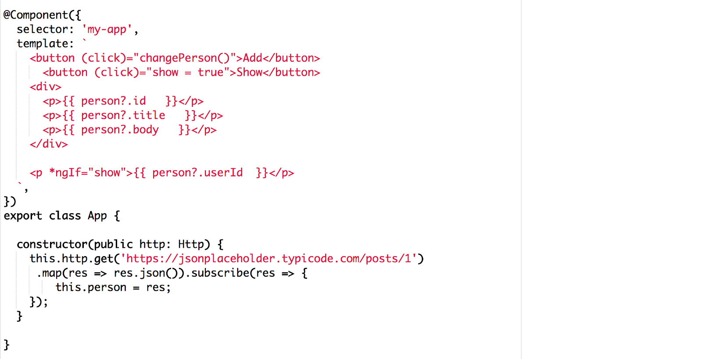
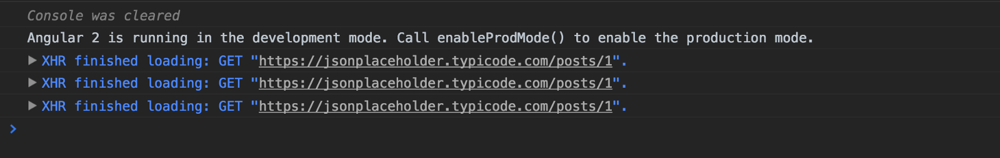
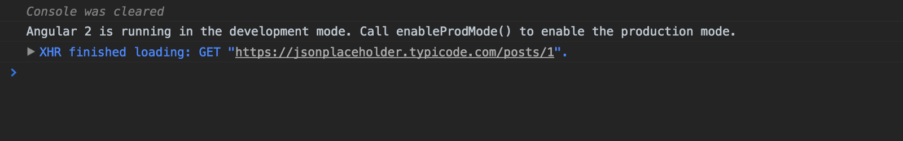

I want to talk about something that bothers me. I see a lot of articles that talks about how to solve the multiple HTTP requests problem when using the async pipe. If you don’t know what I’m talking about, let me refresh your memory.

When working with the async pipe and Observable, you can get to a situation that you have multiple HTTP requests. For example:

<Embed src="https://gist.github.com/NetanelBasal/62dfdef652f8fdf5eb6e32cb706e6fcf.js" aspectRatio={0.357} caption="" />



You can see that we are firing three requests to the server. This is happening because our Observable is cold and every use of the async pipe creates new execution.

#### The current solution that people suggest:

<Embed src="https://gist.github.com/NetanelBasal/a3212f3113110d00b35206acd9dcfc42.js" aspectRatio={0.357} caption="" />

Just use the _share_ operator, which internally call to publish().refCount().

But then you have a situation of future subscriber like this:

```
<p *ngIf=”show”>{{ (person | async)?.userId }}</p>
```

Which in this case _share_ does not help you and when you will show the element one more HTTP request will fire. So to solve this problem you need to use the _publishReplay_ operator and call the _connect_ method.

At this point, I am asking myself:

> Why???? This is the right thing to do??

When you have a single event, just use **promise**.

In most of the cases, we just need to GET data from the server and display the data, and we are done.

Let’s fix the multiple HTTP requests problem with a promise:

<Embed src="https://gist.github.com/NetanelBasal/05e67f74d8feb78860b9bfe15842aadc.js" aspectRatio={0.357} caption="" />



Great! Now it does not matter when, how and why you always get the latest value without firing another HTTP request.

#### The second solution — don’t use the async pipe:

<Embed src="https://gist.github.com/NetanelBasal/298fbdd8e0eede0ad9bb8efb7101271d.js" aspectRatio={0.357} caption="" />

### Conclusion:

Rx is the most powerful library that I know when it comes to asynchronous operations. But you don’t always need to use Observables. Promises are **still** here, and it’s OK to use them when you have a single event as we saw in this article.

That’s all!


_☞_ **_Please tap or click “︎_**❤” _to help to promote this piece to others._
