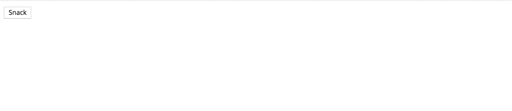
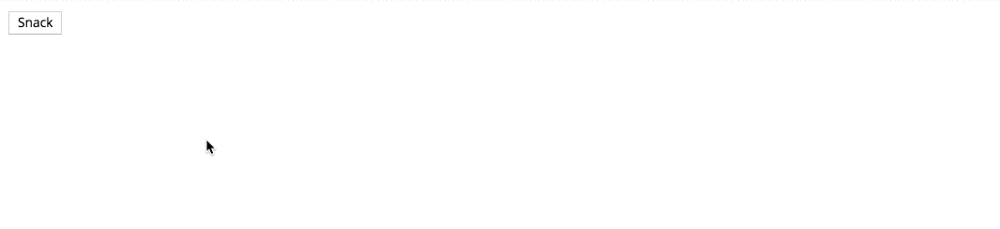
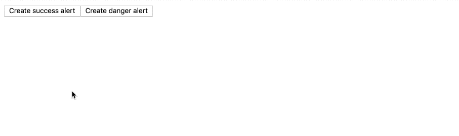

In this article, we’ll learn two different techniques to animate a dynamic component in Angular as it enters and leaves.

In the first example, we leverage pure CSS animations to create the animation effects. Let’s build a snack bar to demonstrate.

Let’s start with the component.

<Embed src="https://gist.github.com/NetanelBasal/87f9087194416e0e8336328f97be935b.js" aspectRatio={0.357} caption="" />

The component implementation is straightforward. We expect to get the content as input and display it in the snack bar container.

Let’s add some styles.

<Embed src="https://gist.github.com/NetanelBasal/ee61b37d21a0016b924ca1cf6a5f809c.js" aspectRatio={0.357} caption="" />

Now, we can continue to create the functionality that will dynamically generate the snack bar component and append it to the body.

<Embed src="https://gist.github.com/NetanelBasal/f80796df89392456539e95ea36d50a9f.js" aspectRatio={0.357} caption="" />

The `resolveComponentFactory()` method takes a component and returns a `ComponentFactory`. You can think of `ComponentFactory` as an object that knows how to create a component. Once we have a factory, we can use the `create()`method to create a `componentRef` instance, passing the current injector.

A `componentRef` exposes a reference to the native DOM element, which we then append to the body.

In this stage, we can call the `open()` method. The result — we’ll get a working snack bar with entering animation.

Now, let’s move on to closing the snack bar. First, we need to add the closing animation.

<Embed src="https://gist.github.com/NetanelBasal/2e5017b7887154606e13483bfcfd9d93.js" aspectRatio={0.357} caption="" />

Listen for the closing click event and apply the leaving animation to the snack bar element.

<Embed src="https://gist.github.com/NetanelBasal/4ca2588682129cc67fa4ec59d278d09e.js" aspectRatio={0.357} caption="" />

In this stage, we’ll see the leaving animation, but the component will still be visible. The key point here is to wait for the animation to end and then call the `componentRef.destroy()` method and remove the DOM element from the body.

To achieve this, we can use the browser `animationend` event — the `animationend` event occurs when a CSS animation is completed.

<Embed src="https://gist.github.com/NetanelBasal/e8ac3993229a692c1fd86cd44dfba78e.js" aspectRatio={0.357} caption="" />

One of the properties of the `animationend` event is the name of the current animation. We can check to see if the current animation is the `snackbarOut` animation. If it is, we can emit the `afterClose` event.

Now, in the `open()` method, we can subscribe to the `afterClose` event and destroy the component, **but only after the animation ends**.

<Embed src="https://gist.github.com/NetanelBasal/7d1c1cbcba871e124c600cb56a086433.js" aspectRatio={0.357} caption="" />

We can also take it further, change it to be auto dismissible and accept the animation duration from the consumer.

<Embed src="https://gist.github.com/NetanelBasal/4e4abf0bc95c3eedbd7f6e9c4f56344e.js" aspectRatio={0.357} caption="snackbar.component" />

<Embed src="https://stackblitz.com/edit/ngsnackbar?embed=1" aspectRatio={undefined} caption="" />

---

Our second example uses the same technique, but this time with Angular animations. I won’t expand on this too much, because it’s basically the same flow as the first example.

It’s just a matter of changing the animation state according to the component status, listening for the animation done event, and destroying the component.

Here is a full working example:

<Embed src="https://stackblitz.com/edit/angular-dynamically-creating-components-animations-ng?embed=1" aspectRatio={undefined} caption="" />

### 👂🏻 **Last but Not Least, Have you Heard of Akita?**

Akita is a state management pattern that we’ve developed here in Datorama. It’s been successfully used in a big data production environment for over seven months, and we’re continually adding features to it.

Akita encourages simplicity. It saves you the hassle of creating boilerplate code and offers powerful tools with a moderate learning curve, suitable for both experienced and inexperienced developers alike.

I highly recommend checking it out.

[**🚀 Introducing Akita: A New State Management Pattern for Angular Applications**  
_Every developer knows state management is difficult. Continuously keeping track of what has been updated, why, and…_netbasal.com](https://netbasal.com/introducing-akita-a-new-state-management-pattern-for-angular-applications-f2f0fab5a8 "https://netbasal.com/introducing-akita-a-new-state-management-pattern-for-angular-applications-f2f0fab5a8")

_Follow me on_ [_Medium_](https://medium.com/@NetanelBasal/) _or_ [_Twitter_](https://twitter.com/NetanelBasal) _to read more about Angular, Akita and JS!_
