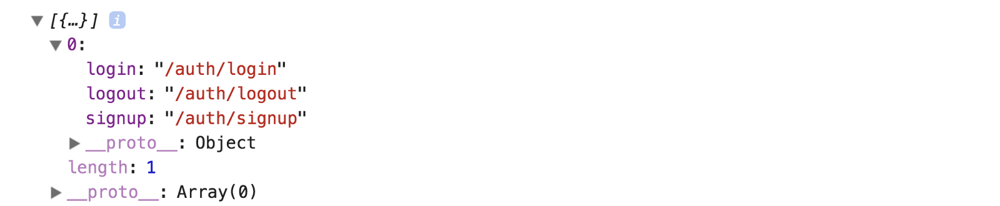
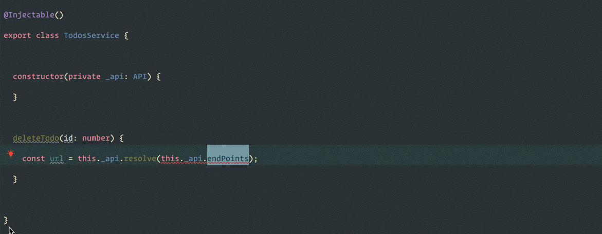

In almost every application there is a file where we throw all our application endpoints. If you are working with Angular, it probably looks something like this:

<Embed src="https://gist.github.com/NetanelBasal/f7192db6b417ae164d8efc620e8d00bc.js" aspectRatio={0.357} caption="" />

At first glance, everything looks fine, but as the application grows, so does this file, creating a couple problems.

We are violating the one single responsibility. We are exposed to merge conflicts, our endpoints are not portable, and it becomes difficult to find the endpoint location in the file.

We need to assign responsibility to the module in charge, so each module is responsible for exposing its endpoints.

Then we can aggregate and join the entire endpoints in our API service.

Let’s see how we can do this with the help of Angular Dependency Injection and the `multi` option.

### Create the API Service

First, we need to create the service responsible for performing aggregation and expose application endpoints.

<Embed src="https://gist.github.com/NetanelBasal/9c3399c153596e88508c612db00369e3.js" aspectRatio={0.357} caption="api.service.ts" />

We have an `InjectionToken` that will represent each endpoint. Now let’s see how we can fill the `END_POINTS` token.

### Create the Auth Module

Each module needs to create **two additional files**.

<Embed src="https://gist.github.com/NetanelBasal/317c9c8520c6b600101978d6436c85e3.js" aspectRatio={0.357} caption="auth.api.ts" />

As the name suggests, this file will be responsible for the `Auth` endpoints.

<Embed src="https://gist.github.com/NetanelBasal/8d356046216d4e5fd4c0980282328b17.js" aspectRatio={0.357} caption="auth.d.ts" />

We still want to use the power of typescript by leverage typescript [declaration merging](https://www.typescriptlang.org/docs/handbook/declaration-merging.html).

> At the most basic level, the merge mechanically joins the members of both declarations into a single interface with the same name.

Now, typescript will merge each endpoint to the `EndPoints` interface so that we can get auto-completion.

Next, we provide the `Auth` endpoints to Angular DI in the corresponding module, which in our case is the `Auth` module.

<Embed src="https://gist.github.com/NetanelBasal/87bae30b127577de26ceedd51d738227.js" aspectRatio={0.357} caption="auth.module.ts" />

You can think of the `multi` option as an array. Each time we add a new provider, Angular pushes the provider into the array.

So if we go back to our API service and log the `_endpoints` property, we will see we have one item in the array — the `Auth` endpoints.

Great, now we just need to flat our `endpoints` to one big object.

<Embed src="https://gist.github.com/NetanelBasal/238b96e68646d52f3b28d70feda5e9df.js" aspectRatio={0.357} caption="api.service.ts" />

Finally, let’s create a simple method that will help us to resolve the url.

<Embed src="https://gist.github.com/NetanelBasal/d169a5a4f0f8b7ce8be1203f939f012b.js" aspectRatio={0.357} caption="api.service.ts" />

Now, we can use the API service in every service we need. For brevity, I’ve already added a `Todos` module with the same **process** we described.

For example:

### Summary

In this article we witnessed the power of Angular DI and how we can take advantage of the `multi` option. With this change we are less exposed to merge conflicts and the modules are portable with their API’s, allowing us to use them with other applications. We also avoid violating the one single responsibility, and our code is better organized.

_Follow me on_ [_Medium_](https://medium.com/@NetanelBasal/) _or_ [_Twitter_](https://twitter.com/NetanelBasal) _to read more about Angular, Vue and JS!_
