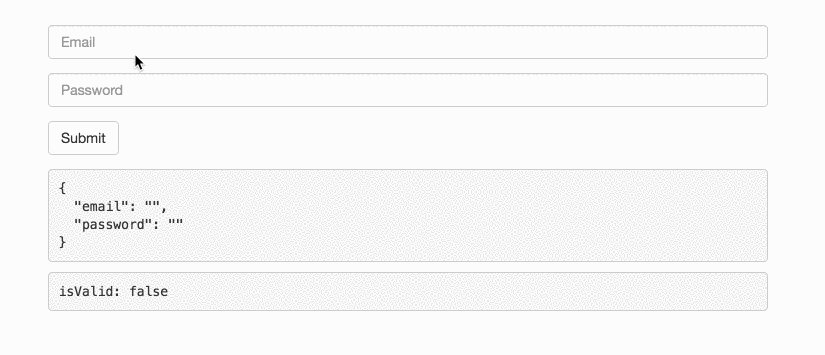

Angular version 5 is about to drop and with her a new wave of features. In this article, I want to expatiate on a handy feature that was added to the Angular Forms API — the `updateOn` option.

By default, whenever a value of a `FormControl` changes, Angular runs the control validation process.

So, for example, if you have an input that is bound to a form control, Angular performs the control validation process for _every_ keystroke.

#### The Problem

Imagine a form with heavy validation requirements, updating on every keystroke can sometimes be too expensive.

Luckily, Angular version 5 provides a new option that improves performance by delaying form control updates until the `blur` or the `submit` event.

#### Reactive Forms Usage

To use it with Reactive Forms, we need to set the `updateOn` option to `blur` or `submit` when we instantiate a new `FormControl` ( the default option is `change` )

```
this.email = new FormControl(null, { updateOn: 'blur' });
```

Or with validators:

```
this.email = new FormControl(null, {
   validators: Validators.required,
   updateOn: 'blur'
});
```

When working with `FormGroup` or `FormArray` we can use it to set the default `updateOn` values for all the form's child controls. For example:

```
this.login = new FormGroup({
   email: new FormControl(),
   password: new FormControl()
}, { updateOn: 'submit' });
```

In the above example, both the controls will be updated on submit unless one of the children explicitly specified a different `updateOn` value. For example:

```
this.login = new FormGroup({
   email: new FormControl(null, {
      validators: Validators.required,
      updateOn: 'blur'
   }),
   password: new FormControl(null, [Validators.required])
}, {updateOn: 'submit'})
```

#### Forms Module Usage

To use it with the Forms Module, we need to set the `updateOn` option to `blur` or `submit` in `ngModelOptions`. For example:

```
<input type="email" ngModel [ngModelOptions]="{updateOn: 'submit'}">
```

We can also use it to set the default `updateOn` values for all the form's child  
controls. For example:

```
<form [ngFormOptions]="{updateOn: 'submit'}">
  <input name="email" ngModel type="email"> 
  <input name="password" ngModel type="email">
</form>
```

In the above example, both the controls will be updated on submit unless one of the children explicitly set its own `updateOn` value in `ngModelOption`. For example:

```
<form [ngFormOptions]="{updateOn: 'submit'}">
  <input name="email" ngModel 
         type="email" 
         [ngModelOptions]="{updateOn: 'blur'}"> 
  <input name="password" ngModel type="email">
</form>
```

<Embed src="https://stackblitz.com/edit/angular5-rc-87gsw6?embed=1" aspectRatio={undefined} caption="" />

Thanks to [Kara Erickson](https://twitter.com/karaforthewin) for her detailed commits messages.

_Follow me on_ [_Medium_](https://medium.com/@NetanelBasal/) _or_ [_Twitter_](https://twitter.com/NetanelBasal) _to read more about Angular, Vue and JS!_
