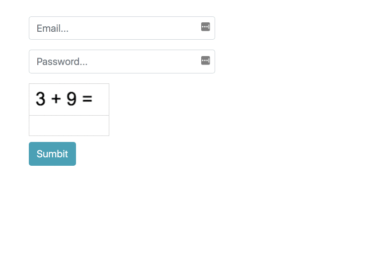

Last week I came across an [article](https://kevv.net/you-probably-dont-need-recaptcha/) that talks about how we (probably) don’t need ReCAPTCHA. Although I have already written a detailed [article](https://netbasal.com/how-to-integrate-recaptcha-in-your-angular-forms-400c43344d5c) about how to integrate ReCAPTCHA in Angular, inspired by this article, I decided to create a math Captcha and share the result with you.

Let’s get started.

### Create the Captcha Component

We want our captcha component to integrate with Angular forms, so first, let’s implement the `ControlValueAccessor` interface:

We have implemented the three methods that the `ControlValueAccessor` requires. In our case, we don’t care about the `writeValue()` method, so we leave it empty. If you want to learn more about this topic, refer to the following article:

[**Angular Custom Form Controls Made Easy**  
_Imagine that you need to implement an auto-expand textarea for one of your forms._netbasal.com](https://netbasal.com/angular-custom-form-controls-made-easy-4f963341c8e2 "https://netbasal.com/angular-custom-form-controls-made-easy-4f963341c8e2")

Next, let’s create the component’s template. In order to display the question, we’ll use canvas. This will make sure it will not be present in the DOM, thus avoiding robots from grabbing it.

Now, let’s grab a reference to the canvas element from the component and draw the question:

The `createCaptcha()` method is straightforward. It generates two random numbers, and draws them by using the `fillText` canvas method. We also save the question’s answer, so that we can validate that against the user’s input.

Let’s finish by implementing the validation part. There are many ways to add custom validation to a form control, but in our case, we want the validation to be baked into in the component.

To do so, we’ll register our component to the `NG_VALIDATORS` provider, and implement the `validate()` method:

The validate method will be called with the `FormControl` instance upon each change detection cycle. With that, we have the opportunity to check the current control value against the question’s answer. If it doesn’t match, we return an `error` object, which will mark the current control as invalid.

Now, we’re ready to use our captcha component:

We can [export](https://netbasal.com/show-form-errors-on-submit-in-angular-a6a10cd3e04b) the `ngForm` directive to a local variable and use its `submitted` property as an indication to know whether the form is submitted. If it is, and the captcha is invalid, we show the error.

### 🚀 **Have You Tried Akita Yet?**

One of the leading state management libraries, Akita has been used in countless production environments. It is constantly being developed and improved.

Whether it is entities arriving from the server or UI state data, Akita has custom-built stores, powerful tools, and tailor-made plugins, which all help to manage the data and negate the need for massive amounts of boilerplate code. We/I highly recommend that you try it out.

[**🚀 Introducing Akita: A New State Management Pattern for Angular Applications**  
_Every developer knows state management is difficult. Continuously keeping track of what has been updated, why, and…_netbasal.com](https://netbasal.com/introducing-akita-a-new-state-management-pattern-for-angular-applications-f2f0fab5a8 "https://netbasal.com/introducing-akita-a-new-state-management-pattern-for-angular-applications-f2f0fab5a8")

[**10 Reasons Why You Should Start Using Akita as Your State Management Solution**  
_State management is ubiquitous in web applications, be they big or small. One of the notable solutions in this field is…_engineering.datorama.com](https://engineering.datorama.com/10-reasons-why-you-should-start-using-akita-as-your-state-management-solution-66b63d033fec "https://engineering.datorama.com/10-reasons-why-you-should-start-using-akita-as-your-state-management-solution-66b63d033fec")

_Follow me on_ [_Medium_](https://medium.com/@NetanelBasal/) _or_ [_Twitter_](https://twitter.com/NetanelBasal) _to read more about Angular, Akita and JS!_

You can play with the source code [here](https://ng-run.com/edit/JJZry1L2aKym3YoUCiSL?open=app%2Fapp.component.html).
