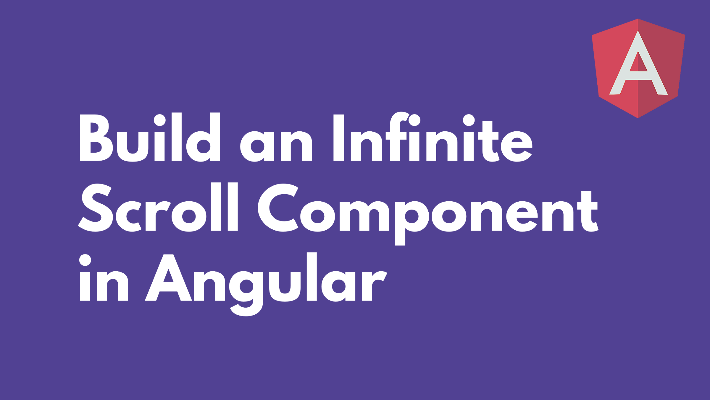

Building SPAs, we sometimes come across the need to display data using the technique of infinite scrolling — i.e., continuously loading data as the user scrolls down the page.

Ever since the [Intersection Observer API](https://developer.mozilla.org/docs/Web/API/Intersection_Observer_API) was added to browsers, building a reusable infinite scroll component has never been easier. Let’s learn how we can create such a component using this API.

Note that we’re not going to dive into the Intersection Observer API, so if you’re not familiar with it, I recommend reading [this](https://www.smashingmagazine.com/2018/01/deferring-lazy-loading-intersection-observer-api/) article beforehand.

### Creating the Component

The main concept is to place an **observable element** at the end of a list of displayed items, in order to add more data when the user reaches the bottom of that list.

<Embed src="https://gist.github.com/NetanelBasal/e4d131aba8cbffe7ce34985cb8047023.js" aspectRatio={0.357} caption="" />

We want to make as it flexible as possible, so we let our consumers pass any template they want using `ng-content`. Below it, we add an anchor element which will serve as the target element that we watch.

Let’s create the [Intersection Observer](https://developer.mozilla.org/docs/Web/API/Intersection_Observer_API):

<Embed src="https://gist.github.com/NetanelBasal/b6a9bd48a60cdc8ac4c15965001061f1.js" aspectRatio={0.357} caption="" />

First, we create a new `IntersectionObserver` which receives `entries` as its argument. This function will be called whenever the observed element enters the viewport.

We can check the element’s visibility status by looking at the `isIntersection` property. If `isIntersecting` is true, the target element has become at least as visible as the threshold that was passed. The default threshold is 0, meaning as soon as even one pixel is visible, the callback will be run.

Next, we call the `observe()` method, passing it the anchor element. This will initiate the observation of this element.

#### 🦊 Support Scrollable Containers

The `root` property indicates the element that is used as the viewport for checking the visibility of the target. When set to `null` it defaults to the browser viewport.

There are times when we’ll need to have a scrollable container, and then we’d want that container to act as the `root` element. Let’s support this functionality:

<Embed src="https://gist.github.com/NetanelBasal/bb7a9320d6d356fb4ea81709224256b4.js" aspectRatio={0.357} caption="" />

We add a check to see whether the current host element is a scrollable container. If it is, we set it as the `root` element.

Finally, we don’t want memory leaks in our application, so we’ll disconnect the observer when the component destroyed:

<Embed src="https://gist.github.com/NetanelBasal/6d8f57705445197a7a8952fd6d225930.js" aspectRatio={0.357} caption="" />

It’s as simple as that.

Let’s see how we use it:

<Embed src="https://gist.github.com/NetanelBasal/0f5d932406d0db5323ea4f4f9cfd90e5.js" aspectRatio={0.357} caption="" />

Or with a scrollable container:

<Embed src="https://gist.github.com/NetanelBasal/c1a5a911477f32ca063e6b54065ad6df.js" aspectRatio={0.357} caption="" />

### Browser Support

The Intersection Observer API works in most major browsers. If you need to support old browsers such as IE, you can load a [polyfill](https://github.com/w3c/IntersectionObserver/tree/master/polyfill) or fallback to the scroll event in runtime.

### 🚀 **Have You Tried Akita Yet?**

One of the leading state management libraries, Akita has been used in countless production environments. It’s constantly developing and improving.

Whether it’s entities arriving from the server or UI state data, Akita has custom-built stores, powerful tools, and tailor-made plugins, which help you manage the data and negate the need for massive amounts of boilerplate code. We/I highly recommend you try it out.

[**🚀 Introducing Akita: A New State Management Pattern for Angular Applications**  
_Every developer knows state management is difficult. Continuously keeping track of what has been updated, why, and…_netbasal.com](https://netbasal.com/introducing-akita-a-new-state-management-pattern-for-angular-applications-f2f0fab5a8 "https://netbasal.com/introducing-akita-a-new-state-management-pattern-for-angular-applications-f2f0fab5a8")

[**10 Reasons Why You Should Start Using Akita as Your State Management Solution**  
_State management is ubiquitous in web applications, be they big or small. One of the notable solutions in this field is…_engineering.datorama.com](https://engineering.datorama.com/10-reasons-why-you-should-start-using-akita-as-your-state-management-solution-66b63d033fec "https://engineering.datorama.com/10-reasons-why-you-should-start-using-akita-as-your-state-management-solution-66b63d033fec")

<Embed src="https://stackblitz.com/edit/akita-infinite-scroll-xgapt7?embed=1" aspectRatio={undefined} caption="" />

_Follow me on_ [_Medium_](https://medium.com/@NetanelBasal/) _or_ [_Twitter_](https://twitter.com/NetanelBasal) _to read more about Angular, Akita and JS!_
