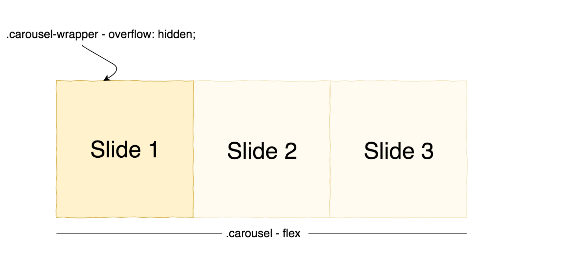

In this article, we will create a simple carousel component with Angular that includes animation with the help of the Animation Builder service. We will also discuss several approaches to querying the DOM.

The following will be our final result:

<Embed src="https://gist.github.com/NetanelBasal/a4b532f511348e168cb83488bac2bcb4.js" aspectRatio={0.357} caption="" />

Let’s start by creating the `carousel` component.

### The Component CSS

<Embed src="https://gist.github.com/NetanelBasal/1f690d66bc8436efc390a78920ea5d79.js" aspectRatio={0.357} caption="" />

Here, we’ll use a well-known CSS technique. We need a wrapper element with `overflow: hidden` and a fixed width we will define later as equal to the width of a carousel item. We must also set the carousel element to `display: flex` so the items appear in the same row. Later, we will use the Animation Builder service to animate the transform property of the carousel element.

Let’s continue to see how we can pull the items out of the template.

#### Building the Carousel Item Directive

<Embed src="https://gist.github.com/NetanelBasal/4835d5fca47343ba7263bc1e0cc80eb8.js" aspectRatio={0.357} caption="" />

The Carousel Item directive is a [structural](https://netbasal.com/the-power-of-structural-directives-in-angular-bfe4d8c44fb1) directive. We can leverage Dependency Injection to get a reference to the template.

#### Rendering The Items

Now, let’s see how we can use this data in the parent component.

<Embed src="https://gist.github.com/NetanelBasal/925a19f9702b73d59b853017c5eadd4c.js" aspectRatio={0.357} caption="" />

We can query for the `CarouselItemDirective` instances in our template with the `[ContentChildren](https://netbasal.com/understanding-viewchildren-contentchildren-and-querylist-in-angular-896b0c689f6e)` decorator. Then we loop through them, passing the `CarouselItemDirective.tpl` property that holds a reference to a template to the `ngTemplateOutlet` directive. ( which we can get from the `CarouselItemDirective` constructor via DI ).

#### Setting The Wrapper Width

As I mentioned before, we need to set the `wrapper` element width to the same as the first item width by querying for the `.carousel-item` element. For this task, I will use a directive with selector `.carousel-item`.

<Embed src="https://gist.github.com/NetanelBasal/db7f6fd81143132f318de17991afd111.js" aspectRatio={0.357} caption="" />

Now we can obtain a reference to every element in the template matching the directive selector.

<Embed src="https://gist.github.com/NetanelBasal/570f3b47604ba1522c93f2cebb4141fa.js" aspectRatio={0.357} caption="" />

Pay attention to two things here: we used `[ViewChildren](https://netbasal.com/understanding-viewchildren-contentchildren-and-querylist-in-angular-896b0c689f6e)` and not `ContentChildren`, and we asked for the native DOM element by setting the read property to `ElementRef`.

Now we can get the width of the first element and set the wrapper element to the same value.

<Embed src="https://gist.github.com/NetanelBasal/5596384b44c64954077be10fa08f4254.js" aspectRatio={0.357} caption="" />

**Note:** You can also use `ViewChild` to get the first element, but I wanted to illustrate this method in case you want to build a carousel with dynamic width.

#### Adding The Control Buttons

<Embed src="https://gist.github.com/NetanelBasal/cff512989756d4ba0c14b21c0aa8070f.js" aspectRatio={0.357} caption="" />

Before we see the `next()` and `prev()` methods, let’s create a couple properties that will help us to build the carousel.

<Embed src="https://gist.github.com/NetanelBasal/6d82ae6128ca7bcf7612fb6257b36c43.js" aspectRatio={0.357} caption="" />

The `carousel` property is a reference to the native DOM element of the carousel. Note that in this case I’m using a local template variable to query the element from the template.

We also have two `Inputs`, one for the animation timing and one that relays whether we need to show the controls. (we will see why this is useful later)

The remaining properties simply keep track of the carousel position.

#### Implementing The next() Method

<Embed src="https://gist.github.com/NetanelBasal/ccc137c24a1f0eb5597791d29f380d9c.js" aspectRatio={0.357} caption="" />

We need to do some math to calculate the carousel position. Then, we can use the Animation Builder service to create and play the animation based on the timing and offset variables.

The purpose of Animation Builder service is to produce an animation sequence programmatically within an Angular component or directive.

Programmatic animations are first built and then a player is created when the build animation is attached to an element.

When an animation is built an instance of `AnimationFactory` will be returned. Using that an `AnimationPlayer` can be created which can then be used to start the animation.

#### Implementing The prev() Method

<Embed src="https://gist.github.com/NetanelBasal/d73fb8ffe155480f566ed0779405ab01.js" aspectRatio={0.357} caption="" />

Here, we can use the same process as the `next()` method: calculate the carousel position and building and starting the animation.

#### Using Custom Controls

We can export our component to the consumer template with the `[exportAs](https://netbasal.com/angular-2-take-advantage-of-the-exportas-property-81374ce24d26)` property on the component metadata.

<Embed src="https://gist.github.com/NetanelBasal/52600316a88020df69f2bac56a17a5a4.js" aspectRatio={0.357} caption="" />

That’s all.

<Embed src="https://stackblitz.com/edit/angular-carousel-component?embed=1" aspectRatio={undefined} caption="" />

_Follow me on_ [_Medium_](https://medium.com/@NetanelBasal/) _or_ [_Twitter_](https://twitter.com/NetanelBasal) _to read more about Angular, Vue and JS!_
