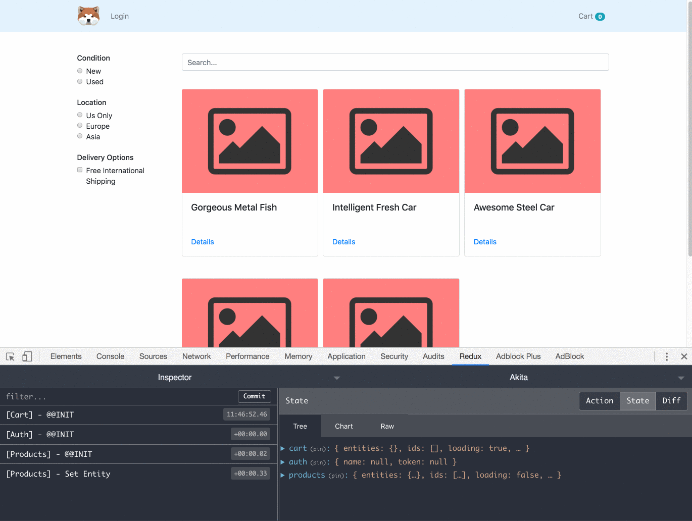
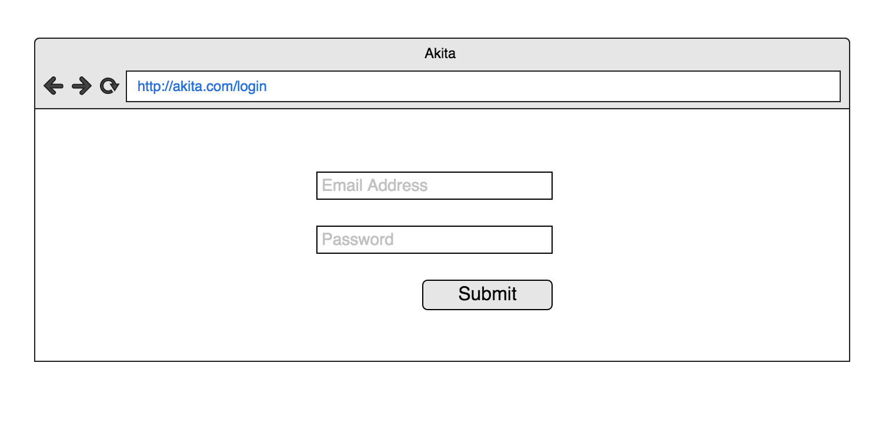
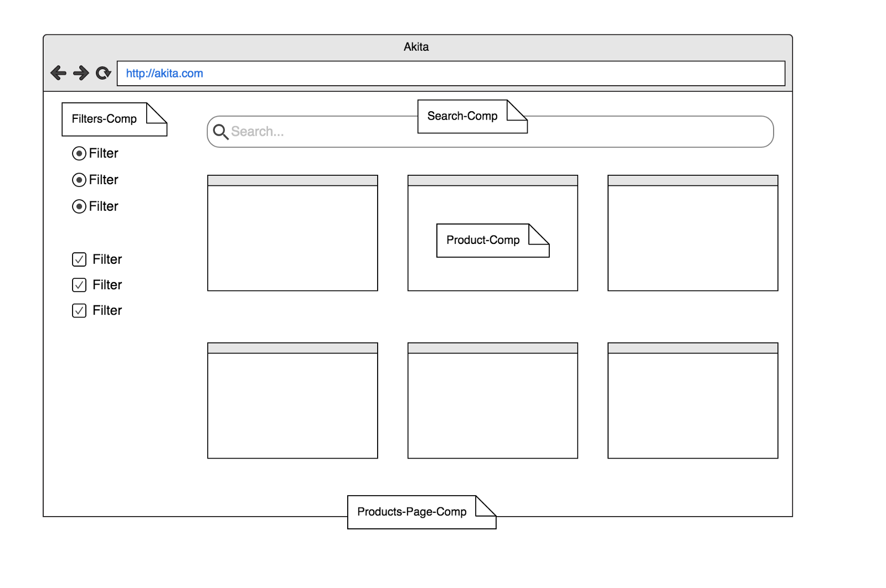
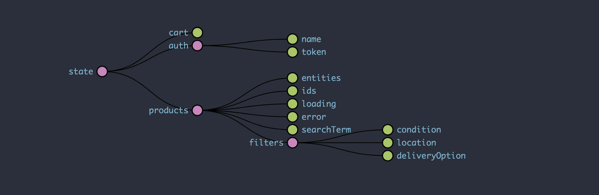
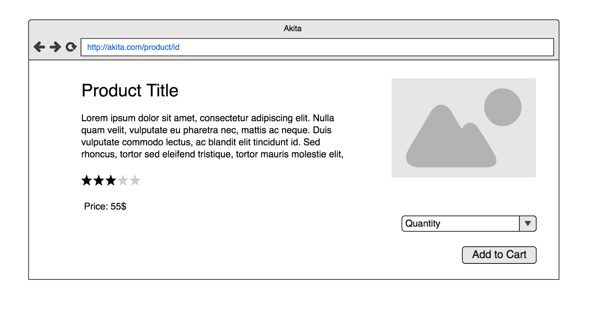
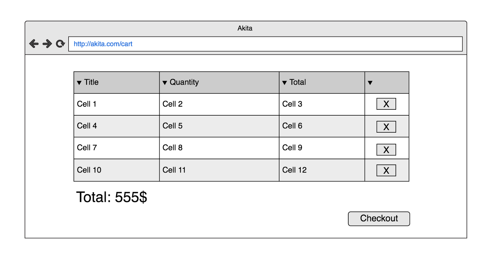

### A Brief Overview

[Akita](https://netbasal.gitbook.io/akita/) is a simple and effective state management pattern, built on top of RxJS. Akita encourages simplicity. It saves you the hassle of creating boilerplate code and offers powerful tools with a moderate learning curve, suitable for both experienced and inexperienced developers alike.

In this article, we’ll create a simple eCommerce website, with a list of products on one side and filters we can apply on the other side. We’ll also create basic authentication functionality and learn how to implement some advanced caching.

This article assumes that you have at least a basic knowledge of Akita, but even if you don’t, I’m sure you’ll be able to understand the code fairly easily.

Here’s an illustration of the final result:

Let the fun begin 😎

### Creating the Login Feature

#### The Auth Store

Akita provides two types of stores, a basic [store](https://netbasal.gitbook.io/akita/core-concepts/store) which can hold any shape of data and an [entity store](https://netbasal.gitbook.io/akita/entity-store/entity-store) which represents a flat collection of entities.

In this case, we need to use the basic store that will hold the `auth` state:

<Embed src="https://gist.github.com/NetanelBasal/b81a58320804a41ad4d86b64f7291496.js" aspectRatio={0.357} caption="auth.store.ts" />

We created an `AuthStore` and provided it with the initial state. We also apply the `[resettable](https://netbasal.gitbook.io/akita/store-config)` option; This means that we’ll be able to call `store.reset()` anytime to go back to the store’s initial state value. In our case, we’ll do it when the user logs out.

#### The Auth Query

The Query is a class responsible for querying the store. In our case, we work with a basic store, so we need to extend the basic `Query`:

<Embed src="https://gist.github.com/NetanelBasal/1c5456c477c521350507cb51b2eb6d6e.js" aspectRatio={0.357} caption="auth.query.ts" />

The built-in `select()` method returns the requested slice from the state. The `isLoggedIn$` property is an observable that notifies whether the current user is logged in based on a token presentation.

In addition, there are times when we want to get a store’s value without the need to subscribe. In our example, we create the `isLoggedIn()` method that returns a boolean which indicates whether the current user is logged in.

#### The Auth Service

Akita maintains a natural work process using Angular services, which encapsulate and manage asynchronous logic and update calls for the store.

Let’s see how we use the service to perform a REST call and update the store:

<Embed src="https://gist.github.com/NetanelBasal/982dbc0d668fe9c08486b86d684db226.js" aspectRatio={0.357} caption="auth.service.ts" />

First, we create a `login()` method that makes an HTTP request to the server to verify the user’s credentials. When we get a success response, we update the store with the response data; it’s as simple as that.

Then, we add the `logout()` method that employs the `reset` functionality and rollback the state to the initial value.

We also use Akita’s [persist state](https://netbasal.gitbook.io/akita/enhancers/persist-state) functionality to persist the token value in the local storage automatically, so we need to clear it when the user logs out.

<Embed src="https://gist.github.com/NetanelBasal/a8c506d4292bd15e903fd078f961b4e3.js" aspectRatio={0.357} caption="main.ts" />

#### The Login Page

First, we need to create the login form:

<Embed src="https://gist.github.com/NetanelBasal/cf795738bb0321248b89d15b2908577a.js" aspectRatio={0.357} caption="login-page.component.html" />

We have two inputs — one for the user’s email and one for the password. Now, let’s see the component implementation:

<Embed src="https://gist.github.com/NetanelBasal/632c9256382f3b5419efb246625ff8da.js" aspectRatio={0.357} caption="" />

In the `submit()` method, we check if the form is valid. If it is, we call the auth service `login()` method with the form value. If we get a 👍 response, we show the user a welcome message and send him to the home page. Otherwise, we display the given server error.

### Creating the Products Feature

#### The Product Model

A common optimization nowadays is to fetch the minimum required data from the server so we can render the view as quickly as possible.

As good developers, we’ll follow this rule and create a `BaseProduct` type which contains the minimum required data to display each product in the list, and a `Product` type with the details we need for the product page:

<Embed src="https://gist.github.com/NetanelBasal/c0133f2f3ef6a7718a60b75dac646319.js" aspectRatio={0.357} caption="product.model.ts" />

#### The Products Store

We need to maintain a collection of products, so we’ll use an `EntityStore`. You can think of an entity store **as a table in a database**, where each table represents a flat collection of entities.

Akita’s `EntityStore` simplifies the process, giving you everything you need to manage it.

Let’s see how we can use it to create a `products` table, i.e., an `EntityStore` managing a `Product` object:

<Embed src="https://gist.github.com/NetanelBasal/98c7979ff6a5eff96d8de15cc1627b5c.js" aspectRatio={0.357} caption="products.store.ts" />

We also need to extend the store and add more properties to it. In our case, we need to save the applied filters and the user’s search term. We do this is by adding the properties type and passing the initial state in the constructor.

At this point, our application state looks like the following:

#### The Products Query

Let’s create a companion Query class:

<Embed src="https://gist.github.com/NetanelBasal/e3ecfe465f58779963db7ab3af3d8b66.js" aspectRatio={0.357} caption="products.query.ts" />

In Akita, we have the ability to query a slice of the store as a stream, i.e. observable, or to receive it as a raw value. We can see both cases in the products query.

There’s no need to elaborate on the nature of the Queries, apart from one — `selectProduct`. In the next section, when we’ll create the product page, we’ll need to know whether we’ve already fetched the complete product and have it in the store, or whether we need to make an additional HTTP request in order to fetch it.

Since we might only have the basic product in the store, we’ll need an additional piece of information in that case. So we’ll use the `additionalData` key to determine whether we have the complete product in the store or not.

Another option would be to maintain it in a new store’s property, for example:

<Embed src="https://gist.github.com/NetanelBasal/8a61ab57c567832d15e46989afd560ea.js" aspectRatio={0.357} caption="" />

#### The Products Service

We create a service with two methods. The first is `getAll()`, which is responsible for fetching the products based on the applied filters and the search term. The second is `getProduct()`, which is responsible for fetching the complete product details based on the product id:

<Embed src="https://gist.github.com/NetanelBasal/094dcefaba4bd6058c5b2dccd7c438b2.js" aspectRatio={0.357} caption="products.service.ts" />

We also add two methods that use the built-in store’s `update()` method to update both the search term and the current filters value. Later, we’ll talk about the `invalidateCache()` method.

Now, let’s use all this goodness in our components.

#### The Filters Component

Now that we’ve pieced together the various Akita parts, we can implement the app components using them:

<Embed src="https://gist.github.com/NetanelBasal/02b7474ae1bc960f9fbc02d964ee8e7c.js" aspectRatio={0.357} caption="filters.component.ts" />

First, we create a `FormGroup` representation of our filters. Then, we initialize them based on the current filters value that we get from the `productsQuery`. This will persist the current user filters upon navigation.

Next, when the form’s value changes, we update the store with the new value. This is the place to mention that Akita comes with two powerful plugins that will help you with complex forms management — the `[FormsManager](https://netbasal.gitbook.io/akita/angular-plugins/angular-forms-manager)` and `[NgPersistForm](https://netbasal.gitbook.io/akita/angular-plugins/persist-form)`.

#### The Search Component

We create a `FormControl` that holds the current search term. We initialize it with the current search term that we get from the `ProductsQuery` and update it upon change:

<Embed src="https://gist.github.com/NetanelBasal/0deffd9ab513c99322893c0a62dc52da.js" aspectRatio={0.357} caption="search.component.ts" />

#### The Product Component

The product component is a dumb component which gets a `Product` via input, and renders the product view:

<Embed src="https://gist.github.com/NetanelBasal/45c5089af518427cbbbe8dee84aa9013.js" aspectRatio={0.357} caption="product.component.ts" />

#### The Products Page Component

It’s time to connect all the pieces in our products page component:

<Embed src="https://gist.github.com/NetanelBasal/07b7bee620ffc5b48fd2de2b0376e14e.js" aspectRatio={0.357} caption="products-page.component.ts" />

A few things are going on here, so let’s break it down:

First, we need to show a spinner while we fetch the products, so we use the built-in `selectLoading()` query method, which will notify us when to show it. The initial value of the loading state is set to true and is switched to false when we call `store.set()` (we can always change it via the API).

Next, we select the products from the store as an Observable by using the built-in `selectAll()` query method.

**Caching Implementation:**

In our application, two operations can invalidate the cache — when users change a filter or when they change the search term. While none of these actions have occurred, there’s no reason to perform an additional HTTP request, as we can use the cached data that’s in the store.

Akita has built-in [cache support](https://netbasal.gitbook.io/akita/entity-store/cache-functionality) that will provide information about whether you already have data in the store. When we call `EntityStore.set()`, Akita internally marks the store as cached. We can also manually mark the store as cached by calling the `Store.setCache(boolean)` method like we did earlier in the `ProductsService`.

We combine three queries — whether we’ve got cached data, the current filters and the current search term. If the data is cached, we return an `[EMPTY](https://github.com/ReactiveX/rxjs/blob/master/src/internal/observable/empty.ts#L8)` observable which completes immediately; Otherwise, we call the `getAll()` method, passing it the current filters and search term.

Here’s the final component template:

<Embed src="https://gist.github.com/NetanelBasal/c2acdda3894714af623a2bc595848228.js" aspectRatio={0.357} caption="products-page.component.html" />

#### The Product Page Component

Let’s create the product page which is responsible for showing the complete product details:

<Embed src="https://gist.github.com/NetanelBasal/c6f32d7aedba9961f9ecc33b0b654f35.js" aspectRatio={0.357} caption="product-page.component.ts" />

First, we create a `product$` property which gets the current product from the store based on the product id, that we obtain from the URL.

Next, we create a `FormControl` that holds the requested quantity. Then, if we don’t have the complete product in the store, we request it and save it there.

Lastly, we create the `addToCart()` method which adds the item to the cart store based on the product id and the quantity. Here’s the component template:

<Embed src="https://gist.github.com/NetanelBasal/548e96d65b28969e77ae65947d86db56.js" aspectRatio={0.357} caption="product-page.component.html" />

### Creating the Cart Feature

#### The Cart Page Component

As with the products, we need to maintain a collection of entities, so we’ll use Akita’s Entity features. As always, we start by creating Akita’s building blocks:

#### The Cart Model

<Embed src="https://gist.github.com/NetanelBasal/b387dc41ecb66fc3e5b1477edcdf2d8a.js" aspectRatio={0.357} caption="cart.model.ts" />

We’re using a useful TS feature that gives us the ability to define a type or interface field based on a definition given in another type.

#### The Cart Store

<Embed src="https://gist.github.com/NetanelBasal/76693c5d56da9faef88090d5d35db1e8.js" aspectRatio={0.357} caption="cart.store.ts" />

The observant among you may have noticed a new code sample. It’s the `[idKey](https://netbasal.gitbook.io/akita/entity-store/entity-store/entity-id)` attribute in the `CartStore` constructor. By default, Akita takes the id key from the entity id field, but in our case, we’re telling Akita — the id key is `productId`.

#### The Cart Query

<Embed src="https://gist.github.com/NetanelBasal/34973dac3a806f7fde40c5986afd1076.js" aspectRatio={0.357} caption="cart.query.ts" />

We create a single custom selector to calculate the total cart amount.

#### The Cart Service

<Embed src="https://gist.github.com/NetanelBasal/082e037bf7e1eab9603f950cace90d7e.js" aspectRatio={0.357} caption="" />

We create two methods; The `add()` method, which uses the built-in `upsert` method, is responsible for adding or updating an existing item. The `remove()` method is responsible for removing an item from the cart (in the real world you’d probably save and get the cart data from the server).

#### The Cart Page

<Embed src="https://gist.github.com/NetanelBasal/b983fffeb85b57378fcbdbdabf71b115.js" aspectRatio={0.357} caption="" />

We’re using both the built-in Akita selectors and the one we created earlier. We also have a `checkout()` method that’s using the `AuthQuery` to check if the current user is logged in. If that’s the case, we perform the checkout; Otherwise, we send the user to the login page. Here’s the component template:

<Embed src="https://gist.github.com/NetanelBasal/e8676b55ea1589ae00dffa3d7233b74f.js" aspectRatio={0.357} caption="" />

### Creating the Nav Component

The last thing that’s left to show is the navigation component:

<Embed src="https://gist.github.com/NetanelBasal/9d2dea3dcc774ad015e8debee1dc8ef4.js" aspectRatio={0.357} caption="" />

We use the `CartQuery` to display the current cart count and the `AuthService` to logout the user.

### Summary

We’ve seen here how the various core concepts of Akita work together to give us an easy way to manage an eCommerce application. This is only a small taste of Akita; It has many more additional features, such as powerful plugins, dev tools, cli, support for active state, transactions, etc.

I encourage you to explore the API by reading the docs and the source code of the demo application.

You can find the complete code in the official repository: (don’t forget to 🤩 it)

[**datorama/akita**  
_🚀 State Management Tailored-Made for JS Applications - datorama/akita_github.com](https://github.com/datorama/akita/tree/master/examples/angular-ecommerce "https://github.com/datorama/akita/tree/master/examples/angular-ecommerce")
