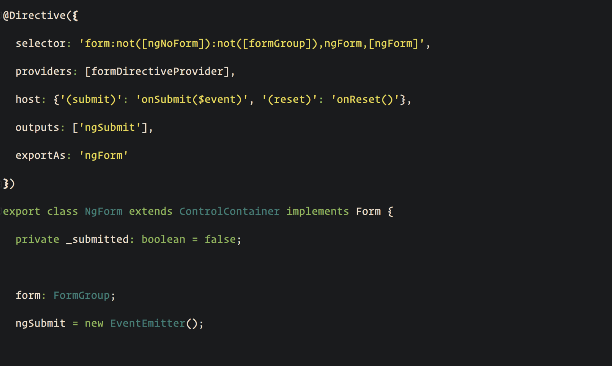

In my previous [article](https://netbasal.com/show-form-errors-on-submit-in-angular-a6a10cd3e04b#.sen14npdy), we talked about how to show form errors on submit.

When your form start to grow, you can end up with something like this:

<Embed src="https://gist.github.com/NetanelBasal/4c7d777c4c021e12524ebd13879f747e.js" aspectRatio={0.357} caption="" />

If you are coding all your forms like that, you are probably Psychopath 😜 (just kidding)

The template is verbose; it’s hard to understand what’s going on and you are not DRY.

What if we could write something like this:

<Embed src="https://gist.github.com/NetanelBasal/29e2d0ff268c01bd192516693d7a04e0.js" aspectRatio={0.357} caption="" />

I think that looks a lot better ( later you will see how we can be even cleaner than that ). So let’s create the `control-errors` component.

<Embed src="https://gist.github.com/NetanelBasal/f353f3c14ec357de2515dc5fab11ab13.js" aspectRatio={0.357} caption="" />

We need two `Inputs`:

1.  The control name.
2.  The errors Object.

Next, we can ask Angular to give us the `ngForm` instance in our component via dependency injection with the `Host` decorator. ( we are using also the `Optional` decorator to protect our code )

That’s the equivalent of doing this in our template:

```
<form #myform="ngForm"></form>
```

If you are still confused from where this NgForm is coming, In a nutshell, it’s just a built-in directive with a selector that points to almost any form tag.

```
@Directive({
 selector: ‘form:not([ngNoForm]):not([formGroup]),ngForm,[ngForm]’
})
export class NgForm extends ControlContainer implements Form {}
```

Ok, now we have the form instance let’s get the errors.

<Embed src="https://gist.github.com/NetanelBasal/a8a843c29e45cd0c78d9fa328dd83dec.js" aspectRatio={0.357} caption="" />

Our getter functionality is straight forward:

1.  Find the current control in our form instance.
2.  Loop over the `Input` errors keys.
3.  Check with the `hasError()` method if we have an error with the same key.
4.  Show the error.

That’s all! You can play with the [plunker](https://plnkr.co/edit/okfgPHnYGWEICgjz71YF?p=preview).

---

If you are happy with this implementation, you are done here. I’m still not happy. I think we can make it even cleaner, maybe something like this:

```
<control-errors control="firstName">
```

I’m not going to implement this fully, but I can give you a hint.

First, we need to centralize our errors object, so let’s do that with DI.

<Embed src="https://gist.github.com/NetanelBasal/f2610b46cc59f3e3774d426aa639730b.js" aspectRatio={0.357} caption="" />

Now we can inject the `CONTROL_ERRORS` object and implement more complex logic. It will take more time, but the benefits are obvious.

<Embed src="https://gist.github.com/NetanelBasal/f96f7fc98867628d3692fae37a26a204.js" aspectRatio={0.357} caption="" />

Currently, the `control-errors` directive works only with template driven forms. You need to add just a little bit of code to make it also work with reactive forms. You can check my [plunker](https://plnkr.co/edit/0XJWhc7Sg0pRIHph0eEQ?p=preview) to see what are the changes.

### 👂🏻 **Last but Not Least, Have you Heard of Akita?**

Akita is a state management pattern that we’ve developed here in Datorama. It’s been successfully used in a big data production environment for over seven months, and we’re continually adding features to it.

Akita encourages simplicity. It saves you the hassle of creating boilerplate code and offers powerful tools with a moderate learning curve, suitable for both experienced and inexperienced developers alike.

I highly recommend checking it out.

[**🚀 Introducing Akita: A New State Management Pattern for Angular Applications**  
_Every developer knows state management is difficult. Continuously keeping track of what has been updated, why, and…_netbasal.com](https://netbasal.com/introducing-akita-a-new-state-management-pattern-for-angular-applications-f2f0fab5a8 "https://netbasal.com/introducing-akita-a-new-state-management-pattern-for-angular-applications-f2f0fab5a8")[](https://netbasal.com/introducing-akita-a-new-state-management-pattern-for-angular-applications-f2f0fab5a8)

_Follow me on_ [_Medium_](https://medium.com/@NetanelBasal/) _or_ [_Twitter_](https://twitter.com/NetanelBasal) _to read more about Angular, Akita and JS!_
