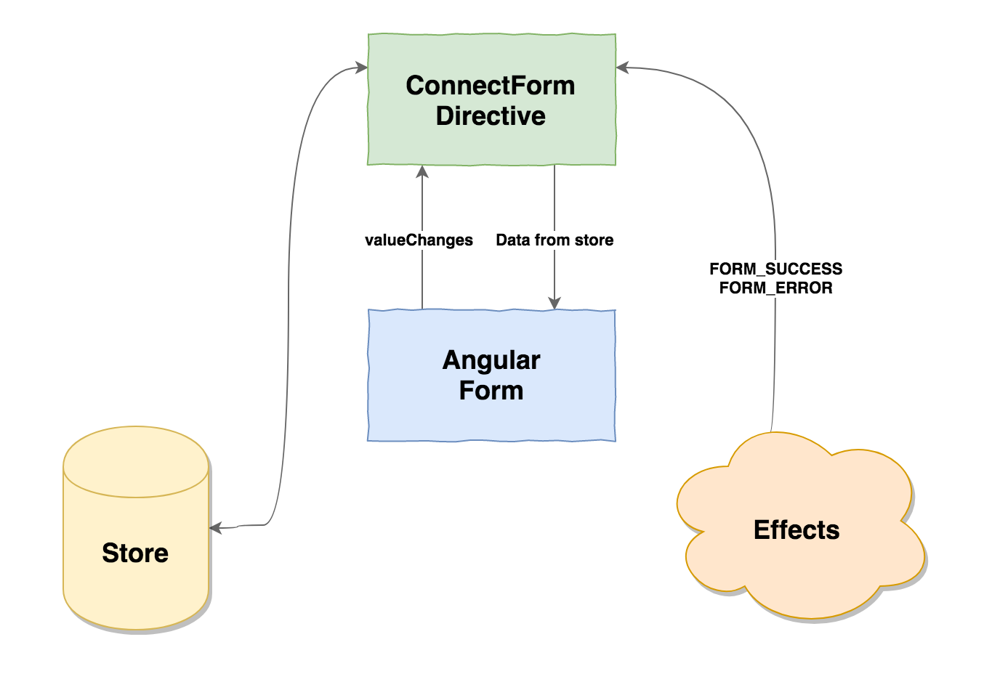

In this article, we will learn how to connect Angular forms to [ngrx/store](https://github.com/ngrx/store) with [ngrx/effects](https://github.com/ngrx/effects).

Our final [result](https://gist.github.com/NetanelBasal/8c033644ea0c6c8105a27072ae1af461) will be the following:

<Embed src="https://gist.github.com/NetanelBasal/74aea9253db47510b42d3f64166d7ea1.js" aspectRatio={0.357} caption="" />

### The Reducer

For the sake of simplicity we will use a single reducer to manage all the forms in our application.

The state will be composed of a simple object whose keys are the IDs, and the values are the forms data.

For example:

<Embed src="https://gist.github.com/NetanelBasal/7ae1d599cdba9afda3b170660c0fa3fa.js" aspectRatio={0.357} caption="" />

We will have one type of action — `UPDATE_FORM`. The action payload will be an object with two keys, the path, and the value.

<Embed src="https://gist.github.com/NetanelBasal/6e0461791bbed827e72f6273d91b3bee.js" aspectRatio={0.357} caption="" />

And the reducer will be responsible for updating the state.

<Embed src="https://gist.github.com/NetanelBasal/41d348b1595342b2482337de3c806c74.js" aspectRatio={0.357} caption="" />

### ConnectForm Directive

#### Get The State

We want to update the form based on the state, so we need to take the path as `Input` and query the right piece from the store.

<Embed src="https://gist.github.com/NetanelBasal/006cf5bacaa6888601cef83ec68795a9.js" aspectRatio={0.357} caption="" />

We are grabbing the form directive instance via DI and updating the form value with the data from the store.

#### Update The State

We also need to update the form state when the form value changes. We can do this easily by subscribing to the `valueChanges` observable and dispatch the `UPDATE_FORM` action with the value.

<Embed src="https://gist.github.com/NetanelBasal/8768e9f3d2e4d88b6bda2383071a8e93.js" aspectRatio={0.357} caption="" />

That’s all we need for the form to be synchronized with the state.

### Notifications and Reset

There are two things we want to achieve in this section:

1.  Display notification to the user based on the HTTP response — we are going to keep it local to the component and not store this information on the store, for two reasons:

-   Usually, no other component is interested in this information.
-   We don’t want to reset the state every time.

2\. Reset the form when the submit succeed.

We will let Angular to do what it does best, handling the local validations and reset the form.

#### The Success Action

The success action takes the form path so we can know which form we need to reset and when to emit the `success` event.

<Embed src="https://gist.github.com/NetanelBasal/d1ed1bef6611b93138617b6d9d980889.js" aspectRatio={0.357} caption="" />

#### The Error Action

The error action takes the form path so we can know when to emit the `error` event with the error.

<Embed src="https://gist.github.com/NetanelBasal/5e3d41eb406e7443b5c85c4cf7236525.js" aspectRatio={0.357} caption="" />

We need to create the `success` and `error` outputs and listen to the `FORM_SUBMIT_ERROR` and `FORM_SUBMIT_SUCCESS` actions.

Because we are working with ngrx/effects, we can use the `Actions` service for listening to actions.

<Embed src="https://gist.github.com/NetanelBasal/0049d97f0226bf47594baa475402e3b3.js" aspectRatio={0.357} caption="" />

And of course, we do not want to forget to clean up the subscriptions.

<Embed src="https://gist.github.com/NetanelBasal/afd05c718555ec778a47087b5aa585d2.js" aspectRatio={0.357} caption="" />

The final step is to invoke the form actions based on the response.

<Embed src="https://gist.github.com/NetanelBasal/86f62f71da439207f4a4d550e78609d5.js" aspectRatio={0.357} caption="" />

Now we can display the alerts in the component.

<Embed src="https://gist.github.com/NetanelBasal/4ecb806e9b2f7de7f0c2690148e2b119.js" aspectRatio={0.357} caption="" />

If you are not working with ngrx/effects, you can find a replacement solution in my previous article — [Listening for Actions in @ngrx/store](https://netbasal.com/listening-for-actions-in-ngrx-store-a699206d2210).

_Follow me on_ [_Medium_](https://medium.com/@NetanelBasal/) _or_ [_Twitter_](https://twitter.com/NetanelBasal) _to read more about Angular, Akita and JS!_

### 🚀 **Have You Tried Akita Yet?**

One of the leading state management libraries, Akita has been used in countless production environments. It’s constantly developing and improving.

Whether it’s entities arriving from the server or UI state data, Akita has custom-built stores, powerful tools, and tailor-made plugins, which help you manage the data and negate the need for massive amounts of boilerplate code. We/I highly recommend you try it out.

[**Form Fatale: How Akita’s Form Manager Can Do Away with Complex Multistep Form Logic in Angular**  
_Akita’s Angular Form Manager_netbasal.com](https://netbasal.com/form-fatale-how-akitas-form-manager-can-do-away-with-complex-multistep-form-logic-in-angular-329a557cc68 "https://netbasal.com/form-fatale-how-akitas-form-manager-can-do-away-with-complex-multistep-form-logic-in-angular-329a557cc68")

[**🚀 Introducing Akita: A New State Management Pattern for Angular Applications**  
_Every developer knows state management is difficult. Continuously keeping track of what has been updated, why, and…_netbasal.com](https://netbasal.com/introducing-akita-a-new-state-management-pattern-for-angular-applications-f2f0fab5a8 "https://netbasal.com/introducing-akita-a-new-state-management-pattern-for-angular-applications-f2f0fab5a8")
