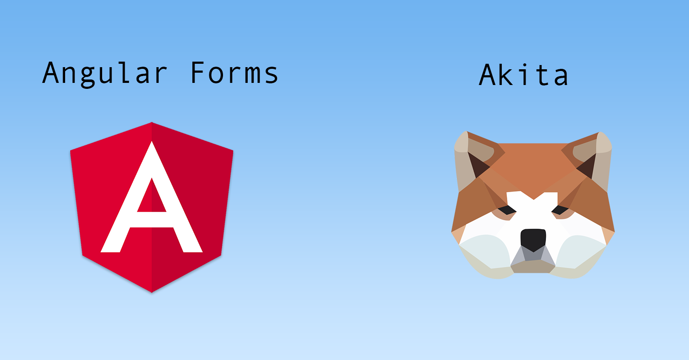
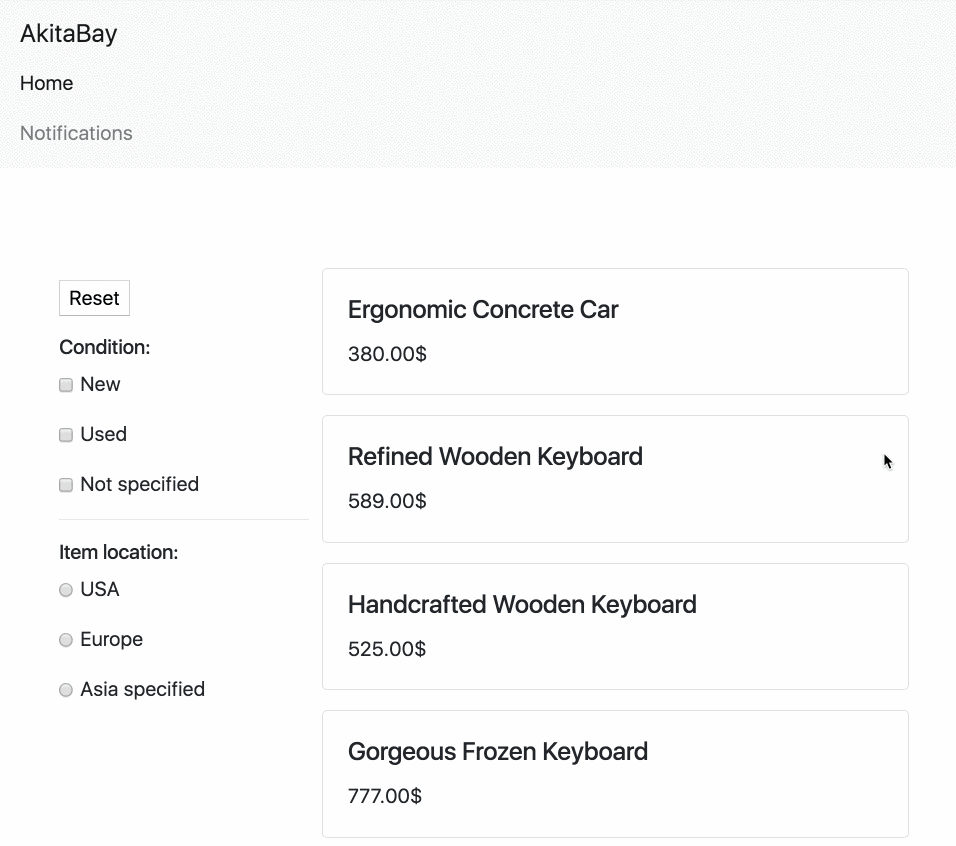
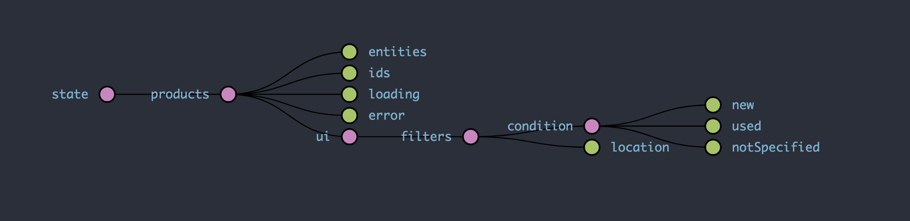
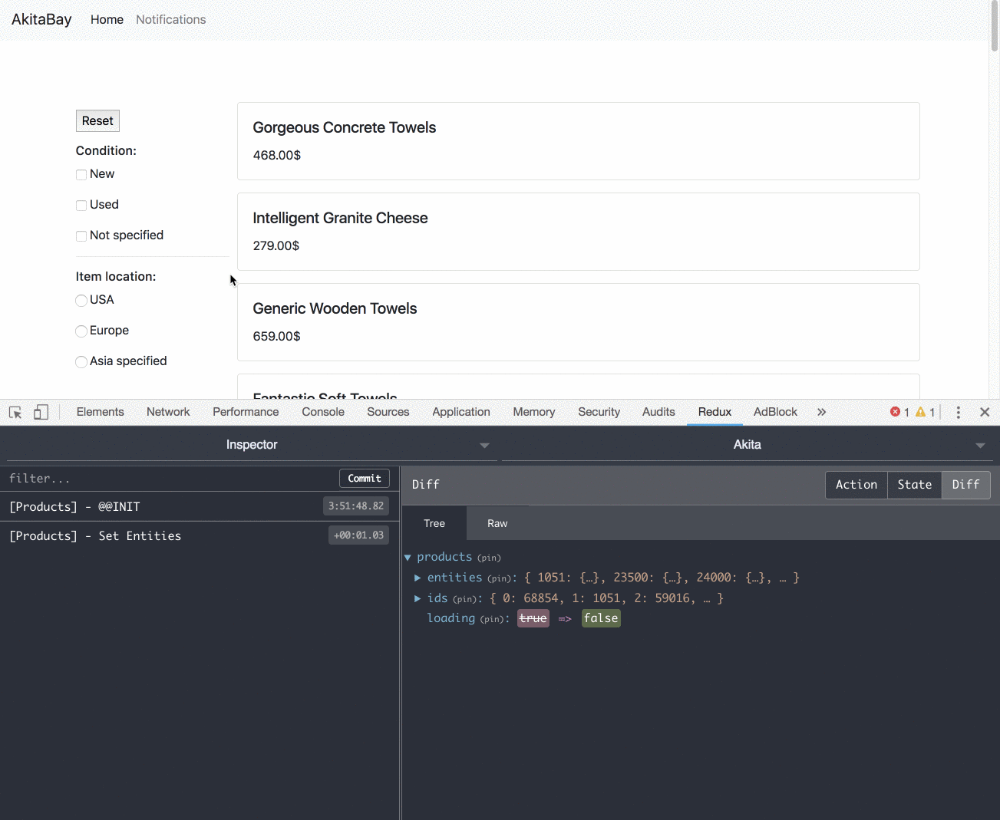

The `[PersistNgFormPlugin](https://netbasal.gitbook.io/akita/angular-plugins/persist-form)` helps to keep your form synced with your store. One common scenario is preventing your user from losing data he filled in a form, after navigating away without saving it. Another scenario is when you want to persist a form’s state across pages.

Let’s build a small application that demonstrates it. We’ll create a page like eBay, where you have a list of products on one side and filters you can apply on the other side.

Here’s an illustration of the final result:

We knows that we need to maintain a collection of products so we’ll create an `EntityStore`.

<Embed src="https://gist.github.com/NetanelBasal/36f530ffa7df9ad3a2296775b6f9fe34.js" aspectRatio={0.357} caption="" />

In addition to the products entities, the store root holds a state which contains the current active filters.

Akita recommends separating the Domain State from the UI State. Domain State is the state of your application in the server side, while the UI state is more along the lines of the current time based on the user’s machine, which tab is active tab, or whether a drop-down is open.

When you have a global UI state for a specific store, you can put the state under a `ui` key.

At this point, our store state looks like the following:

Now, let’s create our components. We need a `products` component which displays the list of products and `filters` component in charge of maintaining the filters.

Let’s start with the `products` component:

<Embed src="https://gist.github.com/NetanelBasal/debe3cb5f43e0b2e12ce3fa2fcf5a8e9.js" aspectRatio={0.357} caption="" />

Nothing fancy here. We’re using the built-in Akita query methods to reactively get the products from our store and the `loading` status.

Let’s continue with the `filters` component.

<Embed src="https://gist.github.com/NetanelBasal/195a83b0a6f3d5fc2a92e974164b9d21.js" aspectRatio={0.357} caption="" />

We can call the `PersistNgFormPlugin`, passing the `ProductsQuery`, the `FormGroup`, and the path we want to sync. From this point, Akita will take care of updating the form value on component initialization and the store upon form’s value changes.

The last thing we want to do is to listen to filters state changes and perform HTTP request to get new data according to their value.

<Embed src="https://gist.github.com/NetanelBasal/c5516741437234b645fcaaddb0e9c82c.js" aspectRatio={0.357} caption="" />

Let’s see it in action with the dev-tools.

<Embed src="https://stackblitz.com/edit/akita-filters?embed=1" aspectRatio={undefined} caption="" />

### But Wait, There’s More!

Akita is a very robust tool which saves you the hassle of creating boilerplate code and offers powerful tools with a moderate learning curve, suitable for both experienced and inexperienced developers alike. For more on that, please see the [documentation](https://netbasal.gitbook.io/akita/entity-store/additional-functionality/web-workers).

In summary: **The Akita** `[PersistNgFormPlugin](https://netbasal.gitbook.io/akita/plugins/persist-form)` **can provide you with a quick and easy way to sync between any form and a store, which comes with built-in functionality that’s often needed when carrying out this technique. Neat.**

_Follow me on_ [_Medium_](https://medium.com/@NetanelBasal/) _or_ [_Twitter_](https://twitter.com/NetanelBasal) _to read more about Angular, Akita and JS!_

