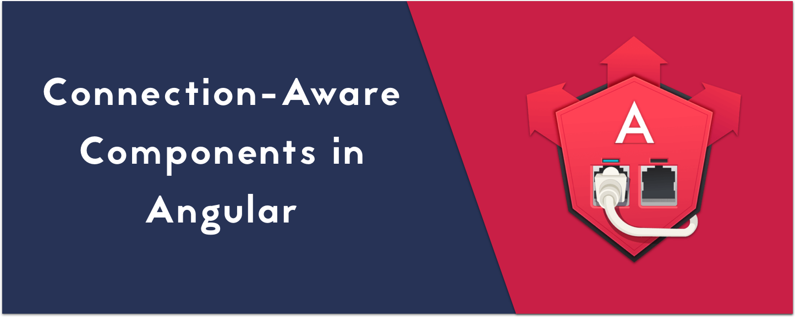

The `navigator.connection` object contains a read-only property named `[effectiveType](https://developer.mozilla.org/en-US/docs/Web/API/NetworkInformation/effectiveType)`, which returns the effective connection type. That type is determined using a combination of recently observed RTT (round-trip time) and downlink values. (at the time of writing, browser support is [limited](https://developer.mozilla.org/en-US/docs/Web/API/NetworkInformation/effectiveType#Browser_compatibility))

The effective connection type can be either: `slow-2g`,`2g`,`3g` , or `4g`.

By combining the [Network](https://developer.mozilla.org/en-US/docs/Web/API/Network_Information_API) Information API with Angular, we can write components that render different elements for different connection speeds. For example, if we observe a slow connection, we can render a placeholder or a lower resolution version of our image or video in order to improve our page loading time.

First, let’s create a nice observable wrapper for the connection `change` event.

<Embed src="https://gist.github.com/NetanelBasal/fa7fd350f247157a7179511566963765.js" aspectRatio={0.357} caption="" />

The `connection$` observable will notify us of the current `effectiveType` value, both on initial page load and on change.

Let’s create the `connection` component:

<Embed src="https://gist.github.com/NetanelBasal/f6b30506b542a39ae117bd969088da0b.js" aspectRatio={0.357} caption="" />

The code is straightforward. The connection component is grabbing the provided `slow` and `fast` templates from its view, and rendering the correct template based on the `effectiveType` property.

Let’s see it in action:

<Embed src="https://gist.github.com/NetanelBasal/3b2865cca14179c596b95e412feaea68.js" aspectRatio={0.357} caption="" />

This is one way to implement this. It depends on your needs, so for example, you can implement a simple directive that displays a different source based on the connection.

<Embed src="https://gist.github.com/NetanelBasal/ebe34ec7dc22fe611a2b6a5c2f8948fc.js" aspectRatio={0.357} caption="" />

<Embed src="https://stackblitz.com/edit/angular-connection?embed=1" aspectRatio={undefined} caption="" />

This article was inspired by the [React](https://mxb.at/blog/connection-aware-components/) version of it.

### **🔥 Last but Not Least, Have you Heard of Akita?**

Akita is a state management pattern that we’ve developed here in Datorama. It’s been successfully used in a big data production environment for over seven months, and we’re continually adding features to it.

Akita encourages simplicity. It saves you the hassle of creating boilerplate code and offers powerful tools with a moderate learning curve, suitable for both experienced and inexperienced developers alike.

I highly recommend checking it out.

[**🚀 Introducing Akita: A New State Management Pattern for Angular Applications**  
_Every developer knows state management is difficult. Continuously keeping track of what has been updated, why, and…_netbasal.com](https://netbasal.com/introducing-akita-a-new-state-management-pattern-for-angular-applications-f2f0fab5a8 "https://netbasal.com/introducing-akita-a-new-state-management-pattern-for-angular-applications-f2f0fab5a8")

_Follow me on_ [_Medium_](https://medium.com/@NetanelBasal/) _or_ [_Twitter_](https://twitter.com/NetanelBasal) _to read more about Angular, Akita and JS!_
