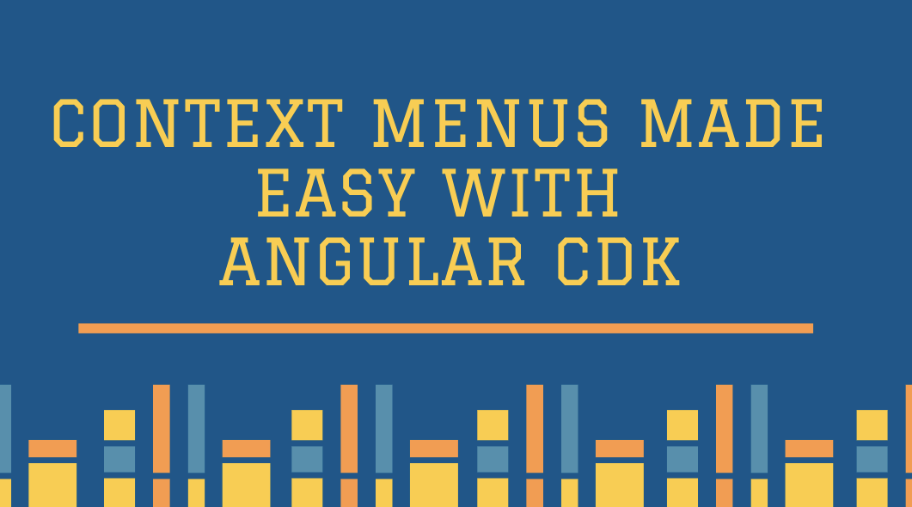

With the new release of the Angular CDK (v7.3.0), the overlay position strategy gets a new cool ability that we can use to help us create context menus with ease.

The positioning strategy now allows for the connected overlay’s origin to be set to a point on the page, rather than a DOM element. This enables implementing right-click context menus easily.

Let’s examine the new functionality by creating a Gmail-style list:

<Embed src="https://gist.github.com/NetanelBasal/faadfd84603444a88e3cc9055e49d496.js" aspectRatio={0.357} caption="" />

We create a users’ list, and attach a `contextmenu` event, that invokes the `open()` method, passing it the `event` object and the current user whenever the user right-clicks on a div.

We also create the context menu by using `ng-template`. Later, we’ll see how we can inject it into the overlay.

Let’s continue with the component:

<Embed src="https://gist.github.com/NetanelBasal/5d9f738350f3019b8ef40c1c423f13e8.js" aspectRatio={0.357} caption="" />

The `open()` method gets the `x` and `y` coordinates from the event object and passes them to the `flexibleConnectTo()` method. We also set the scrollStrategy to `close()` to get the same behavior as in Gmail — close the menu when the user scrolls the page

The last step is to attach the overlay to the page with the provided `TemplateRef`, which we obtained by using `ViewChild`. We also pass the `context`, which consists of the current user object that we got as the second parameter.

If you’re unfamiliar with the Overlay feature, I recommend reading this article I wrote on the subject:

[**Creating Powerful Components with Angular CDK**  
_Creating Components with Angular CDK Overlay_netbasal.com](https://netbasal.com/creating-powerful-components-with-angular-cdk-2cef53d81cea "https://netbasal.com/creating-powerful-components-with-angular-cdk-2cef53d81cea")

Let’s finish by adding the behavior of closing the menu when clicking outside it:

<Embed src="https://gist.github.com/NetanelBasal/4a333e3a2befe3d1b75bda17c82251dc.js" aspectRatio={0.357} caption="" />

On each click, we check if the current target is NOT the overlay element or contained within it, and if that’s the case, we close the menu.

<Embed src="https://stackblitz.com/edit/angular-yd6ay3?embed=1" aspectRatio={undefined} caption="" />

### 🔥 Last but Not Least, Have you Heard of Akita?

Akita is a state management pattern that we’ve developed here in Datorama. It’s been successfully used in a big data production environment, and we’re continually adding features to it.

Akita encourages simplicity. It saves you the hassle of creating boilerplate code and offers powerful tools with a moderate learning curve, suitable for both experienced and inexperienced developers alike.

I highly recommend checking it out.

[**🚀 Introducing Akita: A New State Management Pattern for Angular Applications**  
_Every developer knows state management is difficult. Continuously keeping track of what has been updated, why, and…_netbasal.com](https://netbasal.com/introducing-akita-a-new-state-management-pattern-for-angular-applications-f2f0fab5a8 "https://netbasal.com/introducing-akita-a-new-state-management-pattern-for-angular-applications-f2f0fab5a8")

_Follow me on_ [_Medium_](https://medium.com/@NetanelBasal/) _or_ [_Twitter_](https://twitter.com/NetanelBasal) _to read more about Angular, Akita and JS!_
