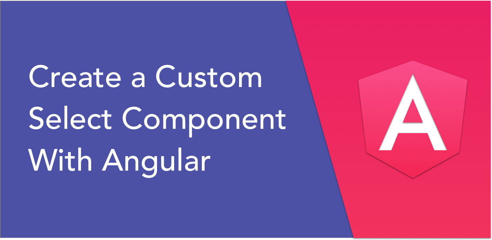
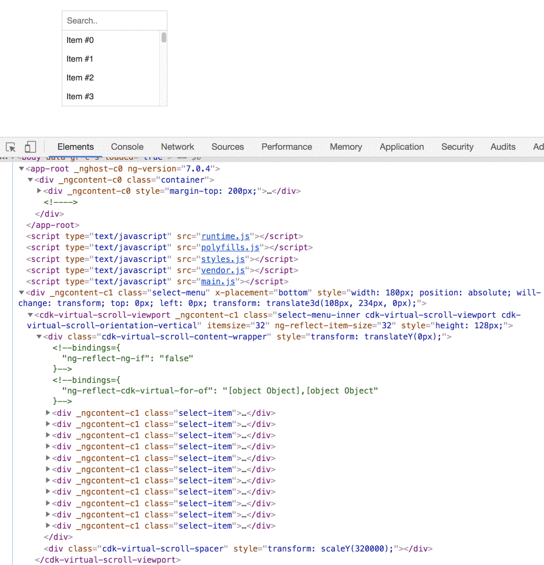
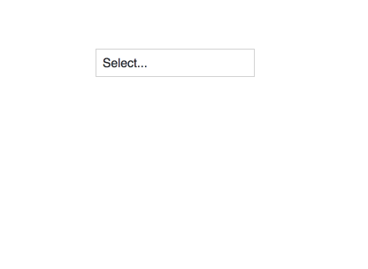
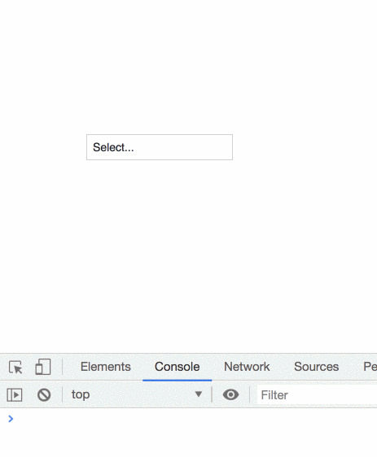

In this article, I will walk you through the process of creating a custom select component. Along the way, we’ll use several techniques to make our component fast and flexible.

As always, here’s an illustration of the end result:

Let the fun begin 🎬

### Creating the Select Component

Let’s create the select component, which takes an array of options as input. Each element in the array should be an object containing at least one unique `id` field and a `label` field.

Moreover, we’ll add two inputs — `idKey`, which defaults to id, and `labelKey`, which defaults to label. This will allow the user to change these when required.

<Embed src="https://gist.github.com/NetanelBasal/f6368d5f01b067fe33547b50823da445.js" aspectRatio={0.357} caption="" />

Note that we also clone the passed `options` array so that we can filter them later without modifying the original array.

Next, we need to maintain a `model` property that will hold the selected option id. We’re going to keep it simple and won’t create a custom form control for our select component, but you can add it fairly easily by following [this](https://netbasal.com/angular-custom-form-controls-made-easy-4f963341c8e2) article.

<Embed src="https://gist.github.com/NetanelBasal/4cc92ace20ea02f3c94694db7a8ed53e.js" aspectRatio={0.357} caption="" />

First, we check if the user passes an initial option `id` through the `model` input property. If that’s the case, we search for a matching `option` and set it as the selected one.

Next, we create a getter named `label` that determines if we should display the selected option label or a placeholder based on the `model` value.

Let’s see how we can use it in the template:

<Embed src="https://gist.github.com/NetanelBasal/4ab2af72b026bd04ccc341157f09ab35.js" aspectRatio={0.357} caption="" />

We have a trigger button that contains two elements. When the dropdown is closed, we display the selected option label (or placeholder), and when it’s open, we show the search input.

In addition, we define a `click` handler, passing the button native element reference and the dropdown template. We’ll see later how we use it. Keep that in mind.

Let’s continue by creating the search functionality:

<Embed src="https://gist.github.com/NetanelBasal/742331a355fbf2bece3a14b393f3657f.js" aspectRatio={0.357} caption="" />

We create the `searchControl` property, which is bounded to the search input `formControl` directive. When the control’s value changes, after applying a debounce, we call the `search()` method passing the search term. We can then set the `options` property based on the obtained results.

Now that we’re done with the boring things, we’re ready to get down to business. 👇

#### Creating the Dropdown Template — Virtual Scroll

A typical dropdown can have many options. However, problems arise when elements are in the DOM, causing slow initial rendering and laggy scrolling, and dirty checking on each one of them can be expensive.

The solution to this problem is to use a well-known technique called **Virtual Scroll**.

The central concept behind virtual rendering is to render only visible items.  
For example, if there are thousands of options in our dropdown, it’s more efficient to load only the elements that are visible and unload them when they aren’t by replacing them with new ones.

Let’s implement this feature in our select component by employing the Angular’s CDK [API](https://material.angular.io/cdk/scrolling/overview):

<Embed src="https://gist.github.com/NetanelBasal/63fcc65f4e347d5378e693b1f946d0b5.js" aspectRatio={0.357} caption="" />

The `<cdk-virtual-scroll-viewport>` component displays large lists of elements performantly by only rendering the items that fit on-screen.

The `*cdkVirtualFor` structural directive replaces `*ngFor` inside of a `<cdk-virtual-scroll-viewport>`, supporting the same API as `*ngFor`.

The most straightforward usage specifies the list of items and the `itemSize` property that must be set.

We also define a click handler on each dropdown item:

<Embed src="https://gist.github.com/NetanelBasal/23655abb48f3986b5f69474524c8d011.js" aspectRatio={0.357} caption="" />

When the user selects an option, we update the `model` property, emitting the new select option, and close the menu. We also want to mark the selected option, so we add the `active` class based on whether the current option is active:

<Embed src="https://gist.github.com/NetanelBasal/dade9d27fd4cffc3dab0073ac67f287f.js" aspectRatio={0.357} caption="" />

#### Creating the Floating Dropdown

Now we need to create the select dropdown when the user clicks on the trigger button. In [previous](https://netbasal.com/creating-powerful-components-with-angular-cdk-2cef53d81cea) [articles](https://netbasal.com/advanced-angular-implementing-a-reusable-autocomplete-component-9908c2f04f5), I have explained in detail how to create floating elements using the CDK [overlay](https://material.angular.io/cdk/overlay/overview) API. This time, we’ll explore a different approach.

Instead, we’ll use a popular library called [**Popper**](https://popper.js.org/). Let me tell you a secret. I created a core components library for our application and only used Popper to create floating elements, such as autocomplete, menus, popover, etc. I did this because I like the simplicity that comes with Popper.

Let’s examine the `open()` method implementation:

<Embed src="https://gist.github.com/NetanelBasal/cd00feabea3ba091dd59e4a19a0810d5.js" aspectRatio={0.357} caption="" />

First, as we saw earlier in the select component template, we pass the dropdown template reference and the origin button element to the `open()` method. Now that we have a template, we need to create it by using the ViewContainerRef `createEmbededView()` method.

At this point, the template has been instantiated, so we can obtain a reference to the native root DOM element from the view’s `rootNodes` property, which in our case, is the select dropdown element.

Then, we move it to the location in the DOM where we want it to be rendered. In our case, we append it to the body because we want to avoid cases when a parent component has an `overflow: hidden` or `z-index` style, but we need the child to visually “break out” of its container.

Next, we set the dropdown width to be the same width as the origin element.

Finally, we create a new Popper instance outside of the Angular zone as we don’t want internal Popper events like scrolling, to cause a change detection cycle. By default, the Popper position is set to bottom. You can expose a placement input to give more control to the consumer.

It’s as simple as that.

The observant among you may have noticed to a specific side-effect. When we perform a search, the dropdown’s height doesn’t change accordingly to fit the length of the new visible items, which is not what we want.

This happens because we must define a fixed height to use the virtual scroll component. Luckily, there is a workaround we can use. We can set the dropdown height dynamically based on the length of the visible items:

<Embed src="https://gist.github.com/NetanelBasal/02816f1a27386b7b29b85e3d0db7202e.js" aspectRatio={0.357} caption="" />

Sweet 🍬🍯

#### **However, designers will probably want more…**

As we all know, designers will not always be satisfied with the idea of always displaying just a label. For example, they might want to display an icon next to the option.

No worries, Angular makes implement it a breeze. We can create a new input property that receives a reference to a template, through which we expose a reference to the current option using the context API:

<Embed src="https://gist.github.com/NetanelBasal/0ad05d5877be97ec5d1fab1b8e67f815.js" aspectRatio={0.357} caption="" />

Now, we can use any custom HTML that we want:

<Embed src="https://gist.github.com/NetanelBasal/74e64974d4c39b79849275aa9d752b52.js" aspectRatio={0.357} caption="" />

Let’s close the article with the `close()` method implementation:

<Embed src="https://gist.github.com/NetanelBasal/95623fb65004f6c8d88cd978c7622442.js" aspectRatio={0.357} caption="" />

### **🤓** 🚀 **Have You Tried Akita Yet?**

One of the leading state management libraries, Akita has been used in countless production environments. It’s constantly developing and improving.

Whether it’s entities arriving from the server or UI state data, Akita has custom-built stores, powerful tools, and tailor-made plugins, which help you manage the data and negate the need for massive amounts of boilerplate code. We/I highly recommend you try it out.

[**🚀 Introducing Akita: A New State Management Pattern for Angular Applications**  
_Every developer knows state management is difficult. Continuously keeping track of what has been updated, why, and…_netbasal.com](https://netbasal.com/introducing-akita-a-new-state-management-pattern-for-angular-applications-f2f0fab5a8 "https://netbasal.com/introducing-akita-a-new-state-management-pattern-for-angular-applications-f2f0fab5a8")

[**_Building Production Quality, Real-World Applications with Angular & Akita_**  
Building Production Quality, Real-World Applications with Angular & Akitaengineering.datorama.com](https://engineering.datorama.com/building-production-quality-real-world-applications-with-angular-akita-bf18d516f2f7 "https://engineering.datorama.com/building-production-quality-real-world-applications-with-angular-akita-bf18d516f2f7")

Here’s the complete source code:

[**NetanelBasal/ng-select**  
_Contribute to NetanelBasal/ng-select development by creating an account on GitHub._github.com](https://github.com/NetanelBasal/ng-select "https://github.com/NetanelBasal/ng-select")

_Follow me on_ [_Medium_](https://medium.com/@NetanelBasal/) _or_ [_Twitter_](https://twitter.com/NetanelBasal) _to read more about Angular, Akita and JS!_
