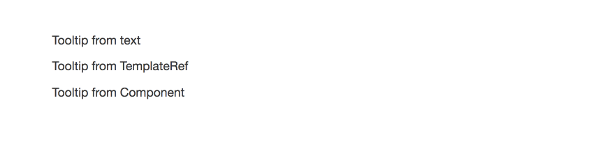
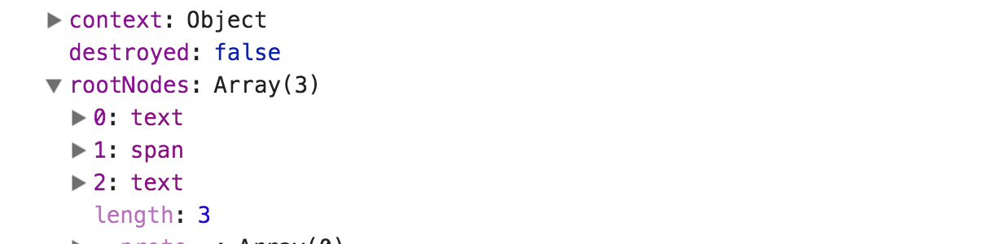

In this article, we are going to learn how to create a dynamic component that uses `ng-content`. We are going to learn advanced techniques like how to create an injector and passing `TemplateRef` or a `Component` as content.

To demonstrate all this, we will create a tooltip. Our final result will be the following:

<Embed src="https://gist.github.com/NetanelBasal/f09e3223ce27a0f7f50a6e3ca030bb3c.js" aspectRatio={0.357} caption="" />



#### Build the Tooltip Component

First, we need to create the component UI. We will use `ng-content` so that the user can pass a dynamic content.

<Embed src="https://gist.github.com/NetanelBasal/8720e53e2c9e1d641530d9d245c79c43.js" aspectRatio={0.357} caption="" />

In the end, we will dynamically create this component through the tooltip directive, so let’s stop here and build the directive (we will come back to this component later).

#### Build the Tooltip Directive

<Embed src="https://gist.github.com/NetanelBasal/8ca680ee2e8e365a2143d6c10ae9e9c2.js" aspectRatio={0.357} caption="" />

If you are not familiar with the basics of creating components dynamically in Angular, I highly recommend stopping here and reading my article — [Dynamically Creating Components With Angular](https://netbasal.com/dynamically-creating-components-with-angular-a7346f4a982d).

What we need to do now is to listen to the `mouseenter` event and create the tooltip component.

<Embed src="https://gist.github.com/NetanelBasal/c4662800a5e72579709f7e3a690cdc06.js" aspectRatio={0.357} caption="" />

We see **two** new parameters that we did not discuss in the previous article.

#### Injector —

We can use the `resolveAndCreate()` method, which resolves an array of providers and creates an injector from those providers. The `config` parameter is the same as `@ngModule.providers`.

In our case, we pass an object with only one property, the `host` element, so we can calculate the tooltip position. In real life, you will pass more things, such as the tooltip placement, animation, etc.

Note that we can pass the same object as an `Input()` to the tooltip component, for instance:

```
this.componentRef.instance.config = config
```

but we want to avoid dealing with errors like _“EXCEPTION: Expression has changed after it was checked.”_

Now we can use the injector providers in our tooltip component and calculate the tooltip position.

<Embed src="https://gist.github.com/NetanelBasal/295c43fcb0b180ac0bd05b555ee2fa1b.js" aspectRatio={0.357} caption="" />

Pay attention to the technique we use to grab the `.tooltip-container`. We are leveraging directives to target the element and query for him with the `@[ViewChild](https://netbasal.com/understanding-viewchildren-contentchildren-and-querylist-in-angular-896b0c689f6e)` decorator that provides an API to obtain the native element.

We are done with the tooltip component, now let’s see how we can project elements to the `ng-content` tag.

#### ngContent —

The fourth parameter is what Angular will pass as `ng-content`. This parameter expects to receive a _two-dimensional_ array of DOM elements. Let’s see the `generateNgContent()` method.

Handling text —

<Embed src="https://gist.github.com/NetanelBasal/f15bd792351e361ee758a44aff701e75.js" aspectRatio={0.357} caption="" />

This is the simplest case. We check that our `Input()` is a string and create a text node with the help of the `renderer` service.

Handling TemplateRef —

<Embed src="https://gist.github.com/NetanelBasal/24859b17edf0157cb3853df166deaa40.js" aspectRatio={0.357} caption="" />

We instantiate an Embedded View based on the `TemplateRef`. This will give us reference to a `View` object that has one special property — `rootNodes`. The `rootNodes` is an array of DOM nodes that are extracted from the template, and that’s exactly what we need.



Handling Components —

<Embed src="https://gist.github.com/NetanelBasal/41c12d93b7f336b0371320bb037e33ef.js" aspectRatio={0.357} caption="" />

We need to create the component, and then we can pass the nativeElement as `ng-content`.

If you want to learn more about `Views` in Angular you can read [this](https://blog.angularindepth.com/exploring-angular-dom-abstractions-80b3ebcfc02) article by [Maxim Koretskyi](https://medium.com/@maxim.koretskyi).

The final step is to remove the component on `mouseout`.

<Embed src="https://gist.github.com/NetanelBasal/9353eae6fd200785ad92e1770fd98c6e.js" aspectRatio={0.357} caption="" />

You can find the full source code in the following link.

[**angular-upbvzm - StackBlitz**  
_Starter project for Angular apps that exports to the Angular CLI_stackblitz.com](https://stackblitz.com/edit/angular-upbvzm?embed=1&file=app/tooltip.component.ts "https://stackblitz.com/edit/angular-upbvzm?embed=1&file=app/tooltip.component.ts")[](https://stackblitz.com/edit/angular-upbvzm?embed=1&file=app/tooltip.component.ts)

### **Things to not miss**:

[**🚀 Introducing Akita: A New State Management Pattern for Angular Applications**  
_Every developer knows state management is difficult. Continuously keeping track of what has been updated, why, and…_netbasal.com](https://netbasal.com/introducing-akita-a-new-state-management-pattern-for-angular-applications-f2f0fab5a8 "https://netbasal.com/introducing-akita-a-new-state-management-pattern-for-angular-applications-f2f0fab5a8")[](https://netbasal.com/introducing-akita-a-new-state-management-pattern-for-angular-applications-f2f0fab5a8)

[**NetanelBasal/spectator**  
_spectator - 👻 Angular Tests Made Easy 🤓_github.com](https://github.com/NetanelBasal/spectator "https://github.com/NetanelBasal/spectator")[](https://github.com/NetanelBasal/spectator)

_Follow me on_ [_Medium_](https://medium.com/@NetanelBasal/) _or_ [_Twitter_](https://twitter.com/NetanelBasal) _to read more about Angular, Vue and JS!_
