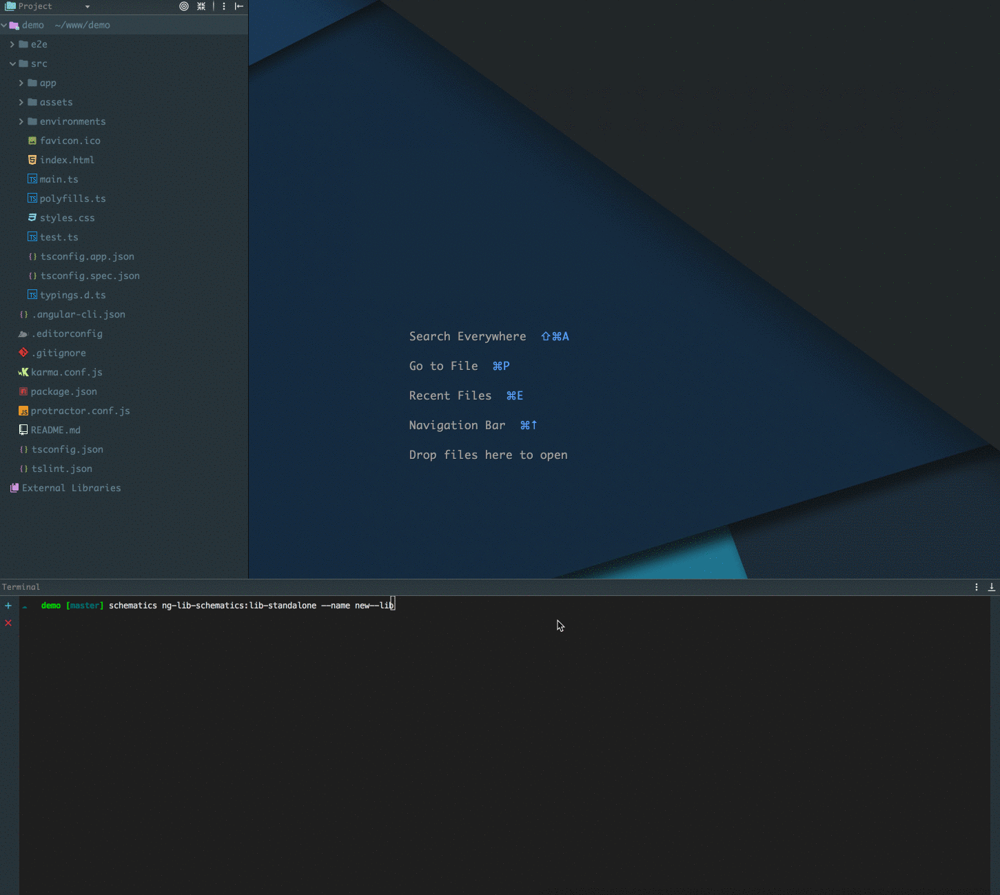

Maybe it’s just me, but since Angular was released, creating an open source library has been no simple task.

Luckily with the release of Angular [Schematics](https://blog.angular.io/schematics-an-introduction-dc1dfbc2a2b2), tools have been created to simplify the process by integrating an environment that is convenient and familiar to us — Angular cli.

In this article, I will guide you step by step as we create and publish an Angular library.

To simplify the process, we will use a library I have encountered recently — [Angular Library Schematics](https://github.com/caroso1222/ng-lib-schematics). (By [Carlos Roso](https://medium.com/@caroso1222))

For our demo, we’ll create a directive that will call for us to `stopPropagation()` when we need to. For example:

```
<button (click.stop)="onClick($event, extraData)">Click Me</button>
```

### Installation

First, we need to install some dependencies.

```
npm i -g 
ng-lib-schematics 
@angular-devkit/core 
@angular-devkit/schematics-cli
```

Now, let’s create a new `angular-cli` project with the following command.

```
ng new <library-name> --skip-install
```

Next, we can create our library.

```
schematics ng-lib-schematics:lib-standalone --name <library-name>
```

After running the above command, you will find a new folder labelled `lib` inside the `src` folder. It will include sample demo module and the build tools.



From here, you can start developing the library like you are used to.

**The real advantage of this tool over something like** [**ng-**](https://www.npmjs.com/package/ng-packagr)**packag**r **is that it exposes the build tools written in gulp, giving you full control over the build process.**

For example, I had to add a custom `postcss` plugin to the build process. It was just a matter of hooking up to the gulp task — very comfortable.

### Add Tests

Adding a test is as simple as creating the `spec` file. For example:

<Embed src="https://gist.github.com/NetanelBasal/0451aa4337ff7388e23b3033a9165246.js" aspectRatio={0.357} caption="" />

Then, let the `angular-cli` take care of the rest.

### Continuous Integration

I don’t know about you, but I like tools that simply work without defining anything. That’s why I use a service called [semaphoreci](https://semaphoreci.com/) for a continuous integration process.

](./asset-3.png)

Don’t get me wrong, I’m not a sponsor or anything like that, it’s free, open source, and very good.

You just need to create account, choose your repository, and let the tool work its magic.

### **Building and Publishing**

To publish our library, we just need to run:

```
npm run build:lib
cd dist && npm publish
```

That’s it. You can find the full example [here](https://github.com/NetanelBasal/ngx-stop-propagation).

I hope this will help you create more Angular libraries, because we need them. Enjoy!

_Follow me on_ [_Medium_](https://medium.com/@NetanelBasal/) _or_ [_Twitter_](https://twitter.com/NetanelBasal) _to read more about Angular, Vue and JS!_
