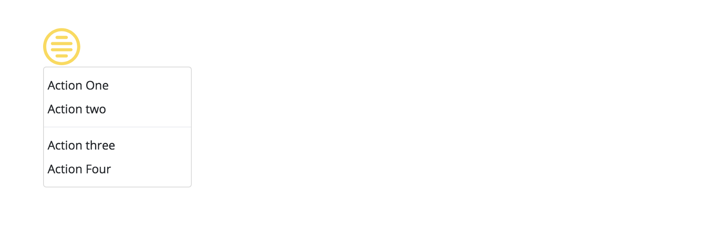

In almost every web developer’s career, there’s a point where he needs to create a custom drop-down or action menu to use in his application.

Like any good developer, we do not want to reinvent the wheel, but instead look to existing libraries.

But inevitably, each library that we find will have one of the following disadvantages:

1.  The library does not append the element to the body, preventing us from using overflow hidden for our containers.
2.  Our designer wants custom HTML so they can, for example, add icons, but the library only supports strings.
3.  The library does not support groups.
4.  The library comes with its own style, and we have to override a bunch of CSS style and in some cases even use the !important attribute. ( 😱 )

And that’s how we looked at that moment.

**What we really need are non-opinionated components.** Let’s create an action menu that will eliminate all the disadvantages mentioned above.

We are going to use [Popper.js](https://popper.js.org/) ,which will help us with the positioning.

> A KICKASS LIBRARY USED TO MANAGE POPPERS IN WEB APPLICATIONS

Our final result will be the following:

<Embed src="https://gist.github.com/NetanelBasal/0abc9bafaf73e4f52ef54a45267ce05f.js" aspectRatio={0.357} caption="nav.component.html" />

### Create The Origin Directive

We need to a way to identify the origin so we can attach the drop-down to it. We also need an elegant solution that listens for click events so we can toggle the drop-down.

<Embed src="https://gist.github.com/NetanelBasal/05447cb227be56bb832e0ea83dd3765d.js" aspectRatio={0.357} caption="action-menu-origin.directive.ts" />

### Create The Dropdown Directive

The drop-down directive is our way of identifying the drop-down element so we can later pass his reference to Popper.

<Embed src="https://gist.github.com/NetanelBasal/91b282458faea675c5d4269727d472dd.js" aspectRatio={0.357} caption="action-menu-dropdown.directive.ts" />

### Create The Action Menu Component

The action menu component is responsible for grabbing the `origin` and the `drop-down` element with the help of the `ContentChild` decorator and managing the action menu.

<Embed src="https://gist.github.com/NetanelBasal/e583a65ba0c3a8b03aea635a3a6ac2f8.js" aspectRatio={0.357} caption="" />

The above code is straightforward. We are subscribing to the click event of the `origin` element and toggling the `drop-down` based on the `_open` property. Popper expects to get the `origin` and the `drop-down` element for doing his magic.

We also add a handler, just in case the user clicks out of the `drop-down` and it needs to be closed.

And that’s it.

Now, if we need to add a divider, for example, we just add it.

<Embed src="https://gist.github.com/NetanelBasal/543c90c2d4cf1e30820076471d11a4e0.js" aspectRatio={0.357} caption="" />

**_Final note_**_: The Angular Material has its own API for_ [_positioning_](https://material.angular.io/cdk/overlay/overview)_, but I find Popper both more powerful and usable._

### Summary

We have seen how easy it is to create a compelling and very flexible component. Of course, this is just a basic example. We can also add animations and accept more Popper options as `Input()`.

_Follow me on_ [_Medium_](https://medium.com/@NetanelBasal/) _or_ [_Twitter_](https://twitter.com/NetanelBasal) _to read more about Angular, Vue and JS!_
