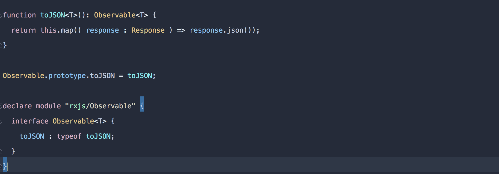
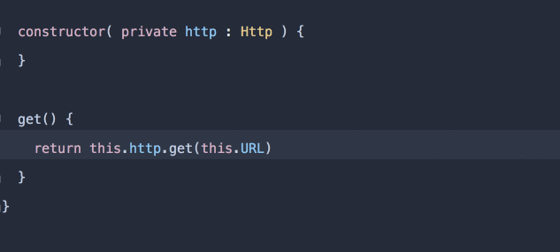

When you work with the Angular `HTTP` service and you want to get the response as `JSON` you need to do something like this:

```
return this.http.get(‘http://api.com').map(res => res.json());
```

What bothers me is that I have to repeat this every time I want to make a request and I don’t even have an automatic completion.

I think it’s worth a new operator. Let’s create the `toJSON` operator.

```
// local-operators.ts

function toJSON<T>(): Observable<T> {
  return this.map(( response : Response ) => response.json());
}

Observable.prototype.toJSON = toJSON;
```

The code is straightforward. The `this` is referencing to the source observable, in our case the `get` observable and we need to return new observable, our newly `mapped` observable.

We can create a new operator by adding it to the Observable `prototype`.

The last thing that we need is to add the typescript definition.

```
declare module "rxjs/Observable" {
  interface Observable<T> {
    toJSON : typeof toJSON;
  }
}
```

_Follow me on_ [_Medium_](https://medium.com/@NetanelBasal/) _or_ [_Twitter_](https://twitter.com/NetanelBasal) _to read more about Angular, Vue and JS!_
