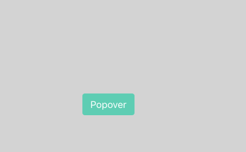
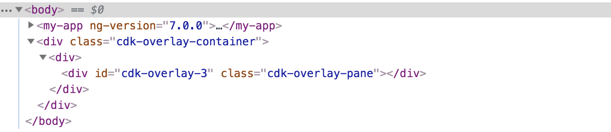
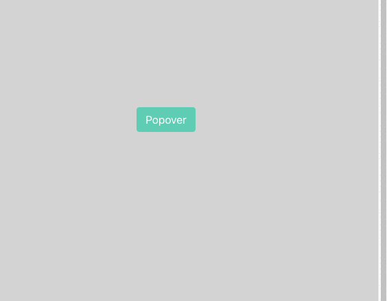

In this article, we’ll learn how to use the Angular CDK `overlay` feature to create powerful components. We’ll accomplish this by creating a popover service that exposes an API that allows us to open a _popover_ relative to any origin element, render a custom component, template, or simple text inside it, and get notified when it’s closed.

As always, here is a visualization of the final result:

And here is a usage example:

<Embed src="https://gist.github.com/NetanelBasal/0ab3ac8474de5437dfd3900605bd1967.js" aspectRatio={0.357} caption="" />

We’re injecting the `Popover` service and calling the `open()` method, passing the `origin`, a custom component and optional `data` object that will be available inside the component via DI.

You can also notice that I prefer passing the `origin` reference directly to the method instead of using the `ViewChild` decorator. This saves me a little boilerplate work.

Let’s get started.

### Create the Popover Service

We first need to create the `Popover` service and expose the `open()` method. The `open()` method takes the `origin` element, which is the DOM element we want our popover to connect to, the `content` that could be a template, component, or simple text, a `data` object which will be passed to the provided component via DI and optional width and height.

<Embed src="https://gist.github.com/NetanelBasal/94ee8cc27af284905cf5d927dbac30dc.js" aspectRatio={0.357} caption="" />

We are injecting the CDK's `Overlay` service and using the `create()` method to obtain a reference to an `overlay` instance. `Overlay` provides a first-class method to render children into a DOM node that is appended to the body.

A typical use case for `overlay` is when a parent component has an `overflow: hidden` or `z-index` style, but you need the child to visually “_break out_” of its container.

Let’s see what we have so far by calling the `open()` method:

As you can see, `overlay` is just a div that is appended to the body. Currently, there is nothing inside this `div`, and we’ll see later how to render `content` inside it. Let’s continue with the `OverlayConfig` parameter.

We set `hasBackdrop` to true so that we can close the popover when the user clicks outside of it. We create a custom `backdropClass` as we want to remove the default `box-shadow` style.

The `scrollStrategy` option determines how the overlay will react to scrolling outside the overlay element. In our case, we set it to `reposition()` as we want to re-position the overlay element on scroll.

The `positionStrategy` option determines how the overlay will be positioned on-screen. Let’s see the `getOverlayPosition()` method implementation:

<Embed src="https://gist.github.com/NetanelBasal/dc8acf016e6dab1599ccb01ce3f6e00c.js" aspectRatio={0.357} caption="" />

Let’s break it down. The `flexibleConnectedTo()` method takes the `origin` element that the `overlay` should be positioned relative to.

The `withPositions()` method take a list of a `ConnectionPositionPair[]`. This is a list of preferred positions, from most to least desirable. The “best” position will be selected based on how well the overlay fits within the viewport.

`originX`: This will be `start`, `end`, or `center`. It’s the attachment point for your `overlay`. This refers to the `start`, `end` and `center` of the `origin` element.

`originY`: This will be `top`, `bottom` or `center`. This refers to the `top`, `bottom` or `center` of the `origin` element.

`overlayX` and `overlayY` have the same options, but refer to where the `overlay` will be attached to.

Take the first `ConnectionPositionPair` and think about it as a connection between the `overlay` bottom to the `origin` top. I know it’s confusing, but try to play with it a little bit and you’ll eventually understand what’s going on.

So, in our case, we preferred a `top` position with a fallback of a `bottom` position, which gives us the following functionality:

Here are more predefined positions for your convenience:

<Embed src="https://gist.github.com/NetanelBasal/df30bc9b5985f41049e412bee2ae5d73.js" aspectRatio={0.357} caption="" />

Back to the code, we set the `withPush()` method to `false` as we don’t want the `overlay` to be pushed on-screen if none of the provided positions fit. Try to remove this method and scroll, you’ll see the effect.

### Create the PopoverRef

The next step is to create a `PopoverRef` which gets the `overlayRef`, `content`, and `data`, and exposes a `close()` method, which will close the popover, and an `afterClosed` observable that will notify us when the user closes the popover.

<Embed src="https://gist.github.com/NetanelBasal/8e1af04a810e99816ef7680a2a7ca9c6.js" aspectRatio={0.357} caption="" />

The code is self-explanatory. We have a `close()` method that optionally accepts a data parameter that will be passed to the observers. We also want to be able to determine if the popover was closed by clicking on the `backdrop` or the `close` button, so we add an event `type`.

A different approach for closing the popover in case that you don’t want to use a `backdrop` is to register a `document` click event and do it by yourself, for example:

<Embed src="https://gist.github.com/NetanelBasal/5787b171a80328ad17ab005168a4587c.js" aspectRatio={0.357} caption="" />

### Create the Injector

As we said before, our popover can also render a **custom component**. We want the custom component to get a reference to the current `popoverRef` instance and use it to get the provided `data` and close the popover. Let’s see how we can do that.

<Embed src="https://gist.github.com/NetanelBasal/bb10832b14dde5c2be060eece35a3c6f.js" aspectRatio={0.357} caption="" />

We are using the `PortalInjector` class to create an injector. The `PortalInjector` class is a tiny abstraction that implements the Injector `get()` method. It uses the parent injector and an optional `WeakMap` that contains custom providers. Here is the implementation directly from the source code:

<Embed src="https://gist.github.com/NetanelBasal/c1b5dee77069a7c09ec8fa5922756afd.js" aspectRatio={0.357} caption="" />

If it can’t find the `provider` in the custom providers list, it will continue with the parent injector. Great, we have an `injector`, now let’s move on to the final step — attaching the popover component to the `overlay`.

### Attach the Popover Component

As we saw before, we have an `overlay`, but nothing has been attached to it yet. To attach a component to an `overlay`, we could use the `attach()` method, passing a `ComponentPortal`.

<Embed src="https://gist.github.com/NetanelBasal/cd287971636e037480587b317cc14162.js" aspectRatio={0.357} caption="" />

A Portal is a piece of UI that can be dynamically rendered to an open slot on the page.

The “piece of UI” can be either a `Component` or a `TemplateRef` and the “open slot” is a `PortalOutlet`. `Overlay` is a `PortalOutlet` and we’re rendering the `PopoverComponent` inside the `overlay`.

**Note:** You can skip the `injector` part if the provided `content` is not a custom component.

Let’s finish with the `PopoverComponent` implementation.

### Create the `Popover` Component

The `PopoverComponent` injects, via DI, the current `popoverRef`, and based on the provided `content` type, renders the view.

<Embed src="https://gist.github.com/NetanelBasal/6fc40877a8d74b3005af7a995f21f41e.js" aspectRatio={0.357} caption="" />

We have a basic `switchCase` that will render the correct type based on the provided `content` type. Note that if it’s a `TemplateRef`, we’re also exposing the `close()` method via `context`.

Let’s see how we can finally use this with all three cases.

### Using with Template

As we saw before, we can now use the `close()` method that we pass via `context`.

<Embed src="https://gist.github.com/NetanelBasal/96de659526faa1d28eecf85e80843726.js" aspectRatio={0.357} caption="" />

### Using with Component

We can inject the `PopoverRef` via DI as well as access the provided `data` and the `close()` method. Note that when a component is dynamically created using portals, it must be included in the `entryComponents` of its NgModule.

<Embed src="https://gist.github.com/NetanelBasal/dea5368f988b2322f86c0fd3dd62bc1a.js" aspectRatio={0.357} caption="" />

### Using with Text

Here is an example of `popover` with simple text.

<Embed src="https://gist.github.com/NetanelBasal/d6e5fa8c1349a67e230b4db5011c24cb.js" aspectRatio={0.357} caption="" />

If you’re using a `translate` provider, you can take it one step further and also accepts a translate `key`. (for example, `general.welcome`)

### Summary

We learned how the Angular CDK overlay feature provides a convenient and robust way to create powerful components. You can take what you learned here and continue to build components like `autocomplete`, `dropdown`, `tooltips`, etc.

This was just a little information on the API capabilities. I highly recommend going over the source code and learning about the other awesome stuff that it provides.

### Ready to Master Angular?

### 🔥 **Last but Not Least, Have you Heard of Akita?**

Akita is a state management pattern that we’ve developed here in Datorama. It’s been successfully used in a big data production environment, and we’re continually adding features to it.

Akita encourages simplicity. It saves you the hassle of creating boilerplate code and offers powerful tools with a moderate learning curve, suitable for both experienced and inexperienced developers alike.

I highly recommend checking it out.

[**🚀 Introducing Akita: A New State Management Pattern for Angular Applications**  
_Every developer knows state management is difficult. Continuously keeping track of what has been updated, why, and…_netbasal.com](https://netbasal.com/introducing-akita-a-new-state-management-pattern-for-angular-applications-f2f0fab5a8 "https://netbasal.com/introducing-akita-a-new-state-management-pattern-for-angular-applications-f2f0fab5a8")

<Embed src="https://stackblitz.com/edit/netanel-popover?embed=1" aspectRatio={undefined} caption="" />

_Follow me on_ [_Medium_](https://medium.com/@NetanelBasal/) _or_ [_Twitter_](https://twitter.com/NetanelBasal) _to read more about Angular, Akita and JS!_
