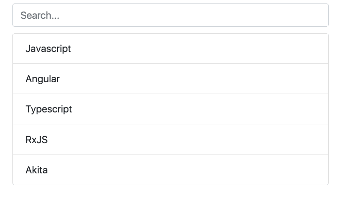

One of my last assignments was to develop generic method to make components and templates searchable in our application. In this article, I will walk you through the process and ideas behind the decisions I made along the way.

As always, just to get a taste of what I’m talking about let’s first see a nice visualization of the final result:

And the markup for the code:

<Embed src="https://gist.github.com/NetanelBasal/4b3fc956774fcdf64aef45b7a158e97e.js" aspectRatio={0.357} caption="" />

### Create the Searchable Container

My first thought was to use something like `ViewChildren` or `ContentChildren` to grab `searchable` items, but this has one big drawback.

In the case of `ViewChildren`, we’re limited to the current view, and in the case of `ContentChildren`, we’re limited to the current `ng-content` section.

Yes, I know we can use the descendants option in `ContentChildren`, but what we need is **flexibility**. We want to give our consumers the ability to add a `searchable` directive anywhere they want in the template hierarchy.

To accomplish this goal, we’ve leveraged a powerful ability in Angular — [Element Injector](https://blog.angularindepth.com/a-curios-case-of-the-host-decorator-and-element-injectors-in-angular-582562abcf0a).

As you may know, just like a service, we can ask Angular to provide us with a directive via a dependency injection. For example:

<Embed src="https://gist.github.com/NetanelBasal/601096ba6f3104dff86c0d575155a428.js" aspectRatio={0.357} caption="" />

What Angular will then do is search for the `ParentComponent` starting from the current host element until it reaches the root component. If Angular can’t find it, it will throw an error, therefore we’re using the [@Optional](https://netbasal.com/exploring-the-various-decorators-in-angular-b208875b207c) decorator.

Back to our code. We’ll use this feature to register each `searchable` directive in our `SearchableContainer` component.

<Embed src="https://gist.github.com/NetanelBasal/72d67a8fdeeef0cb8eddc8443dad7cf1.js" aspectRatio={0.357} caption="" />

We define an `input` that takes the current search term and call the `search()` method with it (we’ll demonstrate the implementation of this method shortly).

We also expose methods for `register` and `unregister` searchable directives. Let’s move on to the `SearchableDirective`.

### Create the Searchable Directive

<Embed src="https://gist.github.com/NetanelBasal/2a6eb8c441ded6ecc9e3a9f656410255.js" aspectRatio={0.357} caption="" />

As stated before, we’re asking Angular to provide us with the `SearchableContainer` and register the current instance. We’re expecting the `SearchableContainer` component to be presented, so we’ll throw an error if it doesn’t.

We’ll also expose methods for hiding and showing the native host element. In this case, I decided to go with the CSS strategy rather than use structural directives because DOM creation operations are expensive, and I don’t want to create and remove DOM elements each time the user searched something.

Yes, I know I can use the ViewContainerRef `insert()` method and save a reference to the view to preserve the elements but it seems like overkill for my needs.

If, for some reason you need this ability, you can always switch to structural directives.

Now, let’s go back to the `search()` method implementation:

<Embed src="https://gist.github.com/NetanelBasal/43e5ffcdf14740ca6eda88285ede1ff0.js" aspectRatio={0.357} caption="" />

When we receive a new search term, we need to loop over the `searchable`   
directives, check if we have a match and run the corresponding method accordingly.

At this point, we have a basic working search. But designers always want more. We need to **highlight** the matching term.

We already have a dedicated pipe in our application that does precisely this, and it looks something like this:

<Embed src="https://gist.github.com/NetanelBasal/0c113132de20e3cf9bc82a4bfd8a952b.js" aspectRatio={0.357} caption="" />

Although it works, this solution isn’t my favorite. It adds verbosity to the template, and then I need to repeat myself and add the search value for each element. In short, I’m not DRY.

So I thought about the relationships. Highlighter depends on a parent `SearchContainer` and also on `Searchable` that could be his parent or on the same host.

So why not leverage the Angular element injector tree again and clean it up?

<Embed src="https://gist.github.com/NetanelBasal/3c23e9c70672070c6d282c3a598a43f8.js" aspectRatio={0.357} caption="" />

### Create the SearchableHighlight Directive

<Embed src="https://gist.github.com/NetanelBasal/51f1ddb61f5fe69bdf49ce582465bbb6.js" aspectRatio={0.357} caption="" />

As I mentioned before, this directive depends on a `SearchableContainer` and a `SearchableDirective`, so we’re asking Angular to provide us with both. We mark them as `Optional()` and throw an error if we can’t find one of them because they are **required**.

We register the instance in the container, so we can control it exactly like we did with the `SearchableDirective`.

The `highlight()` method takes the searchable token and the current search term and sets the `innerHTML` of the host element after [sanitizing](https://netbasal.com/angular-2-security-the-domsanitizer-service-2202c83bd90) it for security reasons.

The `resolve()` method returns the matches term wrapped with a span so we can apply the CSS style to it.

Let’s see the `SearchableContainer` changes:

<Embed src="https://gist.github.com/NetanelBasal/49192b08ccd653d89e2d5acf64e6d7ae.js" aspectRatio={0.357} caption="" />

We’ve added an array to store the `SearchableHighlight` directives. When we receive a new search term we loop over them and invoke the `highlight()` method passing the token and the search term.

### Exposing the Result Count

Let’s finish with adding the ability to view the result count. First, we’ll add a counter to our `SearchableContainer` component:

<Embed src="https://gist.github.com/NetanelBasal/b465362fc653eae6e10a0d6b16da5944.js" aspectRatio={0.357} caption="" />

I don’t believe there is a need to explain the above code. It’s a simple counter that tracks the visible `Searchables` directives length.

Now we need to expose it to the view. We’re going to use an Angular feature that not everybody is familiar with — the `[exportAs](https://netbasal.com/angular-2-take-advantage-of-the-exportas-property-81374ce24d26)` feature.

I already wrote a dedicated article for this topic, but long story short the `exportAs` property allows us to expose a directive public API to the template.

<Embed src="https://gist.github.com/NetanelBasal/f449c621d0e2c5b5eb2c34e5f8b6d8f3.js" aspectRatio={0.357} caption="" />

Now we can access the `SearchableContainer` instance in our template:

<Embed src="https://gist.github.com/NetanelBasal/c76b4d822dfd39526229d402d9cdd3cb.js" aspectRatio={0.357} caption="" />

We’re creating a local variable named container that’s a reference to the `SearchableContainer` instance.

### Summary

Phew…that was long. We learned how we could leverage the Angular element injector to clean up our code and make it reusable. Then we discussed the `Optional()` decorator, and finished with the `exportAs` feature.

**Of course, that’s not the end.** In our application, the code is more optimized, and we support “later arrives”. ( hint: you know when a new searchable has been added ).

The goal was to inspire you with the basic idea of creating searchable components in Angular. You can take it from here.

<Embed src="https://stackblitz.com/edit/angular-fuf9nw?embed=1" aspectRatio={undefined} caption="" />

If you want to know more about Injectors, I recommend reading [Alexey Zuev](https://medium.com/@a.yurich.zuev)’s [article](https://blog.angularindepth.com/angular-dependency-injection-and-tree-shakeable-tokens-4588a8f70d5d) — What you always wanted to know about Angular Dependency Injection tree.

### 🔥 **Last but Not Least, Have you Heard of Akita?**

Akita is a state management pattern that we’ve developed here in Datorama. It’s been successfully used in a big data production environment, and we’re continually adding features to it.

Akita encourages simplicity. It saves you the hassle of creating boilerplate code and offers powerful tools with a moderate learning curve, suitable for both experienced and inexperienced developers alike.

I highly recommend checking it out.

[**🚀 Introducing Akita: A New State Management Pattern for Angular Applications**  
_Every developer knows state management is difficult. Continuously keeping track of what has been updated, why, and…_netbasal.com](https://netbasal.com/introducing-akita-a-new-state-management-pattern-for-angular-applications-f2f0fab5a8 "https://netbasal.com/introducing-akita-a-new-state-management-pattern-for-angular-applications-f2f0fab5a8")

_Follow me on_ [_Medium_](https://medium.com/@NetanelBasal/) _or_ [_Twitter_](https://twitter.com/NetanelBasal) _to read more about Angular, Akita and JS!_
