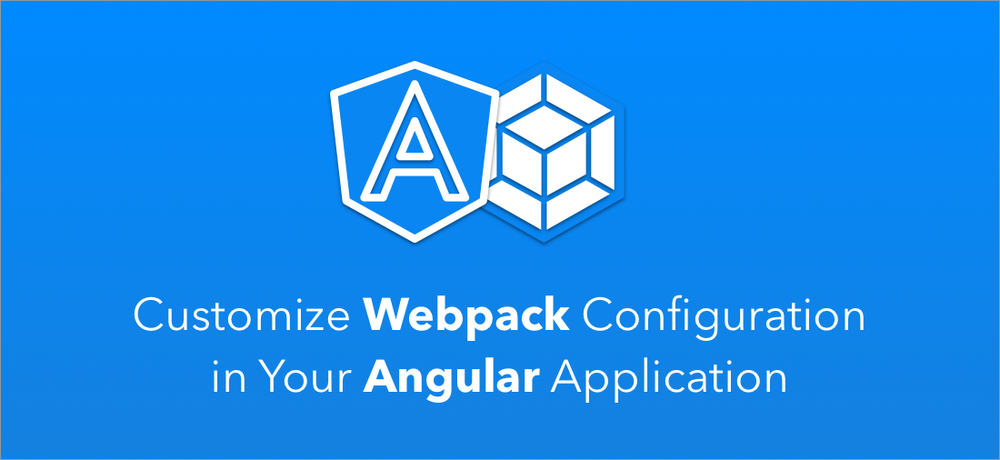
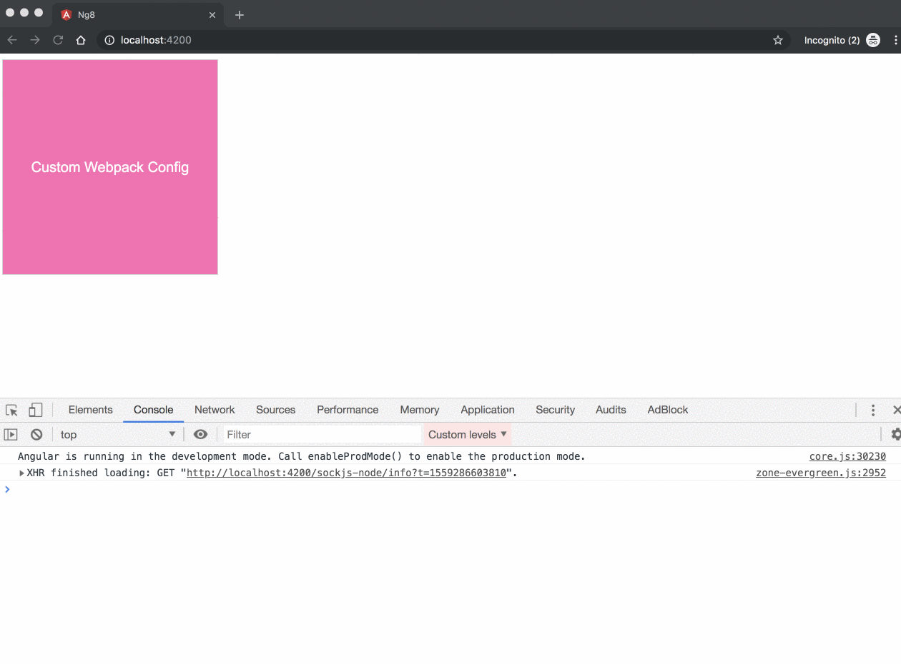

### 🤓 A Brief Overview

Angular CLI is a valuable tool that every Angular developer use to initialize, develop, scaffold, and maintain their applications with ease.

However, one of the crucial things that was missing thus far is the ability to extend the existing webpack config, and add your own custom loaders or plugins.

Sure, there were some hacks, like using `ng-eject` or the experimental Architect API, but it was a risky and complicated thing to do.

Luckily, with the release of Angular 8, the experimental Architect API has been well defined and stabilized, and the good people at the Angular community created a custom webpack builder [library](https://github.com/meltedspark/angular-builders/tree/master/packages/custom-webpack). This library gives us the option to hook into the webpack configuration easily.

We’re not going to dive in and explain how it works under the hood. Instead, I’ll redirect you to a great article written by [Evgeny Barabanov](https://medium.com/@meltedspark), where he explains everything in detail.

### 🦄 Adjust Your Webpack Config

In our example, we’re going to extend the default webpack configuration with two things:

1.  We’ll add a plugin called [webpack-notifier](https://www.npmjs.com/package/webpack-notifier) which uses the [node-notifier](https://github.com/mikaelbr/node-notifier) package to display build status system notifications to the user.
2.  Something I wanted to do for a long time; Add a [postcss](https://postcss.org/) loader.

Let’s get started 😎

First, we need to create a new Angular 8 application:

```
npx @angular/cli new appName
```

Next, we need to install the `angular-builders` library:

```
npm i -D @angular-builders/custom-webpack
```

Now we need to change the `builder` option in the `architect.build` and `architect.serve` fields to the following:

<Embed src="https://gist.github.com/NetanelBasal/ddfa87cc5fcb024fdb13ca57a56821e8.js" aspectRatio={0.357} caption="angular.json" />

With this change, when we run `ng serve` or `ng build` commands, Angular will use our custom builder. The builder will run the same build as the default one does with extra parameters that are specified in the provided webpack file configuration.

Let’s see the `webpack.config` file:

<Embed src="https://gist.github.com/NetanelBasal/ef6e7fb50732fc8909f41bcbcc6b5fb8.js" aspectRatio={0.357} caption="`webpack.config.js`" />

We can expose a partial webpack configuration object with the additional things we need. In our case, we use the w[ebpack](https://webpack.js.org/concepts#loaders) API to add the [postcss](https://github.com/postcss/postcss-loader) loader so we can apply the [postcss-short](https://github.com/jonathantneal/postcss-short) plugin and the `WebpackNotifierPlugin` plugin as we mentioned earlier.

The builder will take care of merging the delta with the existing configuration provided by Angular.

Now, we can use the [postcss-short](https://github.com/jonathantneal/postcss-short) plugin API, for example, let’s add the `[size](https://github.com/jonathantneal/postcss-short#size)` shorthand property:

```
div {
  size: 300px;
}
```

Let’s run the app by using the `npm start` command, and view the result:



We can see the notifier and the transpiled CSS. That’s simple as that.

The library also provides options like custom merge strategies, custom webpack config function, and more. I recommend to check out the [docs](https://github.com/meltedspark/angular-builders/tree/master/packages/custom-webpack).

Happy Hacking! 💻

### 🚀 **Have You Tried Akita Yet?**

One of the leading state management libraries, Akita has been used in countless production environments. It’s constantly developing and improving.

Whether it’s entities arriving from the server or UI state data, Akita has custom-built stores, powerful tools, and tailor-made plugins, which help you manage the data and negate the need for massive amounts of boilerplate code. We/I highly recommend you try it out.

[**🚀 Introducing Akita: A New State Management Pattern for Angular Applications**  
_Every developer knows state management is difficult. Continuously keeping track of what has been updated, why, and…_netbasal.com](https://netbasal.com/introducing-akita-a-new-state-management-pattern-for-angular-applications-f2f0fab5a8 "https://netbasal.com/introducing-akita-a-new-state-management-pattern-for-angular-applications-f2f0fab5a8")[](https://netbasal.com/introducing-akita-a-new-state-management-pattern-for-angular-applications-f2f0fab5a8)

[**10 Reasons Why You Should Start Using Akita as Your State Management Solution**  
_State management is ubiquitous in web applications, be they big or small. One of the notable solutions in this field is…_engineering.datorama.com](https://engineering.datorama.com/10-reasons-why-you-should-start-using-akita-as-your-state-management-solution-66b63d033fec "https://engineering.datorama.com/10-reasons-why-you-should-start-using-akita-as-your-state-management-solution-66b63d033fec")[](https://engineering.datorama.com/10-reasons-why-you-should-start-using-akita-as-your-state-management-solution-66b63d033fec)

_Follow me on_ [_Medium_](https://medium.com/@NetanelBasal/) _or_ [_Twitter_](https://twitter.com/NetanelBasal) _to read more about Angular, Akita and JS!_
