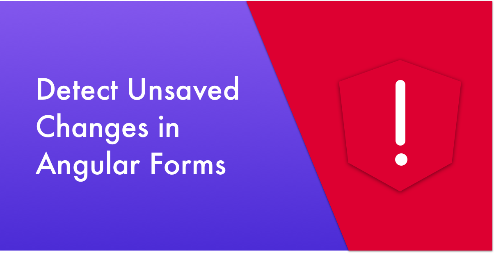
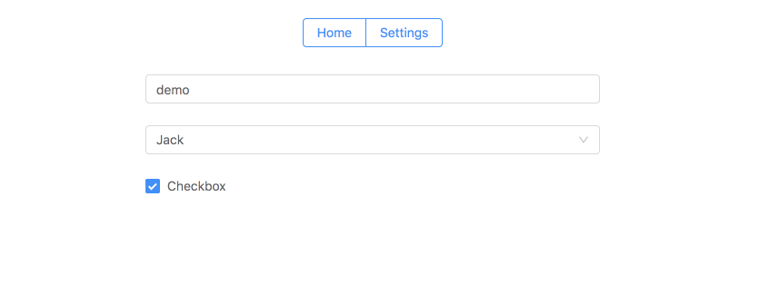

Many applications feature at least one form which allows users to edit previously submitted data. One example of many from our application is that users can create widgets and configure their settings. So, when they click on the settings button, we’ll present a form pre-populated with various settings which can be modified.

The **product requirements** for such forms are:

1.  If the user doesn’t change anything, meaning the form data is identical to the data received from the server, the save button should not be displayed.
2.  If the user changes the data and leave the page without saving, a pop-up window is displayed, warning that there is unsaved data on the page, in order to prevent accidental loss of data.

Here’s an illustration of what we want to achieve:

In this article, we’ll learn how to implement this functionality using observables data sources and Angular forms. Let the fun begin 😎

### Creating the Scaffold

First, we need to create a mock data source, so we have something to work with. In our case, we’ll use a simple `BehaviorSubject`. In real life, it’ll probably be an `Observable` from Akita’s store, ngrx, or any other state management.

<Embed src="https://gist.github.com/NetanelBasal/3b59e004071fbc93a70fa4b31260a8a1.js" aspectRatio={0.357} caption="" />

Next, we create a `SettingsComponent` and initialize a FormGroup representation of our data:

<Embed src="https://gist.github.com/NetanelBasal/33b21ac99b47366147a86ce2081696d1.js" aspectRatio={0.357} caption="" />

We subscribe to the `store$` observable; Whenever it emits, we call the form’s `patchValue()` method to update the form’s values based on the data we get from the server.

In the `submit()` method, we update the store based on the current form value. In real life, we’d check if the form was valid, make an HTTP request, update the store, and display a success notification to the user.

### Creating the isDirty Operator

Our next step is to create an RxJS operator that combines two observables, get their values, perform a deep equality check and return a boolean indicating whether the form is dirty.

The first observable is the `store$` which serves as our single source of truth. The second one is the form’s `valueChanges` observable which emits the current form value upon every form changes. Here’s what we’re aiming for:

<Embed src="https://gist.github.com/NetanelBasal/4979f5bbfc2a77a0330d1fcd06241e62.js" aspectRatio={0.357} caption="" />

Let’s see the operator implementation:

<Embed src="https://gist.github.com/NetanelBasal/82848fef6d814647454a9babde9eb486.js" aspectRatio={0.357} caption="" />

Building your own operator is as simple as writing a function which takes a source observable as an input and returns an output stream.

In our case, we use the `combineLatest()` observable to get both the current store and the form value — when one of them changes, we perform a deep-equal check using the [fast-deep-equal](https://github.com/epoberezkin/fast-deep-equal) library, and return the result.

We also set an initial value for the stream of `false`, as the `valueChanges` observable doesn’t emit immediately, and we don’t want the form to be considered dirty until it is.

#### 🦊 Room for Improvement

Currently, if we subscribe to the `isDirty$` observable multiple times, we’ll re-run the subscription function, which will cause the depth equality check to run again, something we’d like to avoid.

What we need is to always have a single subscription to the source (i.e. a `Subject`), which shares the latest result with each subscriber.

<Embed src="https://gist.github.com/NetanelBasal/0ebaaa66fe900904eed1598221427558.js" aspectRatio={0.357} caption="" />

The `shareReplay` operator creates a `ReplaySubject`, which is the only one subscribed to the source. Whenever we call `subscribe()`, we’re always subscribed to this subject, which shares the latest value.

Great! We’re done with our first requirement, now let’s move on to the next one.

### Handling In-App Navigation

The Angular Router provides the `CanDeactivate` guard, where we can implement a `canDeactivate` method that’ll be called upon any in-app navigation, and provide a reference to the component we’re navigating from.

This method should return a `boolean`, an `Observable<boolean>`, or a `Promise<boolean>`. When we use a `Promise` or an `Observable`, the router will wait for that to resolve to truthy (navigate) or falsy (cancel navigation).

In our case, we will require each component that uses our `dirtyCheck` operator to implement an `isDirty$` property which we can subscribe to in our guard:

<Embed src="https://gist.github.com/NetanelBasal/31e40cc5f09cd983d40db4f655391145.js" aspectRatio={0.357} caption="" />

We subscribe to the `isDirty$` observable. When the component isn’t dirty, we return `of(true)`, which means we can navigate; otherwise, we open a modal component, and depending on the user’s response, we decide whether we should allow the navigation. Note that we also use `take(1)` because Angular expects the first value from the observable to indicate the result.

The last step is to activate the `DirtyCheckGuard`:

<Embed src="https://gist.github.com/NetanelBasal/b85f7d3de82e972d3d5fd6829704a3d4.js" aspectRatio={0.357} caption="" />

### Handling Form Departure

At this point, we aren’t handling cases where users are leaving the application by closing the current tab or refreshing it.

We can tell when this occurs by listening to the window’s `[beforeunload](https://developer.mozilla.org/en-US/docs/Web/API/Window/beforeunload_event)` event. We’ll extend our operator and let it also handle this case:

<Embed src="https://gist.github.com/NetanelBasal/c13cf2460cb38f7dad3904e75b6977e1.js" aspectRatio={0.357} caption="" />

When the `beforeunload` event emits, we check if the component is dirty. If it is, we set the `returnValue` to false, which will cause the browser to display its default confirmation dialog we’re all familiar with.

We don’t want memory leaks, so we clean the `beforeunload` subscription by invoking the passed callback function from within the source’s `finalize()` operator, which will be called when the **source completes or errors**.

Now we’ve fulfilled all the requirements, our product is happy 😀.

### 😱  🚀 **Have You Tried Akita Yet?**

One of the leading state management libraries, [Akita](https://netbasal.gitbook.io/akita/) has been used in countless production environments. It’s constantly developing and improving.

Whether it’s entities arriving from the server or UI state data, Akita has custom-built stores, powerful tools, and tailor-made plugins, which help you manage the data and negate the need for massive amounts of boilerplate code. We/I highly recommend you try it out.

[**🚀 Introducing Akita: A New State Management Pattern for Angular Applications**  
_Every developer knows state management is difficult. Continuously keeping track of what has been updated, why, and…_netbasal.com](https://netbasal.com/introducing-akita-a-new-state-management-pattern-for-angular-applications-f2f0fab5a8 "https://netbasal.com/introducing-akita-a-new-state-management-pattern-for-angular-applications-f2f0fab5a8")

_Follow me on_ [_Medium_](https://medium.com/@NetanelBasal/) _or_ [_Twitter_](https://twitter.com/NetanelBasal) _to read more about Angular, Akita and JS!_

[**NetanelBasal/angular-forms-unsaved-changes**  
_Contribute to NetanelBasal/angular-forms-unsaved-changes development by creating an account on GitHub._github.com](https://github.com/NetanelBasal/angular-forms-unsaved-changes "https://github.com/NetanelBasal/angular-forms-unsaved-changes")
