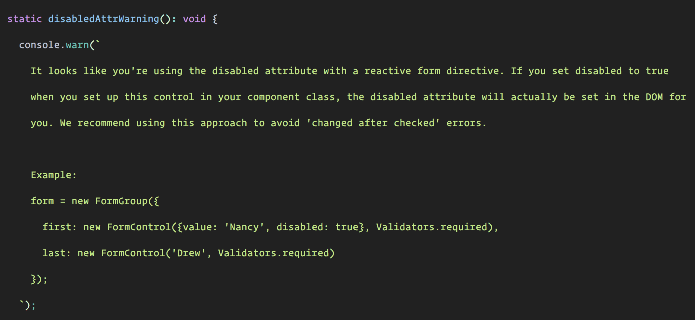

When working with Angular **Reactive Forms** there are times when you need to disable/enable a form control, for example:

```
<input [formControl]="formControl" [disable]="condition">
```

If you’ve ever tried the above code, you probably have encountered the following warning.

> It looks like you’re using the disabled attribute with a reactive form directive. If you set disabled to true when you set up this control in your component class, the disabled attribute will actually be set in the DOM for you. **We recommend using this approach to avoid ‘changed after checked’ errors.**

Angular tells you that it’s better for you to use the ways it gives you to disable/enable form controls.

You can enable/disable a form control by using the following ways:

1.  Instantiate a new `FormControl` with the `disabled` property set to true. `FormControl({value: '', disabled: true})` .
2.  Calling `control.disable()` or `control.enable()` .

But sometimes you miss(😳) or need the method you’re used to (👆). Let’s create a directive that will help us recreate this functionality.

```
import { NgControl } from '@angular/forms';

@Directive({
  selector: '[disableControl]'
})
export class DisableControlDirective {

  @Input() set disableControl( condition : boolean ) {
    const action = condition ? 'disable' : 'enable';
    this.ngControl.control[action]();
  }

  constructor( private ngControl : NgControl ) {
  }

}
```

We can get a reference to the form control instance via DI. Then it is only a matter of calling the correct method according to the `Input()` value.

Now we can use our directive like this:

```
<input [formControl]="formControl" [disableControl]="disable">
<button (click)="disable = true">Disable</button>
<button (click)="disable = false">Enable</button>
```

### 🔥 Last but Not Least, Have you Heard of Akita?

Akita is a state management pattern that we’ve developed here in Datorama. It’s been successfully used in a big data production environment for over seven months, and we’re continually adding features to it.

Akita encourages simplicity. It saves you the hassle of creating boilerplate code and offers powerful tools with a moderate learning curve, suitable for both experienced and inexperienced developers alike.

I highly recommend checking it out.

[**🚀 Introducing Akita: A New State Management Pattern for Angular Applications**  
_Every developer knows state management is difficult. Continuously keeping track of what has been updated, why, and…_netbasal.com](https://netbasal.com/introducing-akita-a-new-state-management-pattern-for-angular-applications-f2f0fab5a8 "https://netbasal.com/introducing-akita-a-new-state-management-pattern-for-angular-applications-f2f0fab5a8")[](https://netbasal.com/introducing-akita-a-new-state-management-pattern-for-angular-applications-f2f0fab5a8)

_Follow me on_ [_Medium_](https://medium.com/@NetanelBasal/) _or_ [_Twitter_](https://twitter.com/NetanelBasal) _to read more about Angular, Vue and JS!_
