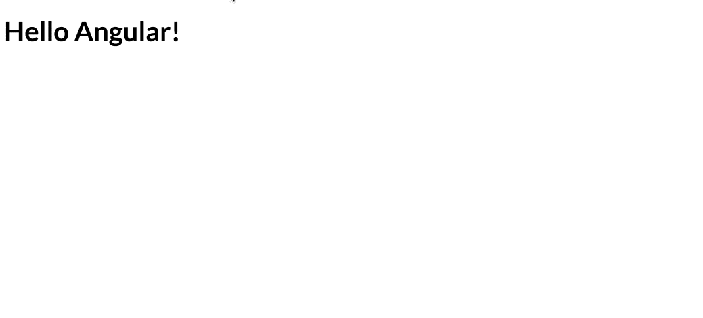

So your new product manager’s request is to add keyboard shortcuts for common actions in the application, giving the users a fast and slick experience.

As a good developer, you don’t want to reinvent the wheel. The initial instinct tells you to google for something like “angular hotkeys” and find an existing library that will do the work for you.

But wait! Before you add a few extra kilobytes to your bundle and give your browser’s engine additional code to parse, let me show you how you can do it yourself by using a built-in Angular API.

### 🧙‍♀️ Events Magic

There is a lesser-known API which provides us with the ability to combine multiple [keys](https://github.com/angular/angular/blob/master/packages/platform-browser/src/dom/events/key_events.ts#L24) when registering a keyboard event through Angular APIs.

For example, here’s how we can define an event that’s triggered only when the user presses `cmd` and `k` at the same time:

<Embed src="https://gist.github.com/NetanelBasal/21c651135c5b71e79c09c5dcf366c7cf.js" aspectRatio={0.357} caption="" />

We are not limited to two keys; we can combine as many as we like:

<Embed src="https://gist.github.com/NetanelBasal/4d6349204986aa5167d839df565feff8.js" aspectRatio={0.357} caption="" />

### 🦊 That’s Nice, However..

When we have one or two shortcuts in the application, we can make do with this functionality. Since we’ve got dozens in our real-world application, we’ll take it a step further.

We want to create an abstraction for the application shortcuts. We need this abstraction to serve as the repository for all the shortcut logic, enabling us to control and modify it from there, and display it to the user if needed.

Next, we’ll “observify” the current API, giving us the power of RxJS.

Let’s create the `Hotkeys` service:

<Embed src="https://gist.github.com/NetanelBasal/405e8127ef5101c24b35a539f54461ae.js" aspectRatio={0.357} caption="" />

We obtain a reference to the `EventKeyManager` provider via DI. This provider exposes the `addEventListener()` method, where we can register the required event.

Alternatively, we can also use the Renderer provider `listen()` method. However, since we can’t inject it in a service, we’ll need to create a new instance of it ourselves, something which I prefer to avoid.

If you’re unfamiliar with this provider, you can read one of my previous detailed article about this topic:

[**Lifting the Veil: Insights into Angular’s EventManagerPlugin**  
_Getting to know the EventManagerPlugin in Angular_netbasal.com](https://netbasal.com/lifting-the-veil-insights-into-angulars-eventmanagerplugin-ed9d14cbb31a "https://netbasal.com/lifting-the-veil-insights-into-angulars-eventmanagerplugin-ed9d14cbb31a")

We create the `addShortcut()` method that receives the element ( which default to `document` ) and the key combo, and returns an observable that registers the event when we subscribe.

Now, we can use the service wherever we want:

<Embed src="https://gist.github.com/NetanelBasal/1ab2772614d78ddd2cf5f599e875615d.js" aspectRatio={0.357} caption="" />

The next thing we need to do is to open a modal where we show the available shortcuts to the users. We’ll do so by registering a new shortcut, `shift + ?`, that opens the modal, and provide the consumer with the option to pass a description for each shortcut:

<Embed src="https://gist.github.com/NetanelBasal/2bac6d1a805348b472238f2ac3829486.js" aspectRatio={0.357} caption="" />

We create a new `hotkeys` property, which is a `Map` where the `key` is the shortcut key combo, and the `value` is the description. Now we can pass this data into our modal and display it to our users:

<Embed src="https://gist.github.com/NetanelBasal/b6ca39bf8fae5e53784d4105217c3c32.js" aspectRatio={0.357} caption="" />

Let’s see the `HotkeysHelpComponent` implementation:

<Embed src="https://gist.github.com/NetanelBasal/f222359866998f87ad7563396a5ae975.js" aspectRatio={0.357} caption="" />

We convert the data into an array, so we can iterate over it and elegantly display it in a table. In real life, don’t forget to take care of windows/mac different key handling.

More improvements that can be made include creating a directive use along with the service, and showing the user the keyboard symbols. Here’s the list for your convenience:

<Embed src="https://gist.github.com/NetanelBasal/ce2904e78675764c5e0becf05cee572a.js" aspectRatio={0.357} caption="" />

### Summary

We’ve learned how Angular can simplify our lives and provides us with a useful built-in functionality to create keyboard shortcuts for our application. In most cases, you can make do with this API. If you need more advanced functionality, you can use a third-party library.

### 😍 **Have You Tried Akita Yet?**

One of the leading state management libraries, Akita has been used in countless production environments. It’s constantly developing and improving.

Whether it’s entities arriving from the server or UI state data, Akita has custom-built stores, powerful tools, and tailor-made plugins, which help you manage the data and negate the need for massive amounts of boilerplate code. We/I highly recommend you try it out.

[**10 Reasons Why You Should Start Using Akita as Your State Management Solution**  
_State management is ubiquitous in web applications, be they big or small. One of the notable solutions in this field is…_dev.to](https://dev.to/theblushingcrow/10-reasons-why-you-should-start-using-akita-as-your-state-management-solution-c72 "https://dev.to/theblushingcrow/10-reasons-why-you-should-start-using-akita-as-your-state-management-solution-c72")

[**🚀 Introducing Akita: A New State Management Pattern for Angular Applications**  
_Every developer knows state management is difficult. Continuously keeping track of what has been updated, why, and…_netbasal.com](https://netbasal.com/introducing-akita-a-new-state-management-pattern-for-angular-applications-f2f0fab5a8 "https://netbasal.com/introducing-akita-a-new-state-management-pattern-for-angular-applications-f2f0fab5a8")

_Follow me on_ [_Medium_](https://medium.com/@NetanelBasal/) _or_ [_Twitter_](https://twitter.com/NetanelBasal) _to read more about Angular, Akita and JS!_

<Embed src="https://stackblitz.com/edit/angular-phidsk?embed=1" aspectRatio={undefined} caption="" />

or in [ng-run](https://ng-run.com/github/NetanelBasal/hotkeys-ng).
