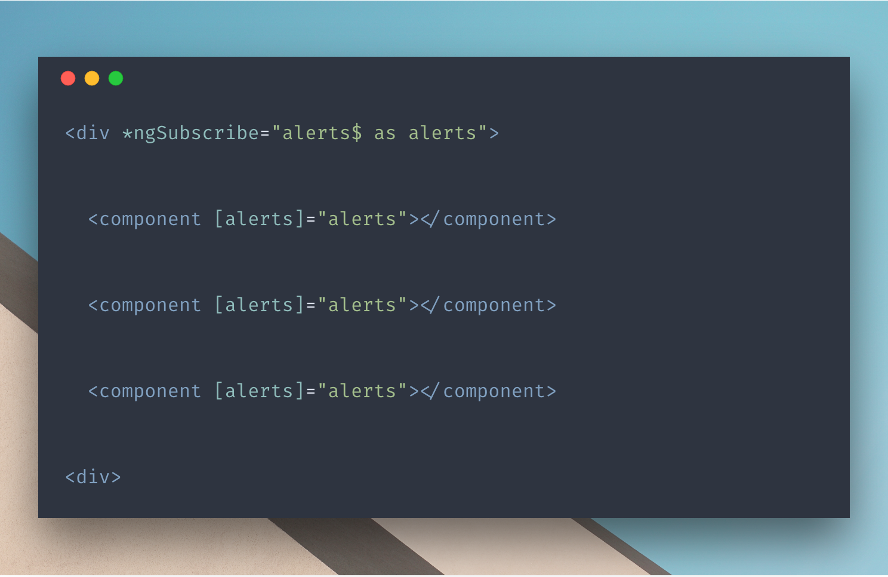

In this article, we’ll learn how to manage subscriptions in the template with a bit more elegance. We’ll see the disadvantages to the current solution and consider how we can improve it by creating our own directive.

Let’s say we have the following code:

<Embed src="https://gist.github.com/NetanelBasal/cf6f9ee22c3ac8f0dbc458a2b9416bf4.js" aspectRatio={0.357} caption="" />

The problem with the above code is that we create **multiple** subscriptions on `alerts$`. There’s one for each async pipe, and two in the example above.

Angular recently presented a solution to this problem. We can use the `ngIf` directive and bind the result to a local variable.

So, for example, we can rewrite our code as follows:

<Embed src="https://gist.github.com/NetanelBasal/aaae2cff418966dbbd437ebf6af307f0.js" aspectRatio={0.357} caption="" />

We can use the `ngIf` directive and store the condition result in a local variable. In our case, we called this variable `alerts` .

The advantages of this approach are obvious:

1.  We use only one async pipe and, as a result, create only **one** subscription.
2.  The local `alerts` can be bound repeatedly in a more efficient way.

The problem with this solution is that there are times when it won’t feel right or, to be more accurate, suitable. Let me explain why.

1.  **Semantic meaning is lost**. The code doesn’t properly convey its meaning: it’s not clear whether the conditional rendering is the point, or whether it just required the expression to pass its result to the child view.
2.  If the value is `falsy`, using it in the `ngIf` directive means the view won’t be rendered altogether. This might not be the desired result, for instance in cases where you want to display the value, or use it in an argument for an event or a child element’s output.

For these reasons, I decided to create a directive that addressed the above problems, and its whole purpose is to subscribe to an observable and expose the result to its child view.

Let’s see the final result:

<Embed src="https://gist.github.com/NetanelBasal/d8ffac940eff13d8977f1393712be7a6.js" aspectRatio={0.357} caption="" />

### Create the `*ngSubscribe` Directive

We can already see that we need a structural directive, so let’s inject the `TemplateRef` and `ViewContainerRef` providers to the constructor.

<Embed src="https://gist.github.com/NetanelBasal/768da1fcb924e277a729d5ee124b45f5.js" aspectRatio={0.357} caption="" />

When we create the embedded view, we can pass in the `context` object. It contains all the properties we want to make available for binding in the template. That’s how we’ll pass the observable result into the view.

Let’s complete the `ngSubscribe` input:

<Embed src="https://gist.github.com/NetanelBasal/11a25257bc9aef2c4c2f6015f33293ac.js" aspectRatio={0.357} caption="" />

We need to subscribe to the input observable, pass the result via `context` to the template, and call `markForCheck()` to support `onPush` components.

Notice, for example, that when the consumer writes `as alerts` in the template, it actually binds to the value specified under the context `ngSubscribe` key (which is also the name of the input).

And that’s all there is to it. Simple, readable and clean. I like it!

<Embed src="https://stackblitz.com/edit/ngsubscribe?embed=1" aspectRatio={undefined} caption="" />

You can also take it one step further by accepting an array or object of observables. I’ll give you an hint, use `combineLatest`, it takes an array or arguments separated by commas.

### 👂🏻 Last but Not Least, Have you Heard of Akita?

Akita is a state management pattern that we’ve developed here in Datorama. It’s been successfully used in a big data production environment for over seven months, and we’re continually adding features to it.

Akita encourages simplicity. It saves you the hassle of creating boilerplate code and offers powerful tools with a moderate learning curve, suitable for both experienced and inexperienced developers alike.

I highly recommend checking it out.

[**🚀 Introducing Akita: A New State Management Pattern for Angular Applications**  
_Every developer knows state management is difficult. Continuously keeping track of what has been updated, why, and…_netbasal.com](https://netbasal.com/introducing-akita-a-new-state-management-pattern-for-angular-applications-f2f0fab5a8 "https://netbasal.com/introducing-akita-a-new-state-management-pattern-for-angular-applications-f2f0fab5a8")

_Follow me on_ [_Medium_](https://medium.com/@NetanelBasal/) _or_ [_Twitter_](https://twitter.com/NetanelBasal) _to read more about Angular, Akita and JS!_
