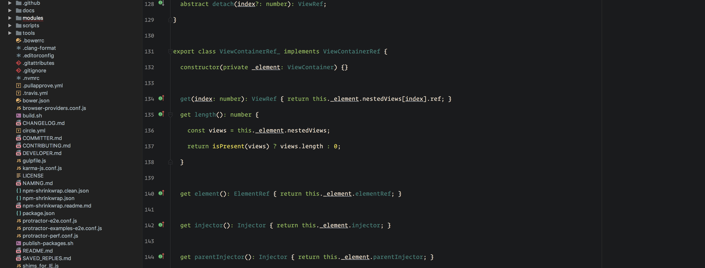
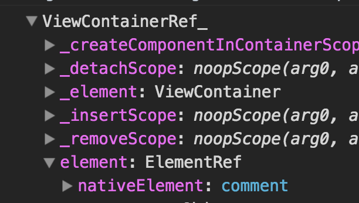
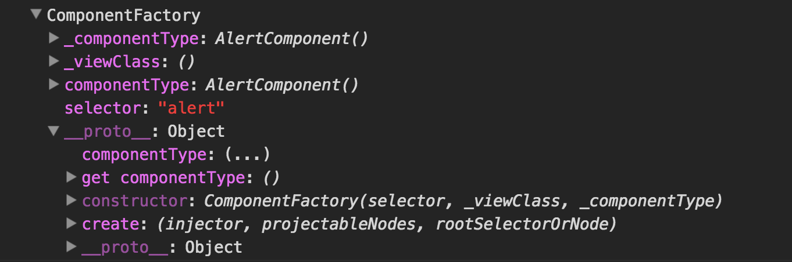
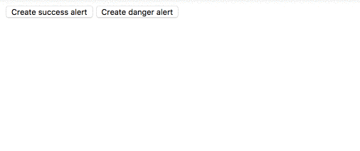

In this article, we will learn how to create components in Angular dynamically.

First, we need a component.

<Embed src="https://gist.github.com/NetanelBasal/c54286097f102212e4fc3579f1548a84.js" aspectRatio={0.357} caption="" />

For the simplicity, we are going to use a simple `alert` component that will take as `Input` the alert type.

Next, If you think about it, eventually components are DOM elements so when you need to add an element, you need a place to “put” it.

<Embed src="https://gist.github.com/NetanelBasal/5e9a4bbd0c617bfe69d384bf4e504ef6.js" aspectRatio={0.357} caption="" />

In Angular, this place is called a **container**.

In the `my-app` component, we are creating a template element. We are also using the hash symbol (#) to declare a reference variable named `alertContainer`. The `template` element is the **place**, or in the Angular world, the **container**.

**Note:** The container can be any DOM element or component.

Now we need to get a reference to our `template` element in the `my-app` component.

<Embed src="https://gist.github.com/NetanelBasal/122dd37282a70ca324f25a45a69015a2.js" aspectRatio={0.357} caption="" />

We can get a reference to the `template` element with the `ViewChild` decorator that also takes a local variable as a parameter.

The default return from the `ViewChild` decorator is the component instance or the DOM element, but in our case, we need to get the element as `ViewContainerRef`.

As the name suggests, `[ViewContainerRef](https://netbasal.com/angular-2-understanding-viewcontainerref-acc183f3b682#.rf5f05b5p)` is a reference to a **container**. `ViewContainerRef` stores a reference to the `template` element ( our container ) and also exposes an API to create components.

Let’s add two buttons that will help us to create the `alert` component.

<Embed src="https://gist.github.com/NetanelBasal/bb52c44594ef5b37373b2b8d673488eb.js" aspectRatio={0.357} caption="" />

Before we proceed to the `createComponent()` method, we need to add one more service.

<Embed src="https://gist.github.com/NetanelBasal/df02fa6d4f3bfb5d6b978971379e69ff.js" aspectRatio={0.357} caption="" />

The `ComponentFactoryResolver` service exposes one primary method, `resolveComponentFactory`.

The `resolveComponentFactory()` method takes a component and returns a `ComponentFactory`.

You can think of `ComponentFactory` as an object that knows how to create a component.

As you can see the `ComponentFactory` exposes the `create()` method that will be used by the **container** ( ViewContainerRef ) internally.

Now for the final step.

<Embed src="https://gist.github.com/NetanelBasal/e9b9cf255364451a53c06716821d3539.js" aspectRatio={0.357} caption="" />

Let’s explain what is happening piece by piece.

<Embed src="https://gist.github.com/NetanelBasal/f300608dc4c27da53fbb3058fd69eafb.js" aspectRatio={0.357} caption="" />

Every time we need to create the component we need to remove the previous view, otherwise, it will append more components to the container. (not required if you need multiple components)

<Embed src="https://gist.github.com/NetanelBasal/0a19b30850e6f3454e779910a0145d87.js" aspectRatio={0.357} caption="" />

The `resolveComponentFactory()` method takes a component and returns the recipe for how to create a component.

<Embed src="https://gist.github.com/NetanelBasal/e98646be30d7b259d7a21de355cfea45.js" aspectRatio={0.357} caption="" />

We are calling the `createComponent()` method with the recipe. Internally this method will call the `create()` method from the factory and will append the component as a **sibling** to our container.

Now we have a reference to our new component, and we can set the type `Input`.

<Embed src="https://gist.github.com/NetanelBasal/f1be0e3de6ec451869727a5803f005ba.js" aspectRatio={0.357} caption="" />

You can also subscribe to a component `Output` like this:

<Embed src="https://gist.github.com/NetanelBasal/c0ea45572a71569fd0c25ef9f93cb7a3.js" aspectRatio={0.357} caption="" />

And don’t forget to destroy the component:

<Embed src="https://gist.github.com/NetanelBasal/3062ac0bb4ce23eaa131fc80549d68e8.js" aspectRatio={0.357} caption="" />

The last step is to add your dynamic components to the [entryComponents](https://angular.io/guide/ngmodule-faq#what-is-an-entry-component) section:

<Embed src="https://gist.github.com/NetanelBasal/340bf49feff6d03cade1d3164fafbad8.js" aspectRatio={0.357} caption="" />

<Embed src="https://stackblitz.com/edit/angular-dynamically-creating-components-vh5gpb?embed=1" aspectRatio={undefined} caption="" />

### 🚀 **Have You Tried Akita Yet?**

One of the leading state management libraries, Akita has been used in countless production environments. It’s constantly developing and improving.

Whether it’s entities arriving from the server or UI state data, Akita has custom-built stores, powerful tools, and tailor-made plugins, which help you manage the data and negate the need for massive amounts of boilerplate code. We/I highly recommend you try it out.

[**🚀 Introducing Akita: A New State Management Pattern for Angular Applications**  
_Every developer knows state management is difficult. Continuously keeping track of what has been updated, why, and…_netbasal.com](https://netbasal.com/introducing-akita-a-new-state-management-pattern-for-angular-applications-f2f0fab5a8 "https://netbasal.com/introducing-akita-a-new-state-management-pattern-for-angular-applications-f2f0fab5a8")

_Follow me on_ [_Medium_](https://medium.com/@NetanelBasal/) _or_ [_Twitter_](https://twitter.com/NetanelBasal) _to read more about Angular, Vue and JS!_
