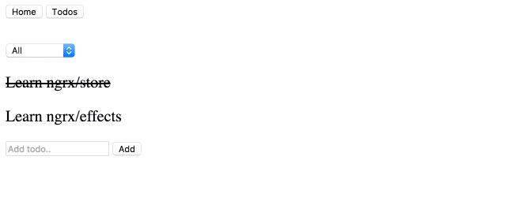
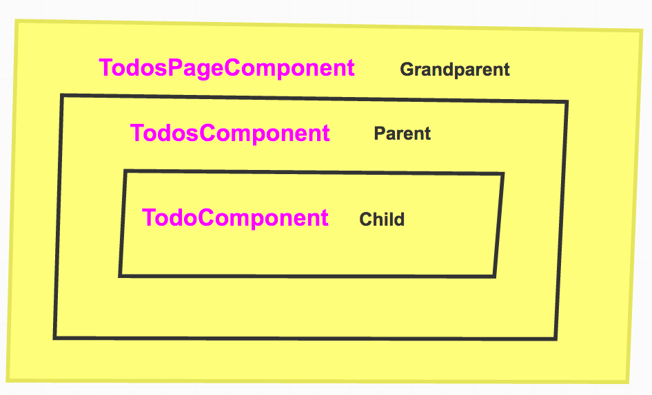
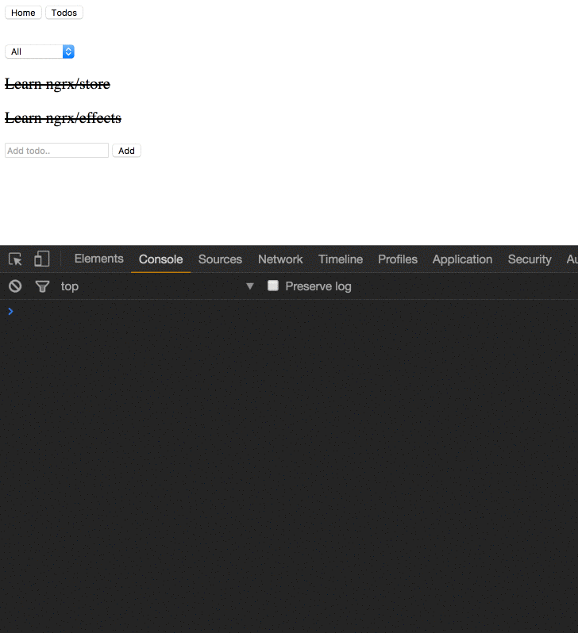
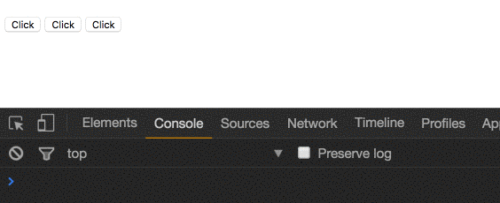

When you start learning Angular one of the first things you learn is how to communicate between child and parent components.

Data flows into your component via property bindings and flows out of your component through event bindings.

If you want your component to notify his parent about something you can use the `Output` decorator with `EventEmitter` to create a custom event.

<Embed src="https://gist.github.com/NetanelBasal/92814db0d492be02f334d88e2c77de2c.js" aspectRatio={0.357} caption="" />

We can use the `Output` decorator to label our property `add` as an event a component can fire to send data to its parent.

The parent can listen to an event like this:

<Embed src="https://gist.github.com/NetanelBasal/8d16a36c7380f3716d6e6a7ced985f1a.js" aspectRatio={0.357} caption="" />

Angular will subscribe to the `add` event and call the `addTodo()` method with the data when the component triggers the `next()` method.

### What is EventEmitter 😕

If you take a look at the source code, you are going to see something interesting.

<Embed src="https://gist.github.com/NetanelBasal/893cb2bc4f6087a3c66857b06a04bcc7.js" aspectRatio={0.357} caption="" />

> Behind the scenes, Event Emitters are just [Subjects](https://netbasal.com/understanding-subjects-in-rxjs-55102a190f3#.ixvchuk2k).

The first thing you can learn from the source code is that you can pass a boolean to `EventEmitter` that will determine whether to send events in a synchronous or asynchronous way. ( The default is synchronous )

### 💪 You have the power of Rx 💪

Because `EventEmitters` are `Subjects` ,we can use all the Rx goodness. For example, we want to emit an event only if we have a value.

<Embed src="https://gist.github.com/NetanelBasal/67ce9f675f968b1361cb33affb57ba27.js" aspectRatio={0.357} caption="" />

Very very cool! 😎

That’s not all. We can also use any `Subject` that we want. Let’s try to use `BehaviorSubject`.

<Embed src="https://gist.github.com/NetanelBasal/d3c3c92fbc23f74b47ac4fc7662f6123.js" aspectRatio={0.357} caption="" />

### 👂EventEmitters !== DOM events 😲

Unlike DOM events Angular custom events do not [bubble](http://www.mattlunn.me.uk/blog/2012/05/what-does-event-bubbling-mean/). What it means if you defined something like this:

<Embed src="https://gist.github.com/NetanelBasal/f21fca6133eeff95a340e70943bf10b7.js" aspectRatio={0.357} caption="" />

You can only listen to the `TodoComponent` `toggle` event at the parent level.

So this will work:

<Embed src="https://gist.github.com/NetanelBasal/63b15910950e01daa7b9b3ad329873dd.js" aspectRatio={0.357} caption="" />

But this will not work:

<Embed src="https://gist.github.com/NetanelBasal/580008ef63f41a3405f1c9e60286ba6a.js" aspectRatio={0.357} caption="" />

### 🤓 The solutions —

#### 1\. Keep passing the event up the tree

<Embed src="https://gist.github.com/NetanelBasal/71cbdf2c991bc7388034293513f8f858.js" aspectRatio={0.357} caption="" />

In this example it’s fine, but it can be frustrating if you will have nested components.

#### 2\. Use native DOM [events](https://davidwalsh.name/customevent)

You can create native DOM events like this:

<Embed src="https://gist.github.com/NetanelBasal/917e6b88944aa06a8ce5b6f26f900ed2.js" aspectRatio={0.357} caption="" />

The custom event is dispatched by invoking the `dispatchEvent()` method. We can pass data to our event with the `detail` property.

<Embed src="https://gist.github.com/NetanelBasal/a88cf2a2e2c076d535e8d261bb8ae5c4.js" aspectRatio={0.357} caption="" />

Event bubbling will work here, but the problem with this approach is that we miss out on the opportunity to be able to execute also in none-DOM environments such as native mobile, native desktop, web worker or server side rendering.

#### 3\. Shared Service

<Embed src="https://gist.github.com/NetanelBasal/2529c56131c7d26822374aab0f6ebd20.js" aspectRatio={0.357} caption="" />

We are using `TodoService` as a message bus. You can learn more about this approach from the [documentation](https://angular.io/docs/ts/latest/cookbook/component-communication.html#!#bidirectional-service).

### 👻 Let’s be crazy 🤖

Because `EventEmitters` are observables, we can do some crazy things with them. I don’t know, let’s say you have a button component, and you need to know when the user is finished press all x buttons and then get the latest value from each.

<Embed src="https://gist.github.com/NetanelBasal/5d8e54c399a3006ae14ee7f897c8b170.js" aspectRatio={0.357} caption="" />

If you want to know more about the code above, read my article [Manage your Filters Like a Pro in Angular With combineLatest](https://netbasal.com/manage-your-filters-like-a-pro-in-angular-with-combinelatest-e7b0204be2df#.22ts0r3mc).

### 😍 **Have You Tried Akita Yet?**

One of the leading state management libraries, Akita has been used in countless production environments. It’s constantly developing and improving.

Whether it’s entities arriving from the server or UI state data, Akita has custom-built stores, powerful tools, and tailor-made plugins, which help you manage the data and negate the need for massive amounts of boilerplate code. We/I highly recommend you try it out.

[**🚀 Introducing Akita: A New State Management Pattern for Angular Applications**  
_Every developer knows state management is difficult. Continuously keeping track of what has been updated, why, and…_netbasal.com](https://netbasal.com/introducing-akita-a-new-state-management-pattern-for-angular-applications-f2f0fab5a8 "https://netbasal.com/introducing-akita-a-new-state-management-pattern-for-angular-applications-f2f0fab5a8")

_Follow me on_ [_Medium_](https://medium.com/@NetanelBasal/) _or_ [_Twitter_](https://twitter.com/NetanelBasal) _to read more about Vue, Angular and JS!_
