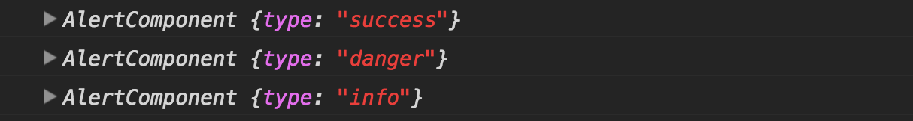
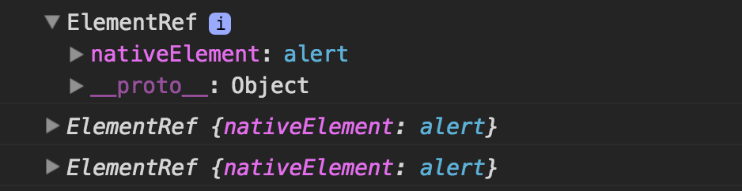
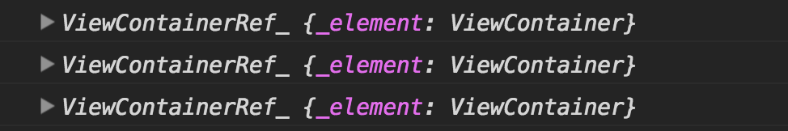
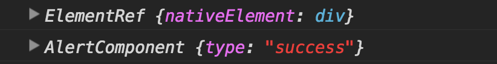
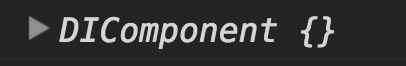

### @Attribute —

<Embed src="https://gist.github.com/NetanelBasal/72a1f5d10926b045b137d0907af8e1e9.js" aspectRatio={0.357} caption="" />

> Returns the value of the specified attribute from the host

### @ViewChildren—

<Embed src="https://gist.github.com/NetanelBasal/cb10ecd0ec039399dc8bf53255be1d4a.js" aspectRatio={0.357} caption="" />

> Returns the specified elements or directives from the view DOM as QueryList



`QueryList` is just a fancy name for an object that stores a list of items. What is special about this object is when the state of the application changes Angular will automatically update the object items for you.

`QueryList` implements an `iterable` interface, therefore, it can be used in Angular templates with the `ngFor` directive. ( you can read more about this topic [here](https://netbasal.com/angular-2-ngfor-array-with-unique-values-6b15478d6484#.letjx3svz) )

#### QueryList API —

Getters —

-   `first` — get the first item
-   `last` — get the last item
-   `length` — get the length

Methods —

`[map](https://developer.mozilla.org/en-US/docs/Web/JavaScript/Reference/Global_Objects/Array/map)()`, `[filter](https://developer.mozilla.org/en-US/docs/Web/JavaScript/Reference/Global_Objects/Array/filter)()` , `[find](https://developer.mozilla.org/en-US/docs/Web/JavaScript/Reference/Global_Objects/Array/find)()`, `[reduce](https://developer.mozilla.org/en-US/docs/Web/JavaScript/Reference/Global_Objects/Array/reduce)()`, `[forEach](https://developer.mozilla.org/en-US/docs/Web/JavaScript/Reference/Global_Objects/Array/forEach)()`, `[some](https://developer.mozilla.org/en-US/docs/Web/JavaScript/Reference/Global_Objects/Array/some)().`

-   `toArray()` — returns the items as javascript array
-   `changes()` — Changes can be observed by subscribing to the changes Observable. Any time a child element is added, removed, or moved, the query list will be updated, and the changes observable of the query list will emit a new value.

#### Things to Remember —

1.  The `QueryList` is initialized only before the `ngAfterViewInit` lifecycle hook, therefore, is available only from this point.
2.  `ViewChildren` don’t include elements that exist within the `ng-content` tag.

#### The read parameter —

By default, the `ViewChildren` decorator will return the component instance, but you can ask for other tokens:

-   The native DOM element —

```
@ViewChildren(AlertComponent, { read: ElementRef }) alerts: QueryList<AlertComponent>
```

-   [ViewContainerRef](https://netbasal.com/angular-2-understanding-viewcontainerref-acc183f3b682#.oesntskk3) — You need this token when you need to create templates or components dynamically

```
@ViewChildren(AlertComponent, { read: ViewContainerRef }) alerts: QueryList<AlertComponent>
```

### @ViewChild—

<Embed src="https://gist.github.com/NetanelBasal/c18ba10473e86bac965d6f16e78e0006.js" aspectRatio={0.357} caption="" />

> Like ViewChildren but returns only the first element or the directive matching the selector from the view DOM

You can see that you also can use a local variable from your template to get a reference to the element in your parent component.



### @ContentChildren —

<Embed src="https://gist.github.com/NetanelBasal/6bcc10d5c7108e476639bb3ff866fb92.js" aspectRatio={0.357} caption="" />

> Returns the specified elements or directives from the content DOM as QueryList

#### Things to Remember —

1.  The `QueryList` is initialized only before the `ngAfterContentInit` lifecycle hook, therefore, is available only from this point.
2.  `ContentChildren` includes only elements that exists within the `ng-content` tag.
3.  Returns `QueryList` like `ViewChildren` .

### @ContentChild —

> Like ContentChildren but returns only the first element or the directive matching the selector from the content DOM

<Embed src="https://gist.github.com/NetanelBasal/c75c5f223c691d8212462f34ba7c79d8.js" aspectRatio={0.357} caption="" />

### @HostBinding —

> Declares a host property binding

<Embed src="https://gist.github.com/NetanelBasal/68bda4e6f048bbdfa4b834a427bac578.js" aspectRatio={0.357} caption="" />

In the third example Angular will add `type=”text”` to our host because when you don’t provide a parameter the class property name is used.

### @HostListener —

> Declares a host listener. Angular will invoke the decorated method when the host element emits the specified event

<Embed src="https://gist.github.com/NetanelBasal/54648b0ca73615a730108f7beb54dc45.js" aspectRatio={0.357} caption="" />

This decorator also support adding events to the globals `window`, `document`, and `body` with this syntax — `global:event`.

### @Self —

> The @Self decorator tells DI to look for a dependency only from itself, so it will not walk up the tree

<Embed src="https://gist.github.com/NetanelBasal/b51c00a3197db856d0009a7143457e17.js" aspectRatio={0.357} caption="" />


If the injector does not find the dependency, it will throw.

### @SkipSelf —

> The @SkipSelf decorator tells DI to look for a dependency in the whole tree starting from the parent injector

<Embed src="https://gist.github.com/NetanelBasal/158cddc0048363b3525e3acded3d3f60.js" aspectRatio={0.357} caption="" />


If the injector does not find the dependency, it will throw.

### @Host —

> The @Host decorator tells DI to look for a dependency in any injector until it reaches the host

<Embed src="https://gist.github.com/NetanelBasal/24b4709f21b184f89d111c88fc1fbeb4.js" aspectRatio={0.357} caption="" />



For a more complicated use case you can read my article — [Angular — Clean Up your Form Template.](https://netbasal.com/angular-clean-up-your-form-template-646faa164b1b#.o3jjznbsv)

### @Optional —

> A parameter metadata that marks a dependency as optional. The injector provides null if the dependency is not found.

<Embed src="https://gist.github.com/NetanelBasal/dbdd8a5cce72df5d42d16259db662544.js" aspectRatio={0.357} caption="" />

In our example, the `dependency` property will be null because we don’t register the `OptionalDependency` provider in any injector.

### @Inject —

> A parameter decorator that specifies a dependency

<Embed src="https://gist.github.com/NetanelBasal/0374bd390949957623094d124ad61652.js" aspectRatio={0.357} caption="" />

### @Injectable —

> Let’s Angular know that a class can be used with the DI

<Embed src="https://gist.github.com/NetanelBasal/fa0846fb32f588c3405f2662f4f90f48.js" aspectRatio={0.357} caption="" />

Remember that this decorator is not required if the class does not have any dependencies or you don’t need the class to be injectable.

I skipped on the most **common** decorators: `Input`, `Output`, `Component`, `Directive`, `Pipe`.

### 😱 🚀 Have You Tried Akita Yet?

One of the leading state management libraries, Akita has been used in countless production environments. It’s constantly developing and improving.

Whether it’s entities arriving from the server or UI state data, Akita has custom-built stores, powerful tools, and tailor-made plugins, which help you manage the data and negate the need for massive amounts of boilerplate code. We/I highly recommend you try it out.

[**🚀 Introducing Akita: A New State Management Pattern for Angular Applications**  
_Every developer knows state management is difficult. Continuously keeping track of what has been updated, why, and…_netbasal.com](https://netbasal.com/introducing-akita-a-new-state-management-pattern-for-angular-applications-f2f0fab5a8 "https://netbasal.com/introducing-akita-a-new-state-management-pattern-for-angular-applications-f2f0fab5a8")[](https://netbasal.com/introducing-akita-a-new-state-management-pattern-for-angular-applications-f2f0fab5a8)

_Follow me on_ [_Medium_](https://medium.com/@NetanelBasal/) _or_ [_Twitter_](https://twitter.com/NetanelBasal) _to read more about Angular!_
