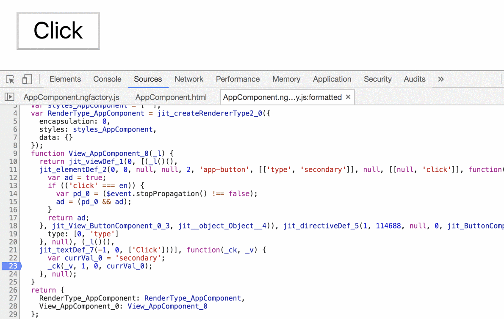

The `@Attribute` decorator is one of the least known and least used, but in some cases, it can bring a performance boost to the application.

The `@Attribute` decorator returns the value of the specified attribute from the host.

Let’s say that we have a core button component that accepts the `type`, which can be primary or secondary.

<Embed src="https://gist.github.com/NetanelBasal/df35d7a5dcc20deea048ab92144eb6b8.js" aspectRatio={0.357} caption="" />

And because it is a **static string**, we will use it in the template without the brackets.

<Embed src="https://gist.github.com/NetanelBasal/449f364c5892819444663478fc9dd57b.js" aspectRatio={0.357} caption="" />

There is one drawback to this approach. Because we are using an `Input()`, Angular will still create a binding for the `type` property and will check it with every change detection cycle, even though this is a static string.

To illustrate this, let’s see the compiled code.

As you can see, when we trigger the change detection by emitting the click event, Angular is checking the value.

We can be more efficient in this case if we use the `@Attribute` decorator.

<Embed src="https://gist.github.com/NetanelBasal/ccd6d08ad08230bdc4b196603f855740.js" aspectRatio={0.357} caption="" />

With this change, Angular will evaluate it once and forget about it. As a general rule, I prefer the `@Attribute()` approach when the string is a fixed value that never changes.

Note that in this case, it is possible to take it further, remove the `ngClass` and leverage CSS selector, but I’m sure you got the idea.

_Follow me on_ [_Medium_](https://medium.com/@NetanelBasal/) _or_ [_Twitter_](https://twitter.com/NetanelBasal) _to read more about Angular, Vue and JS!_

**Things to not miss**:

[**datorama/akita**  
_akita — 🚀 Simple and Effective State Management for Angular Applications_github.com](https://github.com/datorama/akita "https://github.com/datorama/akita")

[**NetanelBasal/spectator**  
_spectator — 👻 Angular Tests Made Easy 🤓_github.com](https://github.com/NetanelBasal/spectator "https://github.com/NetanelBasal/spectator")
