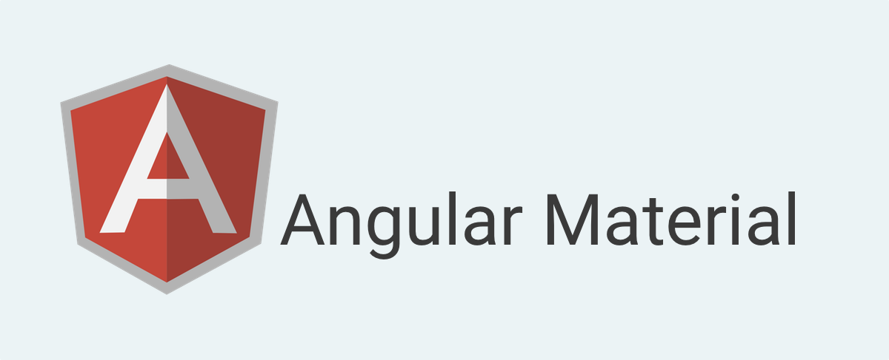
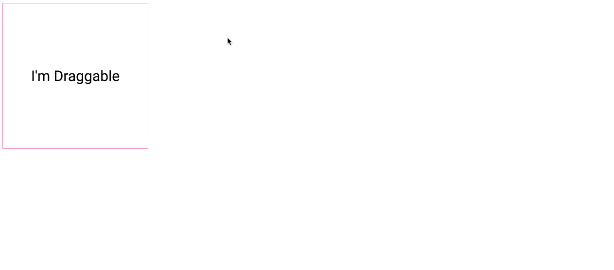
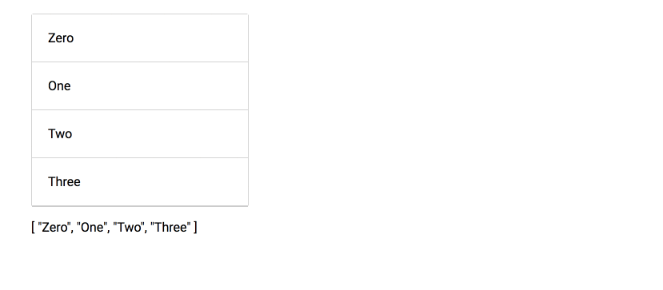
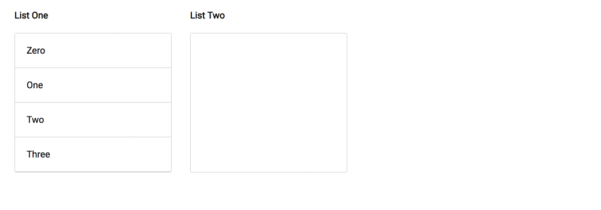
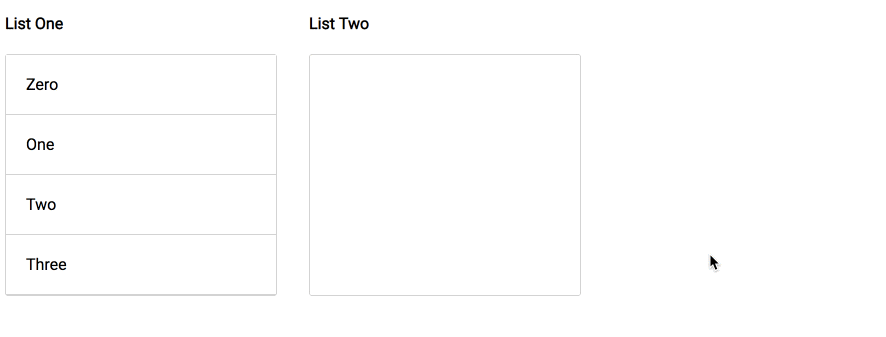

Angular material/cdk version [7.0.0-beta](https://github.com/angular/material2/blob/master/CHANGELOG.md#700-beta0-2018-08-30) is now available. In this release, we have two new exciting features we all waited for — drag and drop and virtual scroll.

In this article, we’ll learn how to use the drag and drop feature. If you want to learn about virtual scrolling, you can read my [previous](https://netbasal.com/a-taste-of-angular-material-virtual-scroll-f173c5c70a1) article.

First, we need to install the angular cdk package and import the `DragDropModule` module.

```
yarn add @angular/cdk@7.0.0-beta.0
```

<Embed src="https://gist.github.com/NetanelBasal/2ce1f610cc3124036e8335f047e3c085.js" aspectRatio={0.357} caption="" />

### Drag Example —

The module exposes a `cdkDrag` directive which as the name suggests, make the host draggable.

<Embed src="https://gist.github.com/NetanelBasal/d835a1f8ca47ba2d055bcae1d1dc7f73.js" aspectRatio={0.357} caption="" />


By default, `cdkDrag` allows free movement in all directions. We can also lock the position of the dragged element along the specified axis.

<Embed src="https://gist.github.com/NetanelBasal/3a57162a8bfa77a3058b37196ac92876.js" aspectRatio={0.357} caption="" />



The `cdkDrag` also exposes the following outputs: `cdkDragStarted`, `cdkDragEnded`, `cdkDragEntered`, `cdkDragExited`, `cdkDragDropped`, and `cdkDragMoved`.

#### cdkDragHandle

With this directive, you can determine who is the draggable handler.

<Embed src="https://gist.github.com/NetanelBasal/4387747e420bdd6ab624f81e9f1f8350.js" aspectRatio={0.357} caption="" />


### Sortable Example

Adding the `cdk-drop` around a set of `cdkDrag` elements groups the draggables into a reorder-able collection. Note that this will not update your data model; you can listen to the `dropped` event to update the data model once the user finishes dragging.

<Embed src="https://gist.github.com/NetanelBasal/7105ecea29ca3514850b7d287302400f.js" aspectRatio={0.357} caption="Sortable example" />

The package exposes the `moveItemInArray` method which on drop rearrange the items array according to the indexes. Note that this method **mutates** the array. I’m suggesting creating an immutable method that does the same.



### Transferring Items between Lists

The `cdk-drop` component supports transferring dragged items between connected drop zones. You can connect one or more `cdk-drop` instances by setting the `connectedTo` property.

<Embed src="https://gist.github.com/NetanelBasal/d88cee22322a5be27aa0e6f492241b83.js" aspectRatio={0.357} caption="Connect list example" />

You can associate some arbitrary data with both `cdkDrag` and `cdk-drop` by setting `cdkDragData` or `data`. In our case, the event `data` property refers to the corresponding `items` array.

If the user is dragging an element within the same container, we perform a sortable action; otherwise, we transform the value from one collection to the other using the built-in `transferArrayItem()` method. ( note that this method mutates the array )



#### enterPredicate

The `enterPredicate` input expects a function that is used to determine whether an item is allowed to be moved into a drop container.

For example, we can disallow from one container to drag items into the other.

<Embed src="https://gist.github.com/NetanelBasal/88f2a7fe6d1e86b3f5cf46877eb81361.js" aspectRatio={0.357} caption="enterPredicate example" />



#### cdkDragPlaceholder

You can pass template that will be used as the placeholder when the element is being dragged. The placeholder is displayed in place of the element being dragged.

<Embed src="https://gist.github.com/NetanelBasal/a95700c44744f74a51478498caad2b44.js" aspectRatio={0.357} caption="cdkDragPlaceholder example" />

#### cdkDragPreview

Element that will be used as a template for the preview of a `cdkDrag` when it is being dragged.

<Embed src="https://gist.github.com/NetanelBasal/625e996cb423b35c7fe6da154b248fe8.js" aspectRatio={0.357} caption="cdkDragPreview example" />

That’s all. For further information check out the [docs](https://github.com/angular/material2/blob/master/src/cdk/drag-drop/drag-drop.md).

<Embed src="https://stackblitz.com/edit/cdk-ng-drag-drop?embed=1" aspectRatio={undefined} caption="Live demo" />

### New Angular Meetup in Tel-Aviv

We’ll be hosting a meet-up entitled “Kickass Angular” where we’ll be showcasing the cutting edge technologies we use/have come up with. You’re welcome to join us if you’re in town 😀

Signup and reserve a seat! 👇🏻

[**Kickass Angular**  
_18:00 - 18:30 Bring an appetite - we'll bring the pizzas. --------------------------------------- 18:30 - 19:00…_www.meetup.com](https://www.meetup.com/Datorama/events/253969284/ "https://www.meetup.com/Datorama/events/253969284/")[](https://www.meetup.com/Datorama/events/253969284/)

### 👂🏻 Last but Not Least, Have you Heard of Akita?

Akita is a state management pattern that we’ve developed here in Datorama. It’s been successfully used in a big data production environment for over seven months, and we’re continually adding features to it.

Akita encourages simplicity. It saves you the hassle of creating boilerplate code and offers powerful tools with a moderate learning curve, suitable for both experienced and inexperienced developers alike.

I highly recommend checking it out.

[**🚀 Introducing Akita: A New State Management Pattern for Angular Applications**  
_Every developer knows state management is difficult. Continuously keeping track of what has been updated, why, and…_netbasal.com](https://netbasal.com/introducing-akita-a-new-state-management-pattern-for-angular-applications-f2f0fab5a8 "https://netbasal.com/introducing-akita-a-new-state-management-pattern-for-angular-applications-f2f0fab5a8")[](https://netbasal.com/introducing-akita-a-new-state-management-pattern-for-angular-applications-f2f0fab5a8)

_Follow me on_ [_Medium_](https://medium.com/@NetanelBasal/) _or_ [_Twitter_](https://twitter.com/NetanelBasal) _to read more about Angular, Akita and JS!_
