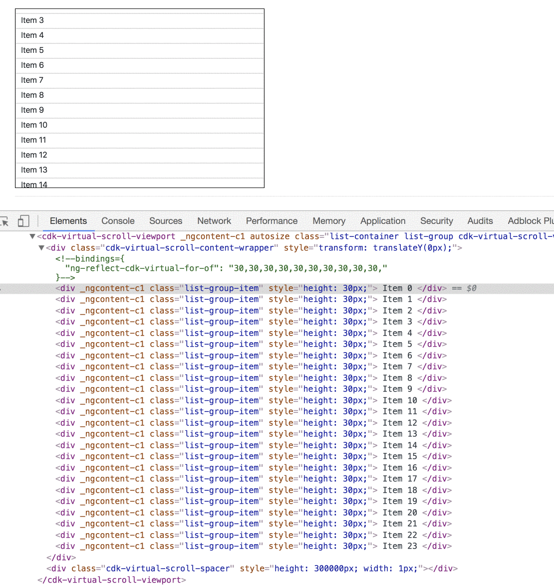
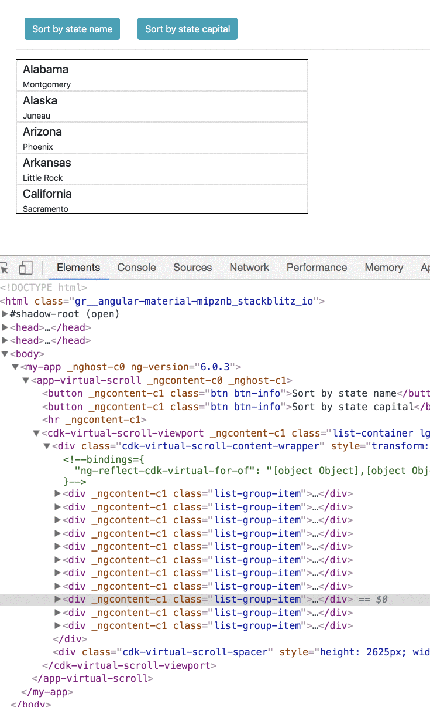

As a developer, you’ve probably had to implement a big list or table for your application using an infinite scroll technique.

The problem with that is that so many elements in the DOM can cause slow initial rendering, laggy scrolling, and dirty checking on each one of them in the context of Angular can be expensive.

### Virtual Scroll

The central concept behind virtual rendering is rendering only the visible items.

For example, if there are thousands of alerts in an application, an efficient way would be to load only the elements that are visible and unload them when they are not by replacing them with new ones.

An initial implementation of virtual scrolling is now available in @angular/cdk. (v7.0.0-beta.0)

Let’s see two examples of how to use them.

First, we need to install the cdk package and import the `ScrollingModule` module.

```
yarn add @angular/cdk@7.0.0-beta.0
```

<Embed src="https://gist.github.com/NetanelBasal/f29a9976414bc9cff7b2121c392b5f9c.js" aspectRatio={0.357} caption="" />

Next, let’s create a component that renders a list.

<Embed src="https://gist.github.com/NetanelBasal/59fd3c3352c8ca970b0a8fe715c63903.js" aspectRatio={0.357} caption="" />

We create an array of 10000 items, and each cell contains the number 30. Let’s move forward to the template.

<Embed src="https://gist.github.com/NetanelBasal/13e3375b6db77c91124fa6dfd2b7ff70.js" aspectRatio={0.357} caption="Demo" />

The `autosize` attribute indicates we want to use a virtual scroll strategy that supports unknown or dynamic size items. The rest of the code is self-explanatory.



Note: An autosize strategy that works on elements of differing sizes is currently being developed in `@angular/cdk-experimental`, **but it is not ready for production use yet.**

The next example is using fixed item size and observable.

<Embed src="https://gist.github.com/NetanelBasal/a93f98afe5d5626b2b2031a78d6b7f06.js" aspectRatio={0.357} caption="Fixed Size & Observale" />



Continue playing in stackblitz.

<Embed src="https://stackblitz.com/edit/angular-material-mipznb?embed=1" aspectRatio={undefined} caption="Live demo from StackBlitz. Try editing the code yourself." />

You can find full examples [here](https://github.com/angular/material2/blob/31fd6a216b4155a219bb3c3f4eadb9dfa7c12ac0/src/demo-app/virtual-scroll/virtual-scroll-demo.html). For further information check out the [docs](https://github.com/angular/material2/blob/ba84d5b3f0a249c70f01054a696eed7211e81087/src/cdk/scrolling/scrolling.md).

_Follow me on_ [_Medium_](https://medium.com/@NetanelBasal/) _or_ [_Twitter_](https://twitter.com/NetanelBasal) _to read more about Angular, Vue and JS!_

### **Things to not miss**:

[**🚀 Introducing Akita: A New State Management Pattern for Angular Applications**  
_Every developer knows state management is difficult. Continuously keeping track of what has been updated, why, and…_netbasal.com](https://netbasal.com/introducing-akita-a-new-state-management-pattern-for-angular-applications-f2f0fab5a8 "https://netbasal.com/introducing-akita-a-new-state-management-pattern-for-angular-applications-f2f0fab5a8")[](https://netbasal.com/introducing-akita-a-new-state-management-pattern-for-angular-applications-f2f0fab5a8)

[**NetanelBasal/spectator**  
_spectator — 👻 Angular Tests Made Easy 🤓_github.com](https://github.com/NetanelBasal/spectator "https://github.com/NetanelBasal/spectator")[](https://github.com/NetanelBasal/spectator)
