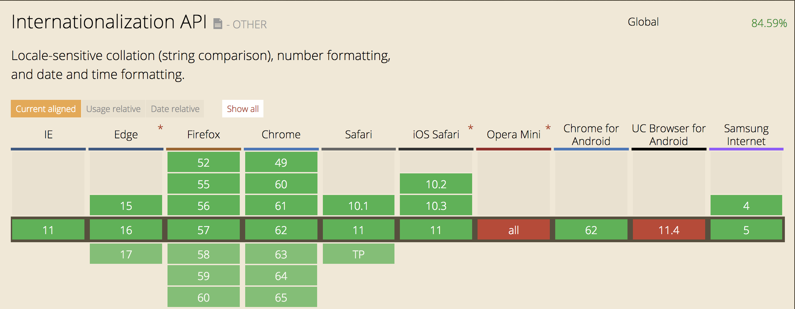

Let me start by boring you with the official definition from [Wikipedia](https://en.wikipedia.org/wiki/Internationalization_and_localization):

> In computing, Internationalization and Localization are means of adapting computer software to different languages, regional differences and technical requirements of a target locale.

As application owners/developers, we desire to produce a good user experience and adjust the user interface of our applications based on the location and the language of the user. For example, a person from the US will see a different date format than a person from the UK.

To achieve this, most of us use today third-party libraries like [globalize](https://github.com/globalizejs/globalize) or rely on our built-in framework support, such as Angular.

However, JavaScript has native support for Internationalization. Yes, I know what you are thinking to yourself:

> The support is low and very inconsistent among browsers.

But let me surprise you.

As you can see, all of the major browsers support it. Now that you are more carefree, let’s explore the basics.

_Note: The Internationalization API is not a full Internationalization framework; it can be useful for common localization tasks involving dates, numbers, and currencies._

### The `**Intl**` object

The `Intl` object is an object that acts as a namespace for the Internationalization API, which provides language sensitive string comparison, number formatting, and date and time formatting.

### Formatting Numbers

The `Intl.NumberFormat` API allows you to format a number. Let’s consider a few examples.

<Embed src="https://gist.github.com/NetanelBasal/9975e137a63fb9021cf3985e1d59dd6a.js" aspectRatio={0.357} caption="Formatting Numbers" />

And of course, we can abstract it to our framework of choice. For example, if you work with VueJS, you can create a custom number filter.

<Embed src="https://codepen.io/phpnetanel/embed/preview/GOBjMe?height=600&slug-hash=GOBjMe&default-tabs=js,result&host=https://codepen.io&embed-version=2" aspectRatio={undefined} caption="VueJS number filter" />

You can find the full documentation on the MDN [website](https://developer.mozilla.org/en-US/docs/Web/JavaScript/Reference/Global_Objects/NumberFormat).

### Formatting Dates

The `Intl.DateTimeFormat` API enables language sensitive date and time formatting.

<Embed src="https://gist.github.com/NetanelBasal/47fb339f110f2bd7e5976a145a42a711.js" aspectRatio={0.357} caption="Formatting Dates" />

<Embed src="https://codepen.io/phpnetanel/embed/preview/GOBjyL?height=600&slug-hash=GOBjyL&default-tabs=js,result&host=https://codepen.io&embed-version=2" aspectRatio={undefined} caption="VueJS date filter" />

You can find the full documentation on the MDN [website](https://developer.mozilla.org/en-US/docs/Web/JavaScript/Reference/Global_Objects/DateTimeFormat).

### String Comparison

The `Intl.Collator` API allows enables language sensitive string comparison.

<Embed src="https://gist.github.com/NetanelBasal/51a8587a8527a545b069b1f58807ced6.js" aspectRatio={0.357} caption="Collator example" />

You can find the full documentation on the MDN [website](https://developer.mozilla.org/en-US/docs/Web/JavaScript/Reference/Global_Objects/Collator).

_Follow me on_ [_Medium_](https://medium.com/@NetanelBasal/) _or_ [_Twitter_](https://twitter.com/NetanelBasal) _to read more about Angular, Vue and JS!_
