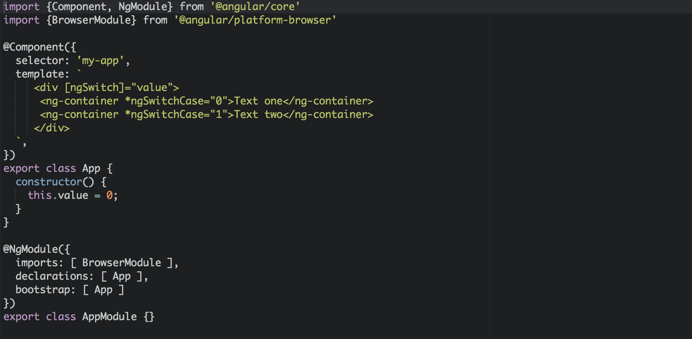

In many cases when working on your app, you forced to wrap your content with an additional tag when using structural directives.

Let’s see a few examples.

#### \- Using `ngIf` to wrap multiple nodes:

<Embed src="https://gist.github.com/NetanelBasal/24376ec844018fb9ed5bbeb72bd9fb21.js" aspectRatio={0.357} caption="" />

In the above example, we are forced to add additional tag because we want to use one `ngIf` for both divs.

This is not the best solution for two reasons:

1.  We are adding unnecessary DOM node.
2.  That’s maybe screwed our styles.

One way to get around this is to use the de-sugared version syntax of structural directives.

<Embed src="https://gist.github.com/NetanelBasal/6724a07920b828e90e5b0a3c78c8045d.js" aspectRatio={0.357} caption="" />

That’s fine, but we are not using the asterisk anymore, and this leads to inconsistency in our code.

The second solution is the `**ng-container**` directive.

> <ng-container> is a logical container that can be used to group nodes but is not rendered in the DOM tree as a node.

> <ng-container> is rendered as an HTML comment.

So now we can do this:

<Embed src="https://gist.github.com/NetanelBasal/4957e0a9d69bf5fd588e28107f3ccd75.js" aspectRatio={0.357} caption="" />

Nice!

#### \- Use ngSwitch:

Sometimes we need to display text based on the switch statement. The problem is that this forces us to add an additional tag. For example:

<Embed src="https://gist.github.com/NetanelBasal/3b906620eb12590dc28776ffb8d2d6ab.js" aspectRatio={0.357} caption="" />

But in many cases, we don’t need the additional tag (in this case the `span`). Let’s use `ng-container` to solve this problem:

<Embed src="https://gist.github.com/NetanelBasal/20b1ad77ccc1be9c644567d5a552fd81.js" aspectRatio={0.357} caption="" />

Now our template is clean!

### 🔥 **Last but Not Least, Have you Heard of Akita?**

Akita is a state management pattern that we’ve developed here in Datorama. It’s been successfully used in a big data production environment, and we’re continually adding features to it.

Akita encourages simplicity. It saves you the hassle of creating boilerplate code and offers powerful tools with a moderate learning curve, suitable for both experienced and inexperienced developers alike.

I highly recommend checking it out.

[**🚀 Introducing Akita: A New State Management Pattern for Angular Applications**  
_Every developer knows state management is difficult. Continuously keeping track of what has been updated, why, and…_netbasal.com](https://netbasal.com/introducing-akita-a-new-state-management-pattern-for-angular-applications-f2f0fab5a8 "https://netbasal.com/introducing-akita-a-new-state-management-pattern-for-angular-applications-f2f0fab5a8")
