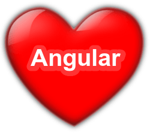

In this article, I’m going to show you how you can create modals and provide them with the ability to act like a “real” page with URL address.

I’m not going to explain what are Auxiliary Routes so if you are not familiar with this feature you can read the [documentation](https://angular.io/docs/ts/latest/guide/router.html).

First, we need to create the modal outlet:

<Embed src="https://gist.github.com/NetanelBasal/0c0086aa6e99baa71a0ef15e725ef958.js" aspectRatio={0.357} caption="" />

Next, lets’ create ModalComponent so we can reuse the code:

<Embed src="https://gist.github.com/NetanelBasal/1a21a1049bda7fb9ae0320cc01b03100.js" aspectRatio={0.357} caption="" />

The code is straightforward; we are just using ng-content so we can project different content every time and a click handler for our x button. I will skip the CSS stuff because it’s not relevant.

<Embed src="https://gist.github.com/NetanelBasal/4b1306ac9ffacf535649b34c29404aee.js" aspectRatio={0.357} caption="" />

We are creating the _modalClose_ Output because we want to let our consumers know when the user closes the modal.

When the user clicks on the x button, we call the _closeModal_ method and closing the modal by setting the modal outlet to null then firing the _closeModal_ event.

Now we can create our first modal:

<Embed src="https://gist.github.com/NetanelBasal/7ea0290c9e2531a9914b8f3746abf1c1.js" aspectRatio={0.357} caption="" />

Before we can use the LoginComponent in the modal outlet we need to define the login route:

<Embed src="https://gist.github.com/NetanelBasal/f9ee665096732590ba71ec1e5f7fc12f.js" aspectRatio={0.357} caption="" />

Create link to open the modal:

<Embed src="https://gist.github.com/NetanelBasal/7349fd8611197f20e58a7242107fa439.js" aspectRatio={0.357} caption="" />

Nice! Now we are missing the ability to let the user close the modal for example on submit button. We can solve this problem with the _exportAs_ property. ( you can read more about this feature [here](https://netbasal.com/angular-2-take-advantage-of-the-exportas-property-81374ce24d26#.1k3kf9n1w) )

<Embed src="https://gist.github.com/NetanelBasal/b016e4e7afd6a11845c8132946c28cf5.js" aspectRatio={0.357} caption="" />

Now we can access the modal API directly in our template with local variables.

<Embed src="https://gist.github.com/NetanelBasal/df5e8b94fe84d82f2fbc6617b6753090.js" aspectRatio={0.357} caption="" />

Note that we are listening to the _modalClose_ event, so we can use the data in our LoginComponent when the modal is closed.

<Embed src="https://gist.github.com/NetanelBasal/1a73a40876bf8678c91434e4b5e8a768.js" aspectRatio={0.357} caption="" />

Now you have reusable modal with URL address, and you can send this link to anyone like a normal link, and you also can use the back and forward button in your browser.

I’m sure we can make our modal much better, but I wanted to keep it simple for this article.

That’s all!

_☞_ **_Please tap or click “︎_**❤” _to help to promote this piece to others._
