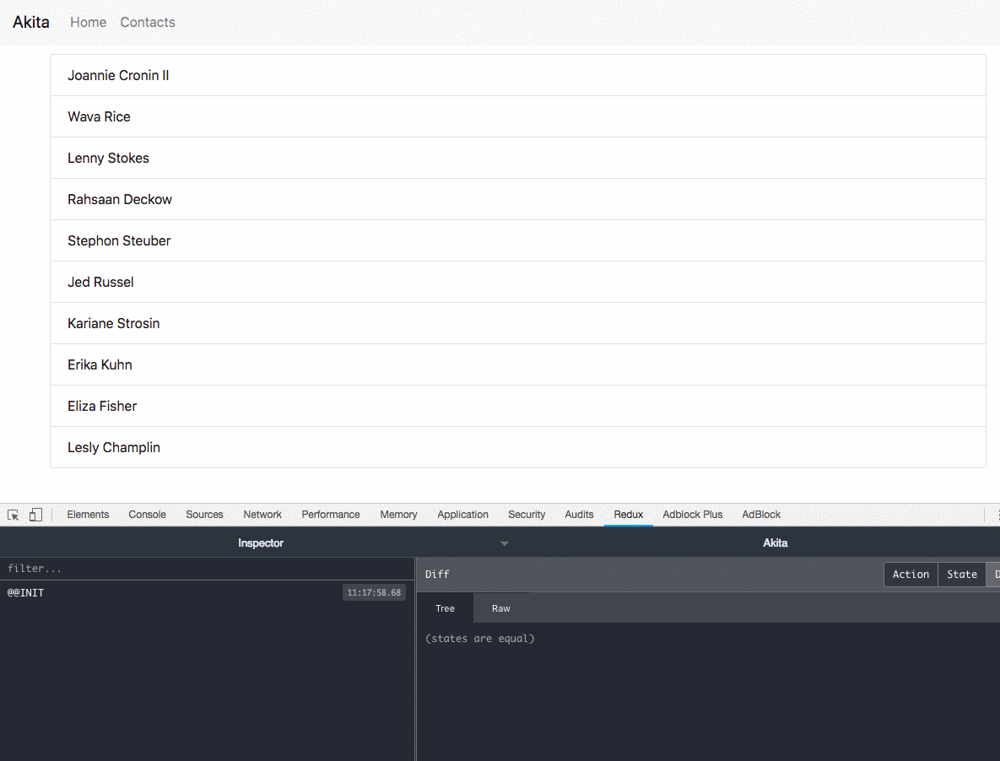

Akita updates are coming in fast and furious — the last one was a little over a month ago, and now we’ve reached a new milestone — we’ve launched Akita 2.0. It’s another step in our plan to help you manage your states more efficiently and with less of a hassle.

[**🚀 What’s New in Akita — _Angular Forms Manager, Dynamic Stores and More!_**  
Angular Forms Manager, Dynamic Stores and More!engineering.datorama.com](https://engineering.datorama.com/whats-new-in-akita-angular-forms-manager-dynamic-stores-and-more-8d8580b09963 "https://engineering.datorama.com/whats-new-in-akita-angular-forms-manager-dynamic-stores-and-more-8d8580b09963")

We wanted to let you know that the main reason we bumped the version to 2.0.0 is that we’ve updated Typescript to the latest version. We’re using the conditional types feature, so if you’re working with Typescript 2.8 and above you should be good to go.

Let’s have a look at what’s new:

### 💪 Multiple Active Support

As you may know, Akita’s Entity Store supports having an active attribute, which holds the active entity’s id. This can prove to be very useful in cases where you want to interact with the entity that is currently active.

In this release, we added support for maintaining a list of active entities instead of one. Let’s see how it works:

<Embed src="https://gist.github.com/NetanelBasal/f091c2b3995cdb5baf1b7b392dbda22b.js" aspectRatio={0.357} caption="" />

The only actions we need to do, is extend the `MultiActiveState` interface and initialize the `active` property to an array. With this setup, we’ll get the following functionality:

<Embed src="https://gist.github.com/NetanelBasal/b38f015d93d3b6afcbb8b3f7b62a61cc.js" aspectRatio={0.357} caption="" />

Here is a live [example](https://github.com/NetanelBasal/akita-multi-active) for caching the selected entities when navigates to a different page:

### 🙌 New Selectors

We’ve added two selectors to Akita’s Entity Query, which simplify the process of selecting the first and last entity in a collection. For example:

<Embed src="https://gist.github.com/NetanelBasal/0936a749b16f414f9f0e467b1f85480e.js" aspectRatio={0.357} caption="" />

In addition to that, the `selectMany` selector now supports `projection` function:

<Embed src="https://gist.github.com/NetanelBasal/66d198f6d808d6c5d5ca64b8988d6ac9.js" aspectRatio={0.357} caption="" />

### 👉 Miscellaneous

-   We’ve deprecated the `getSnapshot()` query method in favor of `getValue()`.
-   The `filterNil` operator is strongly typed now, which means that the next operator in the chain will not be typed as `null or undefined`.

### ✍️ What’s Next

In the next release, we’ll add asynchronous support to the `persistState` plugin. This feature has already been submitted as a pull request, but we want to test it further. This will give you the option to save a store’s value to a persistent storage, such as `indexDB`, `websql`, or any other asynchronous API.

](./asset-3.gif)

Akita continues to grow with more than 150k downloads so far. We’re getting a lot of great feedback, and we’re always open to new suggestions and improvements. You’re welcome to join Akita’s Gitter channel to address any questions you may have.

---

I’d like to thank [Inbal Sinai](https://medium.com/@inbalsinai) and the rest of the contributors, who help make Akita better.
