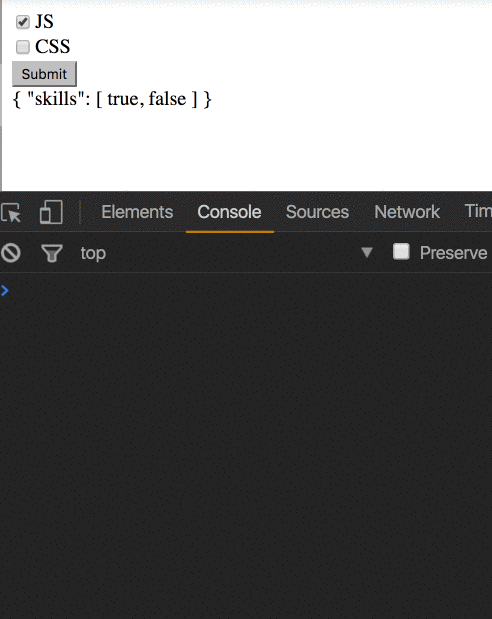

This post assumes that you at least have some working knowledge of Angular reactive forms.

Let’s say this is our structure:

<Embed src="https://gist.github.com/NetanelBasal/fbd5ee89bb67f4bc0b6a403fadca598b.js" aspectRatio={0.357} caption="" />

We need to transform this to an Angular form. Our goal is to render a list of skills with a checkbox that will be un/checked based on the `selected` key from each skill.

Let’s create the form:

<Embed src="https://gist.github.com/NetanelBasal/72a44d911a05cdfc14f8cf88fd01238b.js" aspectRatio={0.357} caption="" />

Our form is just a group with one key — `skills`.

<Embed src="https://gist.github.com/NetanelBasal/733de330749cba15a3c22ec9937332bc.js" aspectRatio={0.357} caption="" />

The `buildSkills()` method is responsible for —

1.  Create an array of `FormControls` with an initial value based on the `selected` key from each skill.
2.  Pass the array to the `FormArray`.

Let’s stop for a second and recognize the final structure without the `form builder`.

<Embed src="https://gist.github.com/NetanelBasal/899c968fab877d9cba0da8f7991f62a4.js" aspectRatio={0.357} caption="" />

Now we can write the HTML.

<Embed src="https://gist.github.com/NetanelBasal/70249e8b0e96e06cbdd2b2dc724b9c41.js" aspectRatio={0.357} caption="" />

The code is straightforward. We are just looping over the skills **controls** and binding each skill to a checkbox.

**_Tip_**_: We can use the_ `_index_` _to show additional information, for example, the skill name._

The final step is to map the form value to something that we can send to our server.

<Embed src="https://gist.github.com/NetanelBasal/d648379a9525336e1ab02774f387c8b9.js" aspectRatio={0.357} caption="" />

You can see the template driven approach in my [forms](https://netbasal.com/angular-2-deal-with-different-form-controls-cheat-sheet-template-vs-model-4c77864cc16b) cheat sheet post.

### 🚀 **Have You Tried Akita Yet?**

One of the leading state management libraries, Akita has been used in countless production environments. It’s constantly developing and improving.

Whether it’s entities arriving from the server or UI state data, Akita has custom-built stores, powerful tools, and tailor-made plugins, which help you manage the data and negate the need for massive amounts of boilerplate code. We/I highly recommend you try it out.

[**🚀 Introducing Akita: A New State Management Pattern for Angular Applications**  
_Every developer knows state management is difficult. Continuously keeping track of what has been updated, why, and…_netbasal.com](https://netbasal.com/introducing-akita-a-new-state-management-pattern-for-angular-applications-f2f0fab5a8 "https://netbasal.com/introducing-akita-a-new-state-management-pattern-for-angular-applications-f2f0fab5a8")

[**10 Reasons Why You Should Start Using Akita as Your State Management Solution**  
_State management is ubiquitous in web applications, be they big or small. One of the notable solutions in this field is…_engineering.datorama.com](https://engineering.datorama.com/10-reasons-why-you-should-start-using-akita-as-your-state-management-solution-66b63d033fec "https://engineering.datorama.com/10-reasons-why-you-should-start-using-akita-as-your-state-management-solution-66b63d033fec")

You can play with the code [here](https://plnkr.co/edit/XwxR0inmaZr8ieT4SlOr?p=preview).

_Follow me on_ [_Medium_](https://medium.com/@NetanelBasal/) _or_ [_Twitter_](https://twitter.com/NetanelBasal) _to read more about Angular, Akita and JS!_
